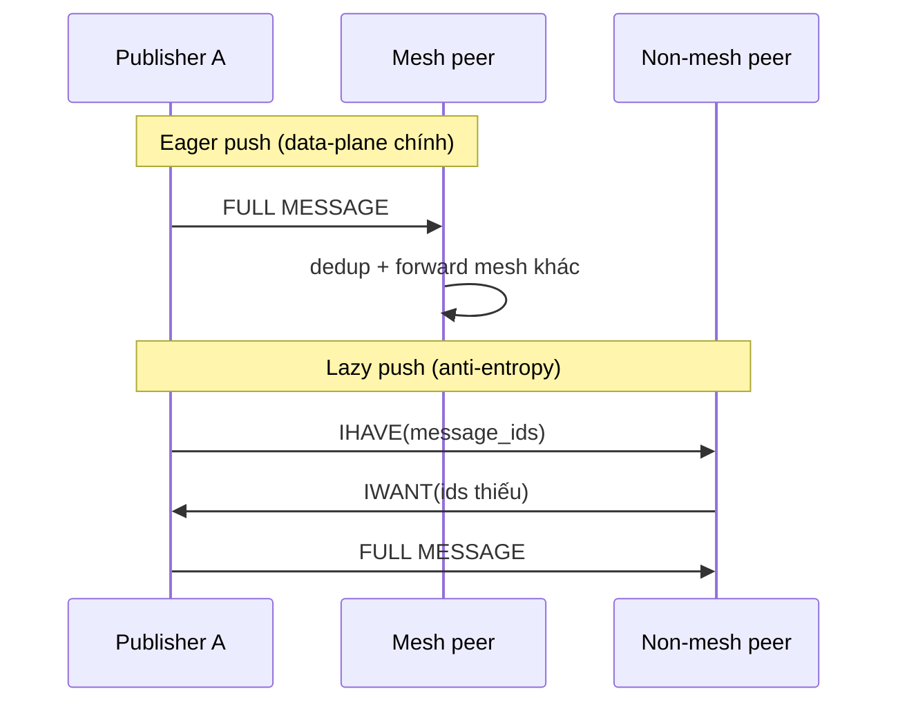
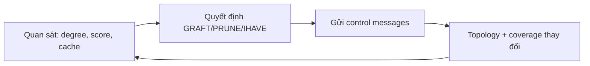
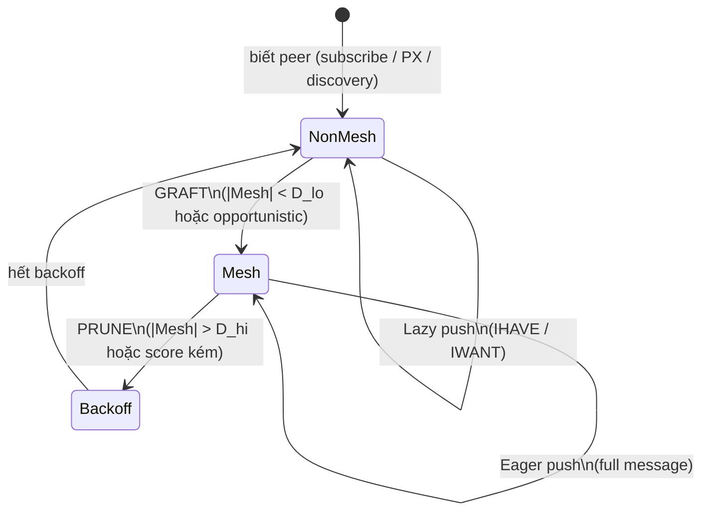

# Gossipsub — kiến trúc overlay Pub/Sub

> Tài liệu **chỉ** về thuật toán / kiến trúc Gossipsub như một **overlay pub/sub động**.
>
> Không bàn transport (TCP/QUIC/Noise/Yamux), không API rust-libp2p, không wiring ứng dụng.
> Phần gắn LUA-DAG / stack dưới: xem [network-gossip.md](./network-gossip.md).
>
> Nguồn: đặc tả Gossipsub (meshsub), thảo luận kỹ thuật ChatGPT / Claude / Gemini.

---

## Mục lục

1. [Gossipsub thực chất là gì?](#1-gossipsub-thực-chất-là-gì)
2. [Underlay vs Overlay](#2-underlay-vs-overlay)
3. [Từ Floodsub đến Gossipsub](#3-từ-floodsub-đến-gossipsub)
4. [Topic = namespace của overlay](#4-topic--namespace-của-overlay)
5. [Mesh degree: D, D_lo, D_hi](#5-mesh-degree-d-d_lo-d_hi)
6. [Eager push vs Lazy push](#6-eager-push-vs-lazy-push)
7. [Heartbeat — vòng điều khiển](#7-heartbeat--vòng-điều-khiển)
8. [Fanout vs Mesh](#8-fanout-vs-mesh)
9. [Message identity, seen cache, mcache](#9-message-identity-seen-cache-mcache)
10. [Peer scoring — feedback cho topology](#10-peer-scoring--feedback-cho-topology)
11. [Cơ chế ambient](#11-cơ-chế-ambient)
12. [State machine peer × topic](#12-state-machine-peer--topic)
13. [Trade-offs](#13-trade-offs)
14. [Tóm tắt](#14-tóm-tắt)

---

## 1. Gossipsub thực chất là gì?

Nhầm lẫn phổ biến: *Gossipsub = gửi message cho peer*.

**Thực ra:** Gossipsub là thuật toán **duy trì và tối ưu một đồ thị overlay động** cho publish/subscribe.

Bài toán:

> Có hàng nghìn node cùng subscribe một topic. Làm sao message lan tới gần như mọi subscriber — **nhanh**, **ít duplicate**, **không flood**, chịu **peer chết** và **peer xấu**?

Đối với Gossipsub chỉ tồn tại:

| Khái niệm | Vai trò |
|-----------|---------|
| Peer | Đỉnh trên overlay |
| Topic | Một overlay graph riêng |
| Message | Đơn vị data-plane (có identity) |
| Control messages | GRAFT, PRUNE, IHAVE, IWANT… |

Gossipsub **không** quan tâm underlay là TCP hay QUIC. Nó giả định đã có cách nói chuyện peer-to-peer; phần còn lại là **topology + dissemination**.

Có thể nhìn Gossipsub như **hệ điều khiển phản hồi phân tán** (distributed feedback control):

- **Đối tượng điều khiển:** overlay graph từng topic  
- **Setpoint:** mesh degree ∈ `[D_lo, D_hi]`  
- **Bộ điều khiển:** heartbeat  
- **Actuator:** GRAFT / PRUNE (+ scoring)  
- **Plant output:** latency, coverage, bandwidth, resilience  

Quản lý **cấu trúc mạng** quan trọng không kém việc **truyền payload**.

---

## 2. Underlay vs Overlay

```text
        UNDERLAY (connectivity thật)
      A -------- B -------- C
      |          |          |
      D -------- E -------- F
      |                     |
      G -------- H -------- I

        OVERLAY topic = "blocks" (ví dụ)
      A -------- C
      |          |
      D          F
       \        /
          H
```

| | Underlay | Overlay (Gossipsub) |
|--|----------|---------------------|
| Là gì | Ai có đường nối tới ai | Ai **eager-forward** full message cho ai trên một topic |
| Ai tạo | Transport / discovery | Mesh + fanout + gossip metadata |
| Peer E | Có thể connected nhiều node | Có thể **không** nằm trong mesh `blocks` |

Hai tầng **độc lập**:

```text
connected (underlay)
    → subscribe(topic)
    → có thể vẫn non-mesh
    → heartbeat GRAFT
    → vào mesh (overlay)
```

Cùng underlay có thể mang **nhiều overlay** (mỗi topic một mesh).

---

## 3. Từ Floodsub đến Gossipsub

### Floodsub

Khi nhận message: forward tới **mọi** peer liên quan.

```text
      A
    / | \
   B  C  D
  /|\ | /|
```

Hệ quả: duplicate lớn, bandwidth ~ theo số cạnh. Ví dụ 1000 node × 80 cạnh ≈ hàng chục nghìn transmission cho **một** message, trong khi ~1000 lần gửi đã đủ phủ nếu mỗi node nhận đúng một lần.

### Ý tưởng Gossipsub

Không flood toàn underlay. Mỗi node duy trì **mesh nhỏ** (~`D` neighbors) trên topic; **full message** chủ yếu chạy trên mesh. Ngoài mesh: chỉ **metadata** (IHAVE) — anti-entropy.

```text
       A
     / | \
    B  C  D      ← mesh của A (degree ≈ D)
      / \
     E   F
```

Đồ thị dissemination **mỏng hơn nhiều** so với flood trên mọi connection.

---

## 4. Topic = namespace của overlay

Topic **không** chỉ là string nhãn. Mỗi topic = **một overlay graph độc lập**.

```text
Topic "blocks"              Topic "transactions"
A—B—C                       A
|   |                       B—F—G
D———E                           |
                                H
```

Cùng một peer có thể:

- **mesh** trên topic A  
- **non-mesh** (chỉ lazy gossip) trên topic B  
- **fanout** (publish tạm) trên topic C  
- không subscribe topic D  

Trạng thái mesh, degree, backoff, score-theo-topic được giữ **riêng từng topic**.

---

## 5. Mesh degree: D, D_lo, D_hi

Đây là **trái tim** topology control.

| Ký hiệu | Ý nghĩa |
|---------|---------|
| **D** | Target degree — số mesh peer mục tiêu |
| **D_lo** | Ngưỡng dưới — nhỏ hơn → cần GRAFT |
| **D_hi** | Ngưỡng trên — lớn hơn → cần PRUNE |

### Invariant

```text
D_lo  ≤  |Mesh(topic)|  ≤  D_hi
```

Không luôn đúng tức thời (churn, GRAFT đồng thời). **Heartbeat** liên tục kéo topology về invariant.

### GRAFT

*“Thêm tôi vào mesh topic này.”*

```text
|Mesh| < D_lo
  → chọn peer từ tập non-mesh (ưu tiên score cao nếu có)
  → gửi GRAFT
  → peer đồng ý → cạnh overlay eager xuất hiện
```

### PRUNE

*“Ra khỏi mesh.”*

```text
|Mesh| > D_hi  (hoặc score kém)
  → gửi PRUNE
  → peer vẫn có thể connected (underlay)
  → nhưng không còn nhận/gửi full message eager trên topic đó
```

**PRUNE ≠ disconnect.** Chỉ giáng cấp khỏi overlay mesh.

---

## 6. Eager push vs Lazy push

Hai cơ chế dissemination **song song**:



| | Eager push | Lazy push |
|--|------------|-----------|
| Gửi gì | Full payload | Message ID (IHAVE) rồi mới full nếu IWANT |
| Với ai | Mesh peers | Một phần peer ngoài mesh |
| Mục tiêu | Latency thấp — đường chính | Sửa lỗ hổng / coverage — đường repair |
| Chi phí | Bandwidth cao hơn / cạnh | Control nhẹ; full chỉ khi cần |

**Eager** = primary dissemination.  
**Lazy** = anti-entropy, không thay eager.

---

## 7. Heartbeat — vòng điều khiển

Heartbeat **không** gửi data ứng dụng. Nó là **control loop** định kỳ:

```text
heartbeat():
  for each topic:
    remove_dead / unreachable mesh peers
    if degree < D_lo:   GRAFT
    if degree > D_hi:   PRUNE (ưu tiên score thấp)
    emit IHAVE (gossip factor → non-mesh)
    expire backoff / fanout
    opportunistic_graft()   # thoát local optimum
  shift / cleanup mcache
  cleanup seen window
```



Đây là **feedback control**, không phải “event handler mỗi khi có message”.

---

## 8. Fanout vs Mesh

| | Mesh | Fanout |
|--|------|--------|
| Khi nào | Peer **subscribe** topic | Peer **publish** nhưng **không** subscribe |
| Bền vững | Có — heartbeat duy trì degree | Tạm — hết hạn nếu lâu không publish |
| Nhận message | Có (subscriber) | Không bắt buộc — chỉ để đẩy ra |
| Mục đích | Overlay ổn định hai chiều | Tránh tạo mesh đắt cho publisher một chiều |

```text
Publisher (chưa subscribe)
    → chọn ~D peer đang subscribe
    → nhớ fanout set
    → eager push vào set đó
    → im lặng lâu → fanout expire
```

Nếu mọi publisher cũng mở mesh đầy đủ, chi phí topology tăng vô ích khi họ không cần nhận.

---

## 9. Message identity, seen cache, mcache

Không có identity → vòng lặp vô hạn trên đồ thị có chu trình:

```text
A → B → C → A → …
```

### Message ID

Định danh duy nhất (thường từ author + seqno, hoặc hash nội dung — tùy cấu hình authenticity).

### Seen cache

```text
receive(msg):
  if msg.id ∈ seen: drop
  else: seen.insert(id); deliver / forward
```

Chặn duplicate & loop. Có cửa sổ thời gian / kích thước hữu hạn.

### mcache (message cache)

**Khác** seen cache:

| | Seen | mcache |
|--|------|--------|
| Lưu gì | ID (đã thấy) | ID + **payload gần đây** |
| Mục đích | Drop trùng | Trả lời **IWANT**, xây **IHAVE** |

Nếu chỉ seen mà drop payload ngay → không repair được khi peer IWANT.

```text
IHAVE → peer phát hiện thiếu
IWANT → cần payload
mcache → nguồn trả full message
```

---

## 10. Peer scoring — feedback cho topology

Mesh chọn peer **ngẫu nhiên mãi** kém: peer chậm / spam / invalid vẫn chiếm degree.

Scoring = **closed loop**:

```text
quan sát hành vi
  → cập nhật score
  → ảnh hưởng GRAFT/PRUNE / graylist
  → topology đổi
  → quan sát tiếp
```

Hướng điểm (ý tưởng, không liệt kê hết công thức P1–P7):

| Tín hiệu | Hướng |
|----------|--------|
| First delivery hữu ích, ở mesh ổn định | Cộng |
| Invalid / spam / không tham gia / mesh failure | Trừ |

Score thấp → ưu tiên **PRUNE**; score cao → ưu tiên giữ / **opportunistic GRAFT**. Topology **tự tối ưu theo thời gian**.

---

## 11. Cơ chế ambient

Không phải “đường chính” dissemination, nhưng giữ mesh **ổn định / thích nghi**:

| Cơ chế | Vai trò |
|--------|---------|
| **Opportunistic grafting** | Dù đủ D, đôi khi GRAFT peer score rất cao → thoát local optimum, rút ngắn đường kính |
| **PX (Peer Exchange)** | Kèm PRUNE: “thử các peer X,Y,Z” → phục hồi liên thông nhanh |
| **Backoff** | Sau bị PRUNE: cấm GRAFT lại ngay → tránh dao động GRAFT↔PRUNE |
| **Graylist** | Score quá thấp: bỏ qua GRAFT/IHAVE của họ — cách ly khỏi overlay mà chưa nhất thiết cắt underlay |

```text
Không backoff:
  PRUNE → GRAFT → PRUNE → GRAFT → …  (oscillation)

Có backoff:
  PRUNE → chờ → mới được GRAFT lại
```

---

## 12. State machine peer × topic

Quan hệ **local node ↔ một remote peer** trên **một topic** (logic overlay — không phải trạng thái TCP):



| Trạng thái | Ý nghĩa |
|------------|---------|
| **NonMesh** | Có thể cùng topic interest; chỉ metadata / IWANT; băng thông thấp |
| **Mesh** | Eager path chính; đóng góp degree |
| **Backoff** | Tạm cấm vào lại mesh với peer đó trên topic |

Một peer underlay-connected có thể **NonMesh** trên topic A và **Mesh** trên topic B.

---

## 13. Trade-offs

Không có topology tối ưu tuyệt đối. Ba trục:

```text
        latency
           /\
          /  \
         /    \
bandwidth ---- resilience
```

| Tăng… | Được | Mất |
|-------|------|-----|
| **D** lớn | Đường kính nhỏ hơn, ít partition, latency tốt hơn | Nhiều eager duplicate, bandwidth ↑ |
| **D** nhỏ | Tiết kiệm bandwidth | Ít dự phòng, dễ partition cục bộ |
| Gossip (IHAVE) nhiều | Repair nhanh, coverage tốt | Control traffic ↑ |
| Gossip ít | Overlay nhẹ | Phục hồi chậm khi mất message |
| Scoring mạnh | Mesh sạch, chống spam | Quá khắt → kém đa dạng topology, thích nghi kém |

Gossipsub cố ý **tách**:

- đường **nhanh đắt** (eager mesh)  
- đường **chậm rẻ** (lazy IHAVE/IWANT)  

để không phải chọn một cực trên ba trục.

---

## 14. Tóm tắt

Gossipsub **không** phải “broadcast kiểu truyền miệng ngẫu nhiên”. Bản chất:

1. **Overlay graph động** theo từng topic, nằm trên underlay.  
2. **Invariant degree** `D_lo…D_hi` do **GRAFT/PRUNE** duy trì.  
3. **Heartbeat** = vòng điều khiển topology + lazy gossip + dọn cache.  
4. **Eager push** = dissemination chính; **lazy push** = anti-entropy.  
5. **Fanout** = publish tạm khi không subscribe.  
6. **Seen + mcache** = chống loop + cho phép repair.  
7. **Scoring + ambient** (PX, backoff, graylist, opportunistic graft) = thích nghi và chống hành vi xấu ở lớp pub/sub.

> **Quản lý cấu trúc overlay quan trọng bằng (hoặc hơn) việc đẩy payload.**

---

## Đọc thêm

- [network-gossip.md](./network-gossip.md) — Gossipsub trong LUA-DAG (topics, Borsh, swarm wiring, transport).
