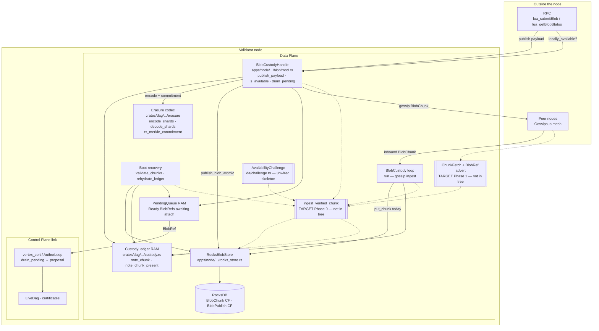
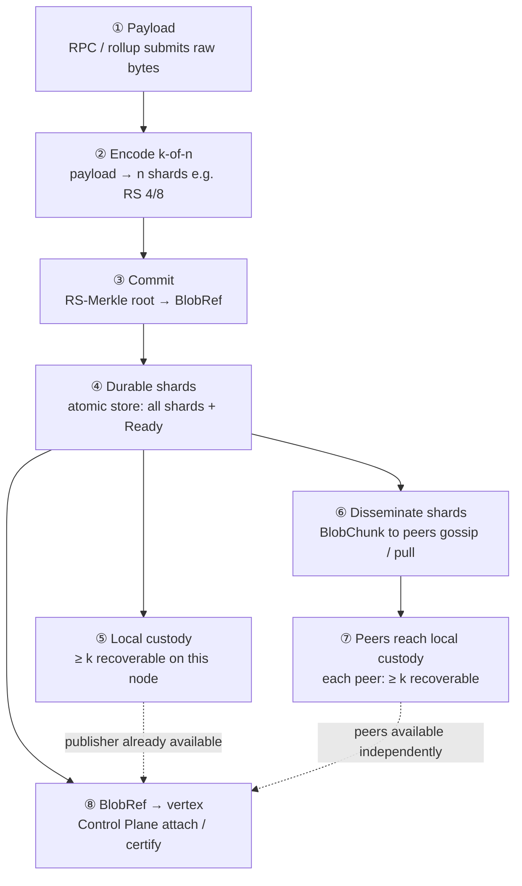
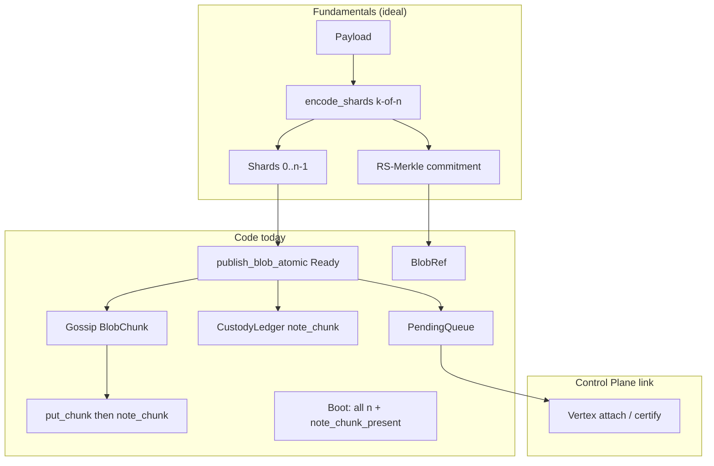

# Layer 1 Data Plane — explained

**Audience:** engineers learning how blob bytes move through L1  
**Status:** Starts from fundamentals, then matches **code today**, then the **target** design. Keep “today” and “target” distinct.  
**Related:** [`layer-1.md`](./layer-1.md) · [`2026-07-19-l1-dataplane-verified-ingest-repair-design.md`](../superpowers/specs/2026-07-19-l1-dataplane-verified-ingest-repair-design.md)

---

## 1. What problem does this solve?

App-chains / rollups submit raw **payload** bytes (a blob) into Layer 1. L1 must:

1. **Store** those bytes (or enough pieces to rebuild them) on validators.
2. **Reference** them from consensus structures without stuffing the full payload into every vote.
3. Later, let anyone who needs the data **reconstruct** it.

The **Data Plane** is the machinery for (1) and reconstruction. The **Control Plane** is the machinery for ordering and certifying vertices that *point at* blobs.

Mental model: the Data Plane is a **local warehouse**. It answers “can *this node* rebuild the blob?” Consensus answers “has the *network* agreed on a vertex that mentions it?”

---

## 2. Keyword foundations

Read this section once; later sections reuse these terms without redefining them.

### Layer 1, Data Plane, Control Plane

| Term | Meaning |
|---|---|
| **Layer 1 (L1)** | The availability DAG layer: Narwhal-style vertices + blob custody. Not the rollup execution layer. |
| **Data Plane** | Moves blob **bytes** (shards), persists them, tracks **local custody**. |
| **Control Plane** | Builds / certifies **vertices**, BLS quorums, equivocation — network agreement, not local disk. |
| **DA (data availability)** | In the loose sense: “the data can be recovered.” **Network DA** is a Control Plane / certification claim. **Local availability** is only “this node can reconstruct.” |

### Payload, blob, BlobId, BlobRef

| Term | Meaning |
|---|---|
| **Payload** | The original byte string submitted (e.g. via `lua_submitBlob`). |
| **Blob** | That payload as a first-class L1 object after publish. |
| **`BlobId`** | Content-derived identity of the blob (hash of payload). |
| **`BlobRef`** | Compact reference carried into vertices: `{ blob_id, commitment, size_bytes }`. Vertices cite refs, not full payloads. |
| **`commitment`** | Cryptographic binding to the erasure shards (see RS-Merkle below). Lets a node check shards without trusting gossip blindly (target design; partially used today). |

### Erasure coding: `k`, `n`, shard, encode / decode

| Term | Meaning |
|---|---|
| **Erasure coding (Reed–Solomon, RS)** | Split data into `n` pieces so any `k` suffice to rebuild the original. Typical config here: **RS 4/8** (`k=4`, `n=8`) — rate 1/2. |
| **`k`** | Minimum number of shards needed to reconstruct. |
| **`n`** | Total shards produced (`k` data + `n−k` parity). |
| **Shard** | One equal-sized piece of the encoded blob (index `0 .. n−1`). |
| **`encode_shards`** | Payload → `n` shards (`crates/dag/src/erasure`). |
| **`decode_shards`** | Any ≥ `k` present shards → original payload. |
| **`ErasureConfig`** | Parameters: `k`, `n`, `data_shard_size`, max payload ≈ `k * data_shard_size` (max blob 128 KiB in architecture docs). |

**Rule of thumb:** you need **any 4 good shards** of 8, not all 8.

### RS-Merkle commitment and proofs

| Term | Meaning |
|---|---|
| **Merkle tree** | Hash tree over leaves; root commits to every leaf. |
| **RS-Merkle commitment** | Hash each shard → Merkle root → domain-separated root stored in `BlobRef.commitment` (`rs_merkle_commitment`). |
| **Merkle proof / `ShardMerkleProof`** | Path proving one shard is a leaf under that root. **Design / Phase 1 wire**; not required on today’s gossip path. |
| **Recoverability** | Not just “I have ≥ `k` indices,” but “decode works and (target) matches the commitment.” |

### Chunks, custody, availability

| Term | Meaning |
|---|---|
| **`BlobChunk`** | Wire/storage unit wrapping one shard (`blob_id`, index, bytes, …). |
| **`put_chunk`** | Persist one chunk into RocksDB (no crypto gate today). |
| **`CustodyLedger`** | In-RAM index: which shard indices this node has, and which blobs are marked available. **Derived** — rebuilt from disk on boot; not a second source of truth. |
| **`note_chunk`** | Runtime: record a shard index, then run `erasure_available` (≥ `k` on disk **and** `decode_shards` OK). |
| **`note_chunk_present`** | Boot-only today: count indices; marks available at ≥ `k` **without decode** (gap). |
| **`erasure_available`** | Helper: load present shards from store, try decode. |
| **`locally_available` / `is_available`** | RPC / API name for “ledger says this blob is available **on this node**.” **Not** network DA. |
| **Local custody** | “I hold enough verified pieces to reconstruct.” |

### Publish lifecycle and queues

| Term | Meaning |
|---|---|
| **`PublishState::Ready`** | Blob durable locally; waiting to be attached into a vertex proposal. |
| **`PublishState::Attached`** | Blob sealed into a local vertex proposal. |
| **`publish_blob_atomic`** | One WAL batch: all `n` shards **and** the Ready publish record (crash-safe). |
| **`PendingQueue`** | RAM FIFO of `BlobRef`s the author loop drains into the next proposal. Ready records on disk are the durable source of truth; queue is a cache. |
| **`enqueue_pending`** | Push a `BlobRef` into that queue (after atomic store; **before** gossip in code). |
| **Vertex / vertex attach** | Control Plane: include `BlobRef`s in a proposal, certify with ≥ 2f+1 BLS, etc. |

### Network and repair

| Term | Meaning |
|---|---|
| **Gossip / Gossipsub** | Best-effort pub/sub of `BlobChunk` (and other L1 messages). |
| **Push-only** | Publisher floods shards; peers do not pull missing ones (**today**). |
| **`ChunkFetch`** | **Target Phase 1:** request missing shard indices from peers. |
| **Repair plane** | Logic that detects incomplete blobs and fetches gaps. |
| **`ingest_verified_chunk`** | **Target Phase 0:** single API every accepted shard must pass before store + availability transition. |
| **`ChunkSource`** | Design enum: `LocalPublish` \| `Gossip` \| `ChunkFetch` \| `BootReplay` — labels origin; must **not** change verify rules. |
| **`AvailabilityChallenge` / `AvailabilityResponse`** | Types + `verify_availability_response` in `crates/dag/src/da/challenge.rs`: decode + re-encode commitment check. **Skeleton today** — not wired into gossip. |

### Storage abbreviations

| Term | Meaning |
|---|---|
| **RocksDB** | Embedded KV store used by the node. |
| **CF (column family)** | Separate key space: e.g. `BlobChunk`, `BlobPublish`. |
| **WAL** | Write-ahead log; atomic batch apply = all-or-nothing durability. |
| **Boot / boot recovery** | On process start: scan Ready blobs, rebuild ledger, re-enqueue pending. |
| **F1** | Tracked debt: double RS encode on publish (`encode_shards` then again inside `blob_ref_commitment`). |

### Design gaps (G1–G3)

| Id | Short name | Meaning |
|---|---|---|
| **G1** | Multiple trust paths | Publish / gossip / boot do not share one Merkle verify gate. |
| **G2** | Boot ≠ runtime availability | Boot wants all `n` for re-enqueue; ledger boot path is count-only; runtime uses ≥ `k` + decode. |
| **G3** | No repair | Push-only gossip; lost shards never pulled. |

### Target availability states

| State | Meaning |
|---|---|
| **Unknown** | No meta / no shards yet. |
| **Partial** | Some shards, but &lt; `k` verified or not yet recoverability-checked. |
| **Recoverable / LocallyAvailable** | ≥ `k` verified + recoverability passed — safe to treat as locally readable. |

---

## 3. Why split Data Plane and Control Plane?

| | Data Plane | Control Plane |
|---|---|---|
| **Carries** | Shard bytes | Certificates, proposals, votes |
| **Question** | Can *I* reconstruct? | Has the *network* certified? |
| **Failure if confused** | Ops think `locally_available` means mesh DA | Consensus trusts unverified local bytes |

A node can be **locally available** and still wait on Control Plane for a certified vertex. Conversely, certificates alone do not put shards on your disk.

---

## 3.1 Component diagram

How the pieces sit on one node. Solid edges are **today**. Dashed edges are **target** (Phase 0 ingest gate / Phase 1 repair) and are not wired in code yet.



### Component roles (quick)

| Component | Owns | Notes |
|---|---|---|
| **BlobCustodyHandle** | Publish API, pending drain, availability query | Entry from RPC and L1 driver |
| **BlobCustody** | Inbound gossip chunks | Today: `put_chunk` then ledger |
| **Boot recovery** | Ready scan after restart | Today: all-`n` gate + count-only ledger |
| **Erasure codec** | `k`-of-`n` encode/decode + RS-Merkle root | Shared library; no I/O |
| **RocksBlobStore** | Chunk + publish CF writes | Atomic Ready batch on publish |
| **CustodyLedger** | Local completeness index | RAM only; rebuild on boot |
| **PendingQueue** | Bridge to Control Plane | Durable truth is Ready rows on disk |
| **Ingest gate / ChunkFetch** | Unified verify + repair | Design only — see dashed edges |

---

## 4. End-to-end story (fundamentals)

This is the **ideal mental model** of the Data Plane: how a blob should travel from client bytes to local reconstructability, then to a consensus reference. Implementation gaps (double encode, boot all-`n`, no repair) are called out in §5 — not here.

### The arc in one line

```text
payload → encode (k-of-n) → commit → durable shards
        → local custody (≥ k recoverable)
        → disseminate shards
        → peers reach local custody
        → BlobRef enters a vertex (Control Plane)
```

### Step-by-step diagram (numbered)



| # | Step | Output / meaning |
|---|---|---|
| ① | **Payload** | Raw bytes enter the Data Plane |
| ② | **Encode (k-of-n)** | `n` shards; any `k` rebuild the payload |
| ③ | **Commit** | `BlobRef` = `{ blob_id, commitment, size_bytes }` |
| ④ | **Durable shards** | Crash-safe local store (`Ready`) |
| ⑤ | **Local custody** | This node can reconstruct (≥ `k` recoverable) |
| ⑥ | **Disseminate** | Shards leave the publisher toward peers |
| ⑦ | **Peers local custody** | Other nodes independently become ≥ `k` recoverable |
| ⑧ | **BlobRef → vertex** | Control Plane cites the ref (not the payload) |

`BlobRef` is **created** at ③ and **attached into a vertex** at ⑧. Steps ⑤ and ⑥/⑦ can proceed after ④ in parallel: custody on the publisher does not wait for the mesh.

### Step by step (detail)

**1. Ingress — payload arrives**  
A rollup/RPC submits raw **payload** bytes. The Data Plane does not order or certify them; it only prepares them for durable local storage and later reconstruction.

**2. Erasure encode — payload becomes shards**  
`encode_shards` turns the payload into **`n` shards** under config **`k`-of-`n`** (e.g. RS 4/8). Any **`k` good shards** can rebuild the original; you do not need all `n`.

**3. Commit — bind shards to a root**  
`rs_merkle_commitment` hashes the shards into an **RS-Merkle commitment**. That root travels in a compact **`BlobRef`** `{ blob_id, commitment, size_bytes }` so vertices can cite the blob without carrying the payload.

**4. Durable publish — crash-safe local store**  
All `n` shards plus a **`PublishState::Ready`** record land together (atomic WAL). After this, the publisher can crash and still have the blob on disk. Ready means “durable here, not yet attached to a vertex.”

**5. Local custody — “can I reconstruct?”**  
The **CustodyLedger** tracks which shard indices this node holds. The blob becomes **locally available** when the node has ≥ **`k`** shards and they are **recoverable** (decode succeeds; ideally commitment matches). This is a **per-node** fact, not network DA.

**6. Hand-off to Control Plane — enqueue BlobRef**  
The same `BlobRef` is queued (**PendingQueue**) so the author loop can put it into a **vertex proposal**. Data Plane stops at “bytes + ref”; Control Plane does attach, vote, and certificate.

**7. Disseminate — move shards to peers**  
Shards go out on the network as **`BlobChunk`** messages (gossip flood today; later advertise + pull). Goal: other validators also reach local custody so the data is not stuck on one disk.

**8. Peer ingest — same custody question elsewhere**  
A peer accepts shards into its store and ledger. When that peer also has ≥ `k` recoverable shards, **it** is locally available — independently of the publisher and of certificates.

**9. (Optional) Repair — fill gaps without republish**  
If dissemination loses some shards, a peer should **fetch missing indices** and run them through the **same verify path** as gossip/publish. Fundamentals: incomplete ≠ forever stuck; repair still never means “trust unverified bytes.”

**10. Restart — rebuild the mental index**  
On boot, durable shards + Ready records are the truth. The RAM ledger is **re-derived**. Availability rules at boot should match runtime: ≥ `k` + recoverability (not a different threshold).

### What this story is *not*

| Not part of Data Plane fundamentals | Belongs to |
|---|---|
| Quorum / BLS certificate | Control Plane |
| “The whole network has the data” | Network DA claim |
| Ordering blobs across rounds | L1 vertices / L2 Bullshark |
| Trusting a peer because they gossiped | Verify / commitment / decode |

### Tiny numeric walkthrough

RS **4/8**, payload reconstructed from any 4 shards:

| Moment | Shards on disk | Custody |
|---|---|---|
| Just published (publisher) | `{0,1,2,3,4,5,6,7}` | Locally available |
| Peer after partial gossip | `{1,3,6}` | Partial (3 &lt; 4) |
| Peer after one more good shard | `{1,3,6,7}` | Locally available |
| Peer with corrupt 4th shard | still 3 good | Stay Partial — reject bad piece |

---

## 5. Code today vs target

*Where the fundamentals diverge from the current tree (and how the design closes the gaps).*

### Today’s path (same arc, real call sites)

1. Client submits **payload**.
2. `encode_shards` → `n` shards; `blob_ref_commitment` builds the root (**encodes again** — F1).
3. `publish_blob_atomic` — all shards + **Ready**.
4. `enqueue_pending(BlobRef)` **before** gossip.
5. `note_chunk` — available when ≥ `k` + `decode_shards`.
6. Gossip each `BlobChunk` (warn on send fail).
7. Peer `BlobCustody::run`: `put_chunk` then `note_chunk` (**no Merkle gate** before store).
8. Boot: `validate_chunks` needs **all `n`**; `note_chunk_present` is **count-only ≥ k**.



`ingest_verified_chunk`, `ChunkSource`, and `ChunkFetch` are **design-only** (not in the Rust tree yet). Challenge verify is implemented as a library helper but **unwired** to gossip.

| Concern | Code today | Target |
|---|---|---|
| Publish | `publish_payload` → encode → atomic Ready → enqueue → ledger → gossip | Same crash-safe order; shards also pass **`ingest_verified_chunk(LocalPublish)`** |
| Commitment | Double encode (F1) | Encode once |
| Gossip | `put_chunk` then `note_chunk` | Verify (gate) **before** store when commitment known |
| Runtime available | ≥ `k` + **decode** | ≥ `k` verified + recoverability; cache result |
| Boot re-enqueue | Needs **all `n`** | Same ≥ `k` + recoverability as runtime |
| Boot ledger | Count-only ≥ `k` | No count-only Available |
| Repair | None | Phase 1 **`ChunkFetch`** through the same gate |
| Challenge | Skeleton in `da/challenge.rs` | Wire on fetch / responses |

### Code map

| Symbol | File | Role today |
|---|---|---|
| `publish_payload` | `apps/node/src/blob/mod.rs` | Local publish + gossip |
| `BlobCustody::run` | same | Gossip ingest |
| `run_boot_recovery` / `validate_chunks` / `rehydrate_ledger` | same | Boot |
| `publish_blob_atomic` / `put_chunk` | `apps/node/src/blob/rocks_store.rs` | Durability |
| `note_chunk` / `note_chunk_present` / `erasure_available` | `crates/dag/src/blob/custody.rs` | RAM custody |
| `verify_availability_response` | `crates/dag/src/da/challenge.rs` | Commitment check helper (unwired) |

---

## 6. Why one ingest gate? (closing G1–G3)

Multiple **ingress** paths are normal (publish, gossip, boot, later fetch). Multiple **trust** paths are not.

Target single entry:

```rust
// Design only — not implemented yet
ingest_verified_chunk(source, chunk, proof?)
// source ∈ { LocalPublish, Gossip, ChunkFetch, BootReplay }
```

Rules that matter:

1. No foreign shard reaches RocksDB without the gate (local atomic publish may batch-write then register through the gate for ledger transitions).
2. Reject bad length / index / failed proof when commitment is known.
3. Idempotent re-ingest of the same `(blob_id, index)`.
4. **`ChunkFetch` never writes RocksDB directly** — transport only; responses feed the gate.
5. **`source` does not change verify rules.**

State machine:

```
Unknown → Partial → Recoverable / LocallyAvailable
```

---

## 7. Worked samples

Assume **RS 4/8**. Labels: **(today)** vs **(target)**.

### Sample A — Gossip reaches `k` **(today)**

Shards `#0,#2,#5,#7` arrive → after the 4th, `decode_shards` succeeds → locally available.  
**Today:** no per-shard Merkle before store. **Target:** same end state only after the gate + commitment match.

### Sample B — Gradual arrival **(today)**

`#2,#5,#0` then `#7`: stays incomplete until the 4th distinct shard.

### Sample C — Missing shard, no pull **(today) / fetch (target)**

Have `#1,#3,#6` only. **Today:** stuck. **Target:** `ChunkFetch` `#7` → gate → available.

### Sample D — Boot + bad shard **(G2 today / gate target)**

Disk `{0,1,2}`. **Today:** Ready re-enqueue needs all `n`; count-only ledger path skips decode. **Target:** Partial; good `#5` → available; bad proof rejected before disk.

### Sample E — Tiny numbers

1024-byte payload, hold `[0,1,3]`, need `#2`. Same lesson: ≥ `k` + recoverability; fetch must not bypass verify.

---

## 8. Failure modes to keep in your head

| Trap | Why it hurts | In code today? |
|---|---|---|
| `locally_available` = network DA | Wrong ops / RPC meaning | Conceptual — always wrong |
| Count-only ≥ `k` | Corrupt pieces still “count” | Yes — `note_chunk_present` |
| Boot requires all `n` | Exactly-`k` Ready blob skipped | Yes — `validate_chunks` |
| Write-before-verify on gossip | Pollutes `BlobChunk` CF | Yes — `BlobCustody::run` |
| Gossip success = mesh durable | Warn-only send fail; no repair | Yes — G3 |
| Design API already shipped | Searching for `ChunkFetch` finds nothing | Design-only |

---

## 9. Cheat sheet — publish path

| Step | What | Plane | Today |
|---|---|---|---|
| 1 | `encode_shards` | Data | yes |
| 2 | RS-Merkle `commitment` | Data | double encode (F1) |
| 3 | `publish_blob_atomic` Ready | Data | yes |
| 4 | `enqueue_pending` | Control link | **before** gossip |
| 5 | `note_chunk` / decode | Data | yes |
| 6 | Gossip `BlobChunk` | Data | best-effort |
| 7 | Peer ingest | Data | `put_chunk` → target gate |

---

## 10. What not to confuse

- **`locally_available` ≠ network DA**
- **≥ `k` ≠ count-only** (runtime decode helps; boot count-only does not)
- **Gossip success ≠ durability of the mesh** (local Ready is durable first)
- **Design keywords ≠ compiled symbols** until Phase 0/1 land

---

## Further reading

- Architecture diagram: [`layer-1.md`](./layer-1.md) (enqueue-after-gossip wording lags code)
- Verified ingest + repair design: [`2026-07-19-l1-dataplane-verified-ingest-repair-design.md`](../superpowers/specs/2026-07-19-l1-dataplane-verified-ingest-repair-design.md)
- Code: `apps/node/src/blob/mod.rs`, `apps/node/src/blob/rocks_store.rs`, `crates/dag/src/blob/custody.rs`, `crates/dag/src/erasure/`, `crates/dag/src/da/challenge.rs`
