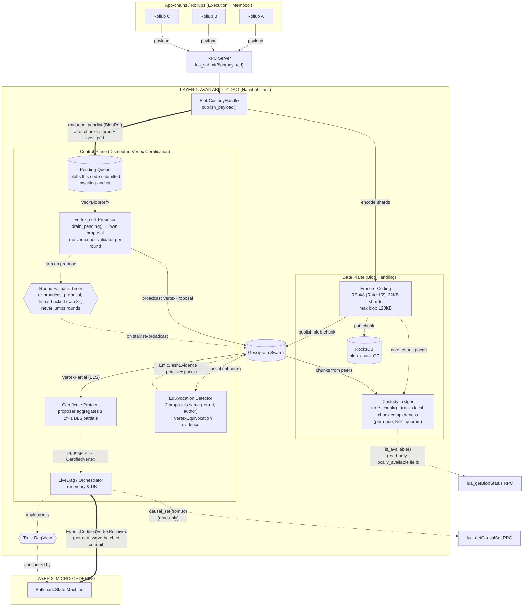

# Layer 1 Architecture — Availability DAG

```mermaid
flowchart TD
    subgraph Rollups["App-chains / Rollups (Execution + Mempool)"]
        direction LR
        RA["Rollup A"]
        RB["Rollup B"]
        RC["Rollup C"]
    end

    RPC["RPC Server<br/>lua_submitBlob(payload)"]

    subgraph Layer1["LAYER 1: AVAILABILITY DAG (Narwhal-class)"]
        direction TB

        BCH["BlobCustodyHandle<br/>publish_payload()"]
        Gossip[("Gossipsub Swarm")]

        subgraph DataPlane["Data Plane (Blob Handling)"]
            direction TB
            RS["Erasure Coding<br/>RS 4/8 (Rate 1/2), 32KB shards<br/>max blob 128KB"]
            DB[("RocksDB<br/>blob_chunk CF")]
            Ledger["Custody Ledger<br/>note_chunk() · tracks local chunk completeness<br/>(per-node, NOT quorum)"]
        end

        subgraph ControlPlane["Control Plane (Distributed Vertex Certification)"]
            direction TB
            PQ[("Pending Queue<br/>blobs this node submitted<br/>awaiting anchor")]
            Proposer["vertex_cert Proposer<br/>drain_pending() → own proposal<br/>one vertex per validator per round"]
            CertBuilder["Certificate Protocol<br/>proposer aggregates ≥ 2f+1 BLS partials"]
            FallbackTimer{{"Round Fallback Timer<br/>re-broadcast proposal, linear backoff (cap 8×)<br/>never jumps rounds"}}
            Slashing["Equivocation Detector<br/>2 proposals same (round, author)<br/>→ VertexEquivocation evidence"]
            LiveDag["LiveDag / Orchestrator<br/>In-memory & DB"]
        end

        DagView{{"Trait: DagView"}}
    end

    subgraph Layer2["LAYER 2: MICRO-ORDERING"]
        Bullshark["Bullshark State Machine"]
    end

    %% Ingress
    RA -->|"payload"| RPC
    RB -->|"payload"| RPC
    RC -->|"payload"| RPC
    RPC --> BCH

    %% Data plane: chunks fan out, then BCH enqueues directly
    BCH -->|"encode shards"| RS
    RS -->|"put_chunk"| DB
    RS -->|"publish blob-chunk"| Gossip
    BCH ==>|"enqueue_pending(BlobRef)<br/>after chunks stored + gossiped"| PQ

    %% Ledger is fed by BOTH local publish and gossip ingest
    RS -.->|"note_chunk (local)"| Ledger
    Gossip -->|"chunks from peers"| Ledger
    Ledger -.->|"is_available()<br/>(read-only, locally_available field)"| RPCStatus["lua_getBlobStatus RPC"]

    %% Control plane
    PQ -->|"Vec&lt;BlobRef&gt;"| Proposer
    Proposer -->|"broadcast VertexProposal"| Gossip
    Gossip -->|"VertexPartial (BLS)"| CertBuilder
    CertBuilder -->|"aggregate → CertifiedVertex"| LiveDag

    %% Liveness: round stalls → re-broadcast own proposal
    Proposer -.->|"arm on propose"| FallbackTimer
    FallbackTimer -.->|"on stall: re-broadcast"| Gossip

    %% Safety: conflicting proposals from a peer → slash evidence
    Gossip -->|"VertexProposal (inbound)"| Slashing
    Slashing -.->|"EmitSlashEvidence → persist + gossip"| Gossip

    %% Layer 1 → Layer 2
    LiveDag ==>|"Event::CertifiedVertexReceived<br/>(per-cert, wave-batched commit)"| Bullshark
    LiveDag -.->|"causal_set(from,to)<br/>(read-only)"| RPCCausal["lua_getCausalSet RPC"]
    LiveDag -.->|"implements"| DagView
    DagView -.->|"consumed by"| Bullshark
```
