# Network & Gossip Architecture — LUA-DAG

---

## 1. Quick summary

LUA-DAG separates **consensus logic** (the consensus state machine) from **network infrastructure** (libp2p):


| Layer           | Crate / module     | Knows                                         | Does not know                  |
| --------------- | ------------------ | --------------------------------------------- | ------------------------------ |
| Consensus       | `crates/consensus` | `Event`, `Action`, L2/L3/L1 algorithms        | libp2p, sockets, TCP           |
| Network adapter | `crates/net`       | libp2p, gossipsub, Borsh wire format          | consensus decisions            |
| Host / node     | `apps/node`        | channel wiring, RocksDB, timers, blob custody | (delegates to net + consensus) |


The real **production path** does **not** go through `Bridge::translate_action` (skeleton); it goes through:

```
swarm_runner (libp2p event loop)
    ↔ gossip_wire (encode/decode + topic routing)
    ↔ mpsc channels ↔ Orchestrator ↔ StateMachine
```

---


## 2. Place in the overall architecture

Per the folder architecture spec (§7.3), the network layer sits **under** the host node and **beside** consensus — it does not reach into the state machine:

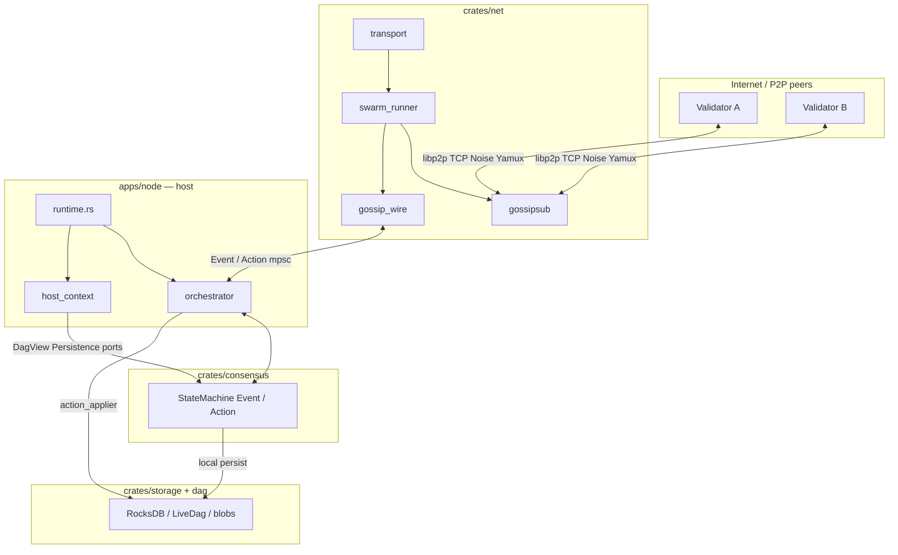


**Golden rule**: `consensus` **never** `use libp2p::`*. Every byte on the wire goes through `crates/net`.

---


## 3. Design principles

1. **Pure consensus, impure adapters** — the SM is deterministic and offline-testable; the network can be swapped for mock/sim without touching the algorithm.
2. **A single wire gateway** — `gossip_wire.rs` is where topic + Borsh ↔ `Event`/`Action` mapping lives. Avoid scattering encode logic across many files.
3. **Topic versioning** — Prefix `lua-dag/v1/`; do not rename old topics, only **add** new variants (see comments in `topics.rs`).
4. **Two publish paths**:
  - **Consensus-driven**: `Action` → orchestrator → `net_actions_tx` → swarm → gossip.
  - **Host-driven**: L1 driver / blob custody → `publish_tx` → swarm (bypasses SM for DA latency).
5. **Fail visible** — Buffer full → WARN log + drop metric; decode fail → log, do not crash the swarm.
6. **Layered identity** — `PeerId` (libp2p Ed25519 keypair on devnet) ≠ `ValidatorId` (consensus). `IdentityMap` maps when attribution is needed.

---


## 4. Transport layer — physical connectivity

The **Transport** layer is the lowest layer in the libp2p network stack: it turns packets on the Internet into **authenticated, encrypted P2P connections that support multiple logical streams** — the foundation on which gossipsub and other protocols run. In LUA-DAG, transport is configured in `crates/net/src/transport.rs` and used by the Swarm when a validator node **listens** (awaits connections) or **dials** (actively connects to a peer).

### 4.1 What is Transport in libp2p?

In libp2p, **Transport** is an abstraction (trait) that answers two questions:

- **Dial**: how do we open an *outbound* connection to an address?
- **Listen**: how do we accept *inbound* connections from other peers?

Once transport completes, the Swarm receives an **upgraded connection** — bound to an authenticated **PeerId**, able to open **substreams** for each protocol (gossipsub, identify, request-response, …). Gossipsub does **not** send blocks/votes straight onto a socket; it borrows substreams on the connection that transport already built.

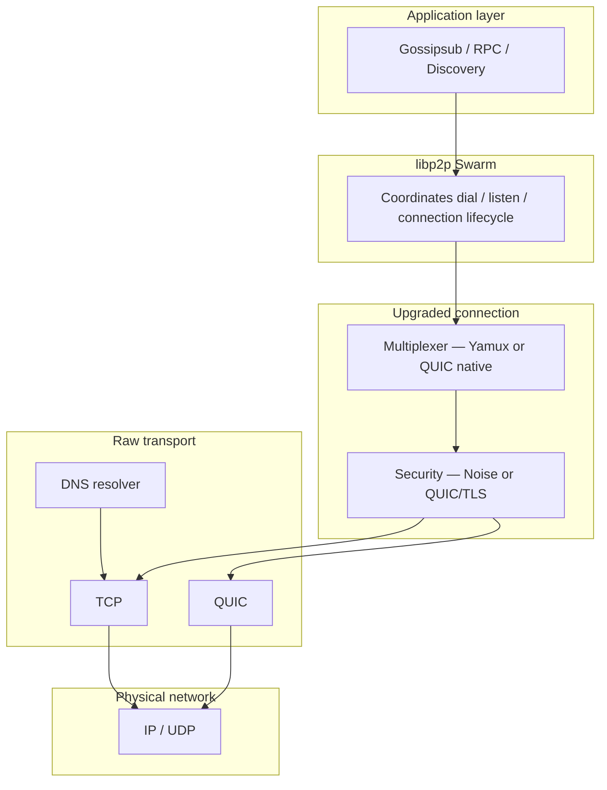


### 4.2 Multiaddr — self-describing addresses

libp2p does not use plain `host:port` strings; it uses **Multiaddr**: a string that describes the **entire protocol stack** to traverse, from outside inward.


| Example Multiaddr                      | Meaning                            |
| -------------------------------------- | ---------------------------------- |
| `/ip4/203.0.113.5/tcp/9000`            | IPv4 + TCP port                    |
| `/dns4/boot.lua-dag.io/tcp/9000`       | Resolve DNS first, then TCP        |
| `/ip4/203.0.113.5/udp/9000/quic-v1`    | QUIC over UDP                      |
| `/dns4/node-a/tcp/9000/p2p/12D3Koo...` | DNS + TCP + **destination PeerId** |


The Swarm uses Multiaddr when:

- `listen_on`: the node opens a listen port and advertises its address.
- `dial`: the node connects to a bootstrap peer or a newly discovered peer.
- **Bootstrap config**: a list of known network entry points.

Transport reads the Multiaddr to **select the appropriate transport branch** (TCP or QUIC) and to know whether DNS is required.

### 4.3 Why a multi-layer stack instead of a raw socket?

A **raw TCP socket** only provides a bidirectional byte stream — no identity, no encryption, a single channel. For a validator P2P network, that lacks three fundamentals:


| Raw socket gap                                                                                       | Solution in the libp2p stack                                                      |
| ---------------------------------------------------------------------------------------------------- | --------------------------------------------------------------------------------- |
| **No peer authentication** — no way to know the other side has the correct PeerId/validator          | **Noise** (TCP branch) or **built-in TLS 1.3** (QUIC branch) binds keys to PeerId |
| **No encryption** — votes, block headers, blob chunks exposed on the wire                            | AEAD encrypted channel after handshake                                            |
| **One socket = one stream** — gossipsub, sync, ping each need their own TCP → socket waste, NAT pain | **Multiplexing** (Yamux on TCP, native streams on QUIC)                           |
| **Hard-wired to TCP** — hard to add QUIC/WebSocket/memory transport for tests                        | **Transport** trait + **or_transport** — upper layers unchanged                   |


libp2p builds connections by **composition + upgrade**: start from a raw byte stream, then **progressively upgrade** into a secure, multi-stream connection.

### 4.4 Two transport branches and `or_transport`

LUA-DAG (via `build_transport`) supports **two parallel transport paths**, combined with `or_transport`: on dial, whichever transport **recognizes** the Multiaddr handles it.

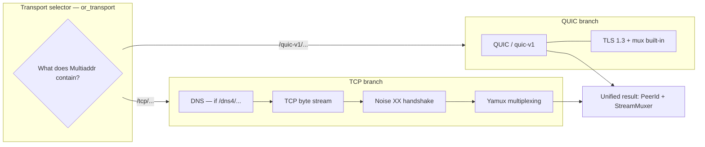


**Key point**: both branches return the **same interface** to the Swarm — `(PeerId, StreamMuxer)`. Gossipsub and consensus **do not need to know** whether a peer is on TCP or QUIC.

### 4.5 Layer details


#### 4.5.1 DNS — hostname resolution

**DNS** (in libp2p) wraps the underlying transport: if the Multiaddr contains `/dns4`, `/dns6`, or `/dnsaddr`, this layer resolves hostname → IP **before** opening TCP.

- Allows bootstrap/listen to use **stable domain names** instead of hard-coded IPs.
- If the IP behind DNS changes → node config does not need editing.
- Fully **transparent** to gossipsub: upper layers only see connection success or failure.


#### 4.5.2 TCP — reliable byte stream

**TCP** (Transmission Control Protocol) provides a **full-duplex**, **ordered**, **self-retransmitting** connection when packets are lost.

- Widely deployed; traverses most firewalls.
- TCP itself does **not** encrypt, **does not** authenticate peers, and **does not** multiplex — so **Noise** and **Yamux** upgrades are required.
- Optional `TCP_NODELAY` (nodelay): reduces buffering, lowers latency for small messages (votes, gossipsub heartbeats).


#### 4.5.3 QUIC — modern transport over UDP

**QUIC** runs over UDP and builds in much of what the TCP branch must assemble separately:


| Capability                           | TCP + Noise + Yamux        | QUIC                              |
| ------------------------------------ | -------------------------- | --------------------------------- |
| Encryption + authentication          | Noise XX (3 messages)      | TLS 1.3 inside the QUIC handshake |
| Multiplexing                         | Yamux over one byte stream | Streams are a native QUIC concept |
| Head-of-line blocking across streams | Yes (TCP is one stream)    | No at the transport layer         |
| Connection setup                     | TCP 3-way + Noise 3 msgs   | ~1 RTT (0-RTT with cache)         |


In libp2p, the QUIC branch does **not** go through Noise/Yamux — TLS and mux already live inside QUIC. PeerId is still verified via the certificate/key bound to the node identity.

#### 4.5.4 Noise — security and PeerId authentication (TCP branch)

After TCP connects, libp2p runs the **Noise Protocol Framework**, pattern **XX** (libp2p 0.55):

```
Dialer                          Listener
  │ ── e (ephemeral key) ────────► │
  │ ◄── e, ee, s, es ──────────── │   (static key s is encrypted)
  │ ── s, se ────────────────────► │
  │ ══ bidirectional AEAD channel ═════ │
```

Notation: `e` = ephemeral key, `s` = static key (identity), `ee/es/se` = Diffie-Hellman steps mixed into the session key.

Noise provides:

- **Encryption + integrity** (AEAD) for every byte after the handshake.
- **PeerId authentication**: the Noise static key is bound to the libp2p keypair — a peer spoofing an ID is disconnected immediately.
- **Forward secrecy**: ephemeral keys protect past sessions if the static key is later exposed.

This is the first line of defense before any gossip message is processed.

#### 4.5.5 Yamux — multiplexing (TCP branch)

**Yamux** (Yet Another Multiplexer) splits **one encrypted connection** into many logical **substreams**:

```
One TCP + Noise connection
         │
    ┌────┴────┬────────┬─────────┐
    ▼         ▼        ▼         ▼
 Stream 1  Stream 2  Stream 3  Stream N
 Gossipsub  Identify   RPC     Ping
```

Each substream:

- Has its own ID, opens/closes independently, full-duplex.
- Has its own **flow control** (window) — a slow sync stream does not throttle gossipsub votes.

Thanks to Yamux, each validator pair usually needs only **one physical connection** for every libp2p protocol.

#### 4.5.6 Handshake — the handshaking process

A **handshake** is the initial exchange before application data. In the libp2p stack there are **two levels**:


| Level        | TCP branch                           | QUIC branch                  |
| ------------ | ------------------------------------ | ---------------------------- |
| Physical     | TCP three-way handshake              | QUIC initial handshake (UDP) |
| Security     | Noise XX (3 messages)                | TLS 1.3 (built-in)           |
| Multiplexing | Negotiate Yamux (multistream-select) | Streams already available    |


Only after the handshake completes does the Swarm consider the connection **ready**, and behaviours (gossipsub) may open substreams.

#### 4.5.7 Upgrade — sequential connection upgrades (TCP branch)

With TCP, libp2p does not use the raw socket directly; it **upgrades** via **multistream-select**:

```
TCP connected
      │
      ▼  negotiate: "/noise"
   Noise XX  →  encrypted channel + authenticated PeerId
      │
      ▼  negotiate: "/yamux/1.0.0"
    Yamux    →  StreamMuxer
      │
      ▼
 Ready for protocols (gossipsub, …)
```

Each step adds a capability; this design allows **replacing/adding** new security protocols or muxers without breaking upper layers.

### 4.6 Transport's role in the Swarm

The Swarm combines **Transport** (how to connect) with **NetworkBehaviour** (what to do with connections — gossipsub in LUA-DAG).


| Swarm operation        | What Transport does                                       | In LUA-DAG                                |
| ---------------------- | --------------------------------------------------------- | ----------------------------------------- |
| `listen_on(multiaddr)` | Opens a listen endpoint; emits `NewListenAddr`            | Validator listens on a P2P port           |
| `dial(multiaddr)`      | Selects TCP/QUIC branch, runs upgrade, returns connection | Connect to bootstrap / new peer           |
| Connection management  | Tracks establish/close; grants substreams to behaviours   | Gossipsub requests substreams on the mesh |


By the time gossipsub sees it, the connection is **always** upgraded — gossipsub only handles publish/subscribe/mesh, never TCP/Noise/Yamux.

### 4.7 Transport ↔ Gossipsub relationship

Clear separation of concerns:


| Layer         | Question answered                                              |
| ------------- | -------------------------------------------------------------- |
| **Transport** | *How do two validators connect securely and exchange bytes?*   |
| **Gossipsub** | *Which messages disseminate, on which topics, via which mesh?* |


Flow when validator A sends a message to B:

1. The Swarm already has (or dials) an upgraded connection to B.
2. Gossipsub opens a substream on the muxer.
3. Borsh payload (MicroQc, MacroProposal, …) travels on the encrypted substream.
4. On B: transport decrypts → Yamux/QUIC demux → gossipsub receives → `gossip_wire` decodes → `Event`.

Transport does **not** understand consensus content; gossipsub does **not** understand socket details.

### 4.8 Summary of layer responsibilities


| Layer            | Responsibility                                      | Notes                           |
| ---------------- | --------------------------------------------------- | ------------------------------- |
| **DNS**          | Hostname → IP in Multiaddr                          | Usually on the dial side        |
| **TCP**          | Reliable byte stream over IP                        | Needs Noise + Yamux upgrade     |
| **Noise XX**     | Encryption, integrity, PeerId auth, forward secrecy | TCP branch only                 |
| **Yamux**        | Multiple substreams, flow control                   | TCP branch only                 |
| **QUIC**         | Transport + TLS 1.3 + mux over UDP                  | Does not go through Noise/Yamux |
| **or_transport** | Selects branch by Multiaddr; unified interface      | Result: `(PeerId, StreamMuxer)` |


Reference implementation: `crates/net/src/transport.rs` — `build_transport` (QUIC + TCP/Noise/Yamux), `build_transport_tcp_only` (DNS + TCP/Noise/Yamux).

---


## 5. Gossip layer — message dissemination

If the **Transport** layer answers *“how do two validators connect securely?”*, the **Gossip** layer answers *“how do consensus messages reach the whole network at a reasonable bandwidth cost?”*. LUA-DAG uses **libp2p Gossipsub** — pub/sub with a mesh overlay — as the primary distribution mechanism for MicroQc, MacroProposal, vertex certs, slash evidence, and blob shards.

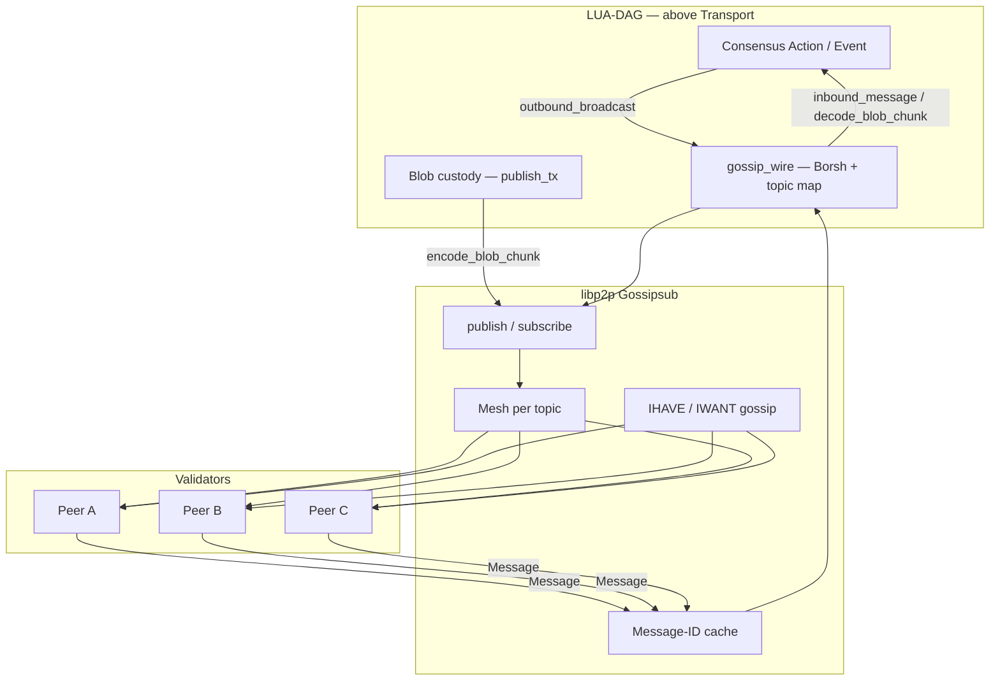


---


### 5.1 Gossip protocol — word-of-mouth dissemination

A **gossip protocol** mimics how rumors spread in society: a node receives a new message → forwards it to a **small set of neighbors** → neighbors forward again → the message gradually reaches the whole network.

```
        Node A (source)
       /    \
      B      C
     / \    / \
    D   E  F   G
```

**Advantages** vs a central server:

- No single point of failure — losing one node does not stop the network.
- Bandwidth is **distributed** — nobody floods every peer on every publish.
- Scales naturally as validators are added.

**Pure gossip drawback**: the same message can arrive multiple times via different paths → need **dedup** and mesh/IHAVE mechanisms to control bandwidth. Gossipsub addresses this.

---


### 5.2 Publish / Subscribe (Pub/Sub)

**Pub/Sub** decouples senders from receivers:


| Concept       | Meaning                                                               |
| ------------- | --------------------------------------------------------------------- |
| **Topic**     | Logical channel — a “chat room” per data type                         |
| **Subscribe** | Node registers to receive every message on a topic                    |
| **Publish**   | Node sends a payload on a topic; the network routes it to subscribers |


The publisher **does not need to know** the peer list — only `publish(topic, bytes)`. This fits a validator set that changes by epoch.

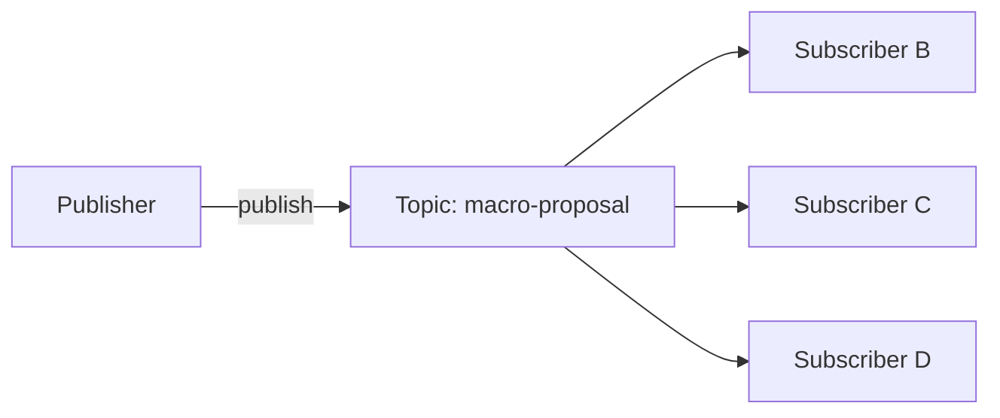


---


### 5.3 Gossipsub — Pub/Sub + mesh overlay

**Gossipsub** (libp2p) combines pub/sub with a **mesh overlay** per topic: instead of sending the full payload to every subscriber, each node maintains a small set of **mesh peers** and only floods full messages within the mesh.

#### 5.3.1 Mesh

For each subscribed topic, a node keeps a **mesh** — the set of peers that receive the **full payload** directly:

```
Topic "macro-qc" — Node A's mesh (~8 peers)

        B
       / \
      A---C
       \ /
        D
```

When A publishes, the payload goes to mesh peers; they forward further in their meshes → the message reaches the whole network at roughly O(mesh × hops) cost, not O(N²).

#### 5.3.2 GRAFT / PRUNE — maintaining the mesh

On each **heartbeat**, gossipsub compares mesh size to thresholds:


| Parameter      | Role                                                     |
| -------------- | -------------------------------------------------------- |
| `mesh_n`       | Target number of peers in the mesh                       |
| `mesh_n_low`   | Below threshold → **GRAFT** (add peers to the mesh)      |
| `mesh_n_high`  | Above threshold → **PRUNE** (remove peers from the mesh) |
| `heartbeat_ms` | Mesh maintenance + metadata gossip period                |


In LUA-DAG (`NetConfig.gossip`): `mesh_n = 8`, `mesh_n_low = 6`, `mesh_n_high = 12`, `heartbeat_ms = 700`.

The heartbeat is also when gossipsub sends **IHAVE**, handles **IWANT**, and updates **peer scores**.

#### 5.3.3 Fanout

A node may **publish** on a topic it has **not subscribed** to (e.g. publish once and not listen). Gossipsub creates a temporary **fanout** set — a few peers already subscribed to that topic — so the message still has an entry into the network. Fanout does not replace the mesh; when the node stays subscribed long-term, the mesh replaces fanout.

#### 5.3.4 IHAVE / IWANT — metadata gossip

Peers **outside the mesh** that subscribe to the same topic do not receive the full payload every time. Instead:

```
1. Node A ── IHAVE [msg-id-1, msg-id-2] ──► Node D (outside mesh)
2. Node D missing msg-id-2 ── IWANT [msg-id-2] ──► Node A
3. Node A ── full payload msg-id-2 ──► Node D
```


| Step         | What is sent                 | Purpose                                     |
| ------------ | ---------------------------- | ------------------------------------------- |
| **IHAVE**    | List of **Message-IDs** held | Advertise “I have new news” — small payload |
| **IWANT**    | IDs to fetch                 | Peer missing news requests content          |
| **Response** | Full message                 | Bytes sent only when actually needed        |


This reduces bandwidth versus blind flooding the whole network.

#### 5.3.5 Message-ID and deduplication

A message can reach the same node via multiple paths:

```
A → B → D
A → C → D   (same message, two paths)
```

Gossipsub assigns a unique **Message-ID** to each message. Nodes keep a **cache** of IDs already seen:

- **New** ID → accept, forward (if valid), process.
- **Duplicate** ID → drop — prevents infinite loops and duplicate processing.

This is dedup **at the gossipsub layer** (P2P network).

#### 5.3.6 Peer scoring

Gossipsub tracks a **reputation score** per peer (P1–P7 in the gossipsub v1.1 spec):


| Behavior                           | Score impact                              |
| ---------------------------------- | ----------------------------------------- |
| Forward valid messages on time     | Score up                                  |
| Spam, invalid messages, slow IWANT | Score down                                |
| Low score                          | Less often chosen for mesh; may be PRUNEd |


LUA-DAG has its own `PeerManager` scoring (`crates/net/src/peers/`) — intended to integrate with gossipsub peer score; business logic (equivocation, slash) lives in consensus.

#### 5.3.7 ValidationMode and MessageAuthenticity

Two security knobs when initializing the gossipsub behaviour:


| Setting                       | Meaning in LUA-DAG                                                                                                                                                                                                          |
| ----------------------------- | --------------------------------------------------------------------------------------------------------------------------------------------------------------------------------------------------------------------------- |
| `ValidationMode::Strict`      | Messages must pass validation before gossipsub forwards them to other peers. Strict mode — prevents junk payloads from spreading on the overlay.                                                                            |
| `MessageAuthenticity::Signed` | Every gossip message is **signed with the publisher's libp2p keypair**. Receivers verify the signature before processing — a **wire**-level authenticity layer, separate from BLS signatures **inside** consensus payloads. |


**Two authentication layers** (do not confuse them):

```
libp2p layer (Signed)     → who published on gossipsub? Does PeerId match the wire signature?
consensus layer (Borsh)   → is the MicroQc / MacroQc / vertex cert protocol-valid?
```

After gossipsub delivers a message, LUA-DAG decodes Borsh in `gossip_wire`; codec errors → WARN log, do not feed the state machine. Consensus `step()` then verifies BLS signatures and protocol rules.

---


### 5.4 Gossipsub's role in the LUA-DAG Swarm

`swarm_runner` attaches `gossipsub::Behaviour` to `LuaDagBehaviour`. The event loop handles:


| Gossipsub event               | Meaning                                           |
| ----------------------------- | ------------------------------------------------- |
| `Message { topic, data }`     | Inbound payload → decode                          |
| `Subscribed` / `Unsubscribed` | Peer joined/left the topic overlay                |
| `GossipsubNotSupported`       | Peer connected but does not speak gossipsub       |
| `SlowPeer`                    | Peer is slow to forward — network quality warning |


Outbound: `swarm.behaviour_mut().gossipsub.publish(topic, payload)` from two sources — `actions_rx` (consensus broadcast) and `publish_tx` (blob/L1 direct).

---


### 5.5 LUA-DAG topic system

Every topic uses the prefix `lua-dag/v1/` — the wire protocol version. **Do not change** old topic names; add new kinds as new variants (`gossip/topics.rs`).


| `Topic`           | Wire name                     | Data type                              |
| ----------------- | ----------------------------- | -------------------------------------- |
| `CertifiedVertex` | `.../certified-vertex`        | Certified L1 vertex                    |
| `VertexProposal`  | `.../vertex-proposal`         | Vertex proposal (distributed cert)     |
| `VertexPartial`   | `.../vertex-partial`          | Partial vote for a vertex              |
| `MicroQc`         | `.../micro-qc`                | Micro quorum certificate (L2)          |
| `MacroProposal`   | `.../macro-proposal`          | Macro checkpoint proposal (L3)         |
| `BlsPartial(s)`   | `.../bls-partial/{subnet_id}` | BLS partial signature by subnet        |
| `SubnetAggregate` | `.../subnet-aggregate`        | Subnet signature aggregate             |
| `MacroQc`         | `.../macro-qc`                | Macro QC                               |
| `SlashEvidence`   | `.../slash-evidence`          | Slash evidence                         |
| `BlobChunk`       | `.../blob-chunk`              | Erasure blob shard (data availability) |


**Why so many topics?**

- Validators subscribe only to streams they must process → less CPU/bandwidth.
- Mesh is **per topic** — a slow macro QC does not block fast vertex partials.
- `bls-partial/{subnet}` — Mode A aggregation: one channel per subnet, avoiding one giant topic.


#### Dynamic subscribe set

When the swarm starts, `subscribe_set(macro_subnet_count)`:

- Subscribes to all fixed topics in the table above.
- `BlsPartial`: subscribes `lua-dag/v1/bls-partial/0` … `/{N-1}` with `N = macro_subnet_count` (flat mode: count = 0 → subscribe subnet 0).

`macro_subnet_count` may be derived from validator set size via `compute_ke` when config = 0.

---


### 5.6 Borsh payload — wire format

Gossipsub only carries `Vec<u8>`. LUA-DAG serializes protocol structs with **Borsh** (deterministic, compact):

```
Rust struct (MicroQc, MacroProposal, …)
        │  borsh::to_vec
        ▼
    Vec<u8> payload
        │  gossipsub.publish(topic, payload)
        ▼
    Peer decode → struct
```

Helpers (`gossip/codec.rs`):

```rust
encode_action_payload<T: BorshSerialize>(value: &T) -> Vec<u8>
decode_event_payload<T: BorshDeserialize>(bytes: &[u8]) -> T
```

**BlobChunk** encode/decode goes directly through `borsh` in `gossip_wire` (type from the `dag` crate).

---


### 5.7 `gossip_wire` — Action/Event ↔ topic bridge

The central module mapping consensus ↔ gossip. Three main functions:


| Function             | Direction | Input → Output                         |
| -------------------- | --------- | -------------------------------------- |
| `outbound_broadcast` | Outbound  | `Action` → `Option<(Topic, Vec<u8>)>`  |
| `inbound_message`    | Inbound   | `(topic_str, bytes)` → `Option<Event>` |
| `is_broadcast`       | Routing   | Does this `Action` go on gossip?       |


**Outbound** — consensus emits an `Action`:

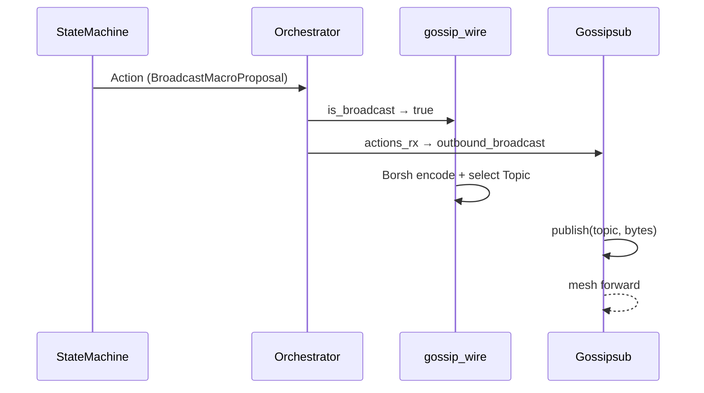


Actions that do **not** go on gossip: `ScheduleTimer`, `PersistMacroQc`, `UpdateBlobStatus`, … → `outbound_broadcast` returns `Ok(None)`.

**Inbound** — a peer sends a message:

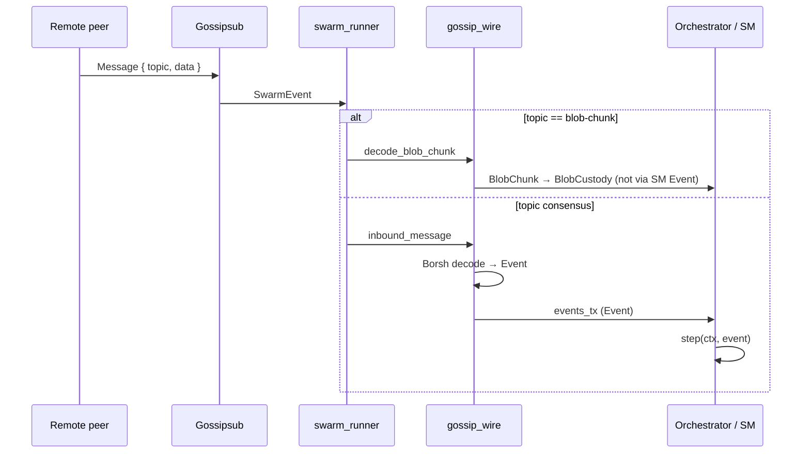


**Special inbound validation**: topic `bls-partial/{n}` — payload must have `p.subnet == n`, otherwise codec error (prevents wrong-subnet sends).

Full mapping table: see [section 8](#8-topic--payload--eventaction-table).

#### Third publish path — bypass consensus queue

L1 driver / blob custody calls `encode_certified_vertex` / `encode_blob_chunk` → `publish_tx` → swarm publishes directly. Does not go through a state-machine `Action` — lower latency for data availability.

#### Certified vertex loopback

Gossipsub does **not deliver** messages the node itself published. The Orchestrator loopbacks `CertifiedVertexReceived` via `events_tx` so LiveDag and Bullshark see the local cert.

---


### 5.8 Separating `blob-chunk`

Blob shards differ from consensus messages in **size, frequency, and consumer**:


|              | Consensus message                | `blob-chunk`                        |
| ------------ | -------------------------------- | ----------------------------------- |
| Size         | Small (QC, vote, proposal)       | Large (erasure shard)               |
| Consumer     | State machine (`Event`)          | `BlobCustody` task                  |
| Decode       | `inbound_message` → `Event`      | `decode_blob_chunk` → `BlobChunk`   |
| Backpressure | `events_tx` full → drop + metric | `blob_chunks_tx` full → drop + WARN |


Separating streams avoids clogging the consensus channel when DA shards flood in.

---


### 5.9 Publisher dedup ring

Besides gossipsub's Message-ID dedup, `gossip/publisher.rs` has a **Publisher** — a ring buffer of BLAKE3 payload hashes:

```
payload bytes → BLAKE3 → seen in window of N? → drop : publish + record
```

Prevents publishing duplicate payloads in a recent window (same Action called twice, accidental re-broadcast). The module is ready; it can be attached to the publish path when needed.

---


### 5.10 Summary — what does the Gossip layer answer?


| Question                 | Answer                                                          |
| ------------------------ | --------------------------------------------------------------- |
| How do messages spread?  | Gossipsub mesh + IHAVE/IWANT per topic                          |
| Who receives what?       | Subscribe to topics; mesh ~8 peers/topic; bls-partial by subnet |
| Wire format?             | Borsh bytes; topic `lua-dag/v1/...`                             |
| How does consensus talk? | `Action` → `gossip_wire` → publish; inbound → `Event`           |
| Blob DA?                 | Separate topic + `decode_blob_chunk` + `publish_tx`             |
| Anti-spam/dedup?         | Message-ID dedup, Signed, Strict, peer scoring, publisher dedup |


Implementation: `crates/net/src/gossip/`, `gossip_wire.rs`, `swarm_runner.rs` (gossipsub behaviour + event loop).

---


## 6. Inbound / Outbound data flows

All communication among **libp2p**, the **consensus state machine**, and the **host** (persist, timer, blob) in `apps/node` goes through **asynchronous channels** — no direct cross-task calls. This section describes each pipeline: who sends what, through which channel, and the policy when the queue is full.

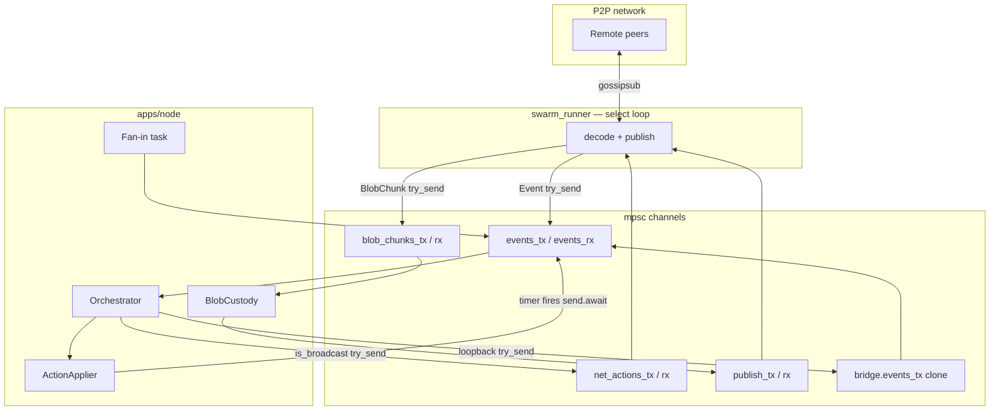


---


### 6.1 Foundations: channels, fan-in/out, backpressure


#### 6.1.1 `tokio::sync::mpsc` — Multi-Producer, Single-Consumer

Each pipeline uses a **bounded channel**:

- Many `Sender`**s** (cloneable) write into one FIFO queue.
- A single `Receiver` reads sequentially.
- The boundary between tasks — transferring ownership of data **without a mutex** on Event/Action.

Example: `events_tx` may be cloned by swarm fan-in, bridge loopback, and the timer task — all converge on one `events_rx` owned by the orchestrator.

#### 6.1.2 Fan-in and fan-out


| Concept     | In LUA-DAG                                                                                                    |
| ----------- | ------------------------------------------------------------------------------------------------------------- |
| **Fan-in**  | Many sources → one `events_rx`: gossip inbound, fan-in from swarm, cert loopback, `TimerFired`                |
| **Fan-out** | One `dispatch_actions` → many destinations: `net_actions_tx`, `action_applier`, `bridge.events_tx` (loopback) |


The Orchestrator processes Events **sequentially** on one receiver — avoiding races on the state machine. Fan-out after `step()` does **not** use a broadcast channel; each `Action` is routed manually.

#### 6.1.3 Backpressure — bounded queues

Channel capacity is typically **1024** (`EVENT_BUFFER` in swarm, runtime wiring). When the consumer is slower than the producer → the queue fills → **backpressure**.

Two ways to react:


| API            | Behavior when full                                     | Risk                                                                       |
| -------------- | ------------------------------------------------------ | -------------------------------------------------------------------------- |
| `send().await` | Producer task **suspends** until space frees           | Data-safe; can **block the event loop** if called from the swarm `select!` |
| `try_send()`   | Returns `TrySendError::Full` **immediately** — no wait | Producer drops / logs / metrics itself — **does not block** the loop       |


**LUA-DAG principle**: on the **swarm** `select!` **loop** and the **orchestrator hot path**, prefer `try_send` — accepting local message loss (gossip is redundant; sync/timeout covers gaps) is better than hanging all network I/O.

Exception: when a timer fires it uses `events_tx.send(...).await` — accept briefly blocking the timer task rather than losing `TimerFired`.

#### 6.1.4 Main channel map


| Channel                             | Payload            | Producer(s)                     | Consumer                  | Capacity (typical)   |
| ----------------------------------- | ------------------ | ------------------------------- | ------------------------- | -------------------- |
| `events_tx` → `events_rx`           | `Event`            | Fan-in, bridge loopback, timers | Orchestrator              | 1024                 |
| `spawn.events_rx` → fan-in          | `Event`            | swarm_runner (internal)         | Fan-in task → `events_tx` | 1024                 |
| `net_actions_tx` → `net_actions_rx` | `Action`           | Orchestrator                    | swarm_runner              | 1024                 |
| `publish_tx` → `publish_rx`         | `(Topic, Vec<u8>)` | BlobCustody, L1 encode          | swarm_runner              | 1024                 |
| `blob_chunks_tx`                    | `BlobChunk`        | swarm_runner                    | BlobCustody               | 1024                 |
| `bridge.events_tx`                  | `Event`            | Orchestrator (loopback)         | Same bus → `events_rx`    | clone of `events_tx` |
| `timer_schedule_tx`                 | `(TimerId, delay)` | ActionApplier                   | Timer loop                | 256                  |


---


### 6.2 Event-driven model

Consensus does **not** call libp2p. libp2p does **not** call `StateMachine::step`. The runtime stands in between:

```
Peer → Swarm → decode → Event → Orchestrator → step() → Vec<Action>
                                                              ↓
                                    ┌─────────────────────────┼─────────────────────────┐
                                    ▼                         ▼                         ▼
                              net_actions              action_applier            bridge loopback
                                    ↓                         ↓                         ↓
                              gossip publish            persist / timer              Event again
```

Closed loop: Event in → Action out → some Actions become gossip outbound → other peers → Event inbound.

---


### 6.3 Four core data paths


| #     | Name                         | Direction      | Short description                                        |
| ----- | ---------------------------- | -------------- | -------------------------------------------------------- |
| **1** | **Inbound gossip → Event**   | Network → SM   | Decode wire → `Event` → orchestrator                     |
| **2** | **Outbound Action → gossip** | SM → Network   | Broadcast `Action` → encode → publish                    |
| **3** | **publish_tx**               | Host → Network | Pre-encoded bytes + topic; bypasses Action queue         |
| **4** | **CertifiedVertex loopback** | SM → SM        | Own cert is not echoed by gossipsub → inject local Event |


Plus a side branch: **blob-chunk inbound → BlobCustody** (does not go through SM Event).

---


### 6.4 Path 1 — Inbound: gossip → Event


#### 6.4.1 Inside `swarm_runner` (`select!`)

When gossipsub delivers `Message { topic, data }`:

```
1. decode_blob_chunk(topic, data)?
      Some(chunk) → blob_chunks_tx.try_send(chunk)   [DA channel]
      None        → continue to step 2
2. inbound_message(topic, data)? → Option<Event>
3. events_tx.try_send(event)   [consensus channel — internal to swarm task]
```

- Decode fail → `WARN`, swarm **continues** (no panic).
- `events_tx` full → drop + `WARN` (in swarm task).
- `blob_chunks_tx` full → drop + `WARN`.


#### 6.4.2 Fan-in task (`runtime.rs`)

The swarm returns `spawn.events_rx` (internal receiver). Runtime spawns a task:

```
while ev = spawn.events_rx.recv().await {
    events_tx_for_swarm.try_send(ev)  // merge onto main bus
}
```

If the main bus is full → `metrics.events_dropped` + WARN. This is **fan-in** from swarm into the orchestrator.

#### 6.4.3 Orchestrator receives Event

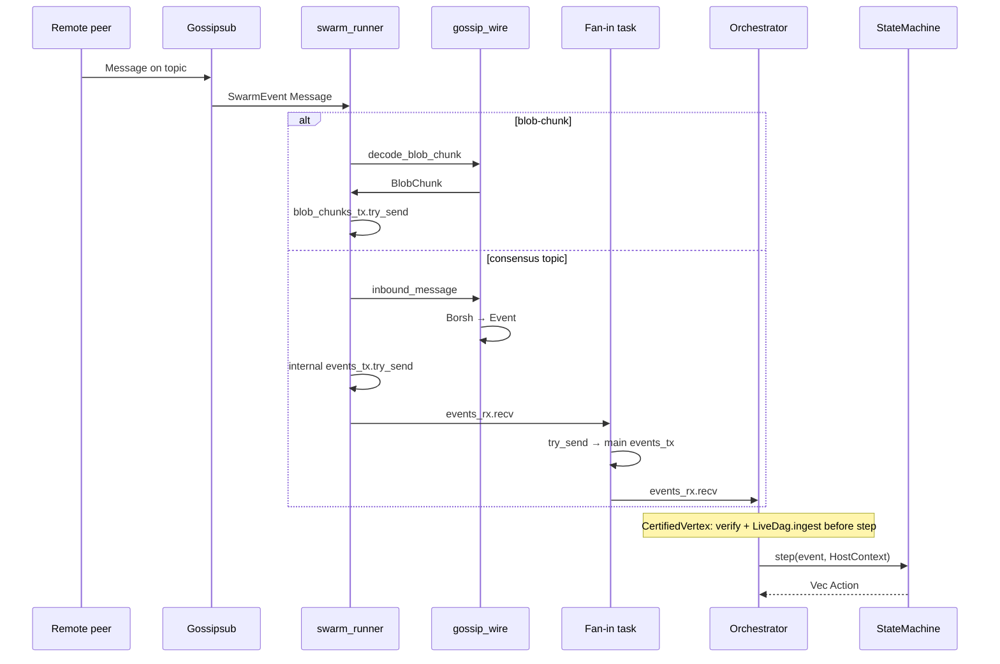


**Special handling for** `CertifiedVertexReceived` (before `step()`):

1. `dag::cert::verify_certified_vertex` — reject if cert invalid.
2. `LiveDag.ingest` — write vertex column to RocksDB.
3. Only then `sm.step(event, ctx)`.

Other Events go straight into `step()`.

**Topic validation**: `bls-partial/{n}` — `payload.subnet` must match `n`.

---


### 6.5 Path 2 — Outbound: Action → gossip

After `step()`, the orchestrator calls `dispatch_actions` for **each** `Action` in the `Vec`:

```rust
// Actual order in orchestrator.rs — same for loop
1. metrics.actions_dispatched++
2. if BroadcastCertifiedVertex → bridge.events_tx.try_send(CertifiedVertexReceived)  // path 4
3. if gossip_wire::is_broadcast(action) → net_actions_tx.try_send(action.clone())     // path 2
4. action_applier.apply(action)  // local — always called, including broadcasts                // persist/timer/...
```

**Important**: broadcast Actions still go through `action_applier` — e.g. `EmitSlashEvidence` both persists evidence and `is_broadcast`; `BroadcastMacroQc` does not persist in the applier, but accompanying timer actions are still applied.

#### 6.5.1 `is_broadcast` vs local Action


| `gossip_wire::is_broadcast` | Example Action                                                              | `net_actions_tx` | `action_applier`             |
| --------------------------- | --------------------------------------------------------------------------- | ---------------- | ---------------------------- |
| `true`                      | `BroadcastMicroQc`, `BroadcastMacroProposal`, `EmitSlashEvidence { .. }`, … | `try_send`       | apply (persist slash if any) |
| `false`                     | `ScheduleTimer`, `PersistMacroQc`, `UpdateBlobStatus`, …                    | skip             | apply only                   |


`outbound_broadcast` in the swarm maps Action → `(Topic, bytes)`; Actions with no wire counterpart return `Ok(None)`.

#### 6.5.2 In the swarm — `actions_rx` branch

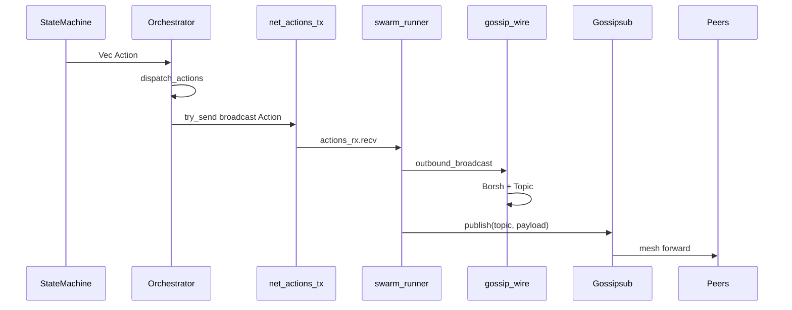


Publish fail (InsufficientPeers, duplicate, …) → `WARN`, no retry in the swarm — consensus timeout/sync owns retry logic.

`net_actions_tx` full → `metrics.actions_dropped` + WARN.

---


### 6.6 Path 3 — `publish_tx`: blob / L1 direct

Some data is **already encoded** as `(Topic, Vec<u8>)` — no need to go through `Action` or `outbound_broadcast` again:


| Source      | Encode function           | Topic              |
| ----------- | ------------------------- | ------------------ |
| BlobCustody | `encode_blob_chunk`       | `blob-chunk`       |
| L1 driver   | `encode_certified_vertex` | `certified-vertex` |


```
BlobCustody / L1
    → publish_tx.send / try_send (Topic, bytes)
    → swarm publish_rx.recv()
    → gossipsub.publish(topic, payload)
```

**Why a separate channel?**

- Blob shards are **bursty** and large — do not clog `net_actions_tx` typed Actions.
- Saves a step: no re-serializing a struct that already has bytes.
- BlobCustody both **receives** inbound chunks (`blob_chunks_rx`) and **publishes** shards (`publish_tx` clone).

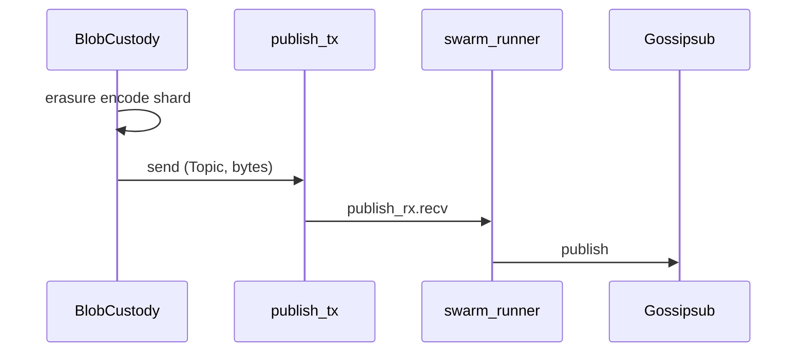


---


### 6.7 Path 4 — `CertifiedVertex` loopback

**Problem**: Gossipsub does **not deliver** messages **this node** published. If the node just `BroadcastCertifiedVertex` onto the network, LiveDag and Bullshark do **not** see the local cert via inbound gossip.

**Solution**: right inside `dispatch_actions`, when seeing `Action::BroadcastCertifiedVertex(cv)`:

```
bridge.events_tx.try_send(Event::CertifiedVertexReceived(cv.clone()))
```

`bridge.events_tx` is a clone of `events_tx` — the event enters the **same bus** as inbound gossip. The next orchestrator iteration treats it like a peer cert (verify + ingest + step).

```
BroadcastCertifiedVertex
    ├─ try_send → net_actions_tx        (peers receive via gossip)
    └─ try_send → bridge.events_tx      (self receives via Event bus)
            └─ events_rx → verify → ingest → step
```

Also uses `try_send` — if full, drop + WARN (do not block the orchestrator).

---


### 6.8 `swarm_runner` — central `select!` loop

One task, three **fair** branches (no branch blocks another indefinitely):

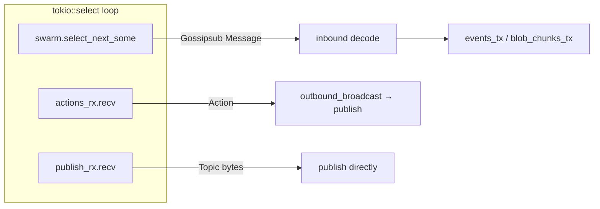


| Branch       | Input                          | Output                          |
| ------------ | ------------------------------ | ------------------------------- |
| Swarm events | libp2p (connect, message, …)   | Inbound decode or lifecycle log |
| `actions_rx` | `Action` from orchestrator     | `gossipsub.publish`             |
| `publish_rx` | Pre-encoded `(Topic, Vec<u8>)` | `gossipsub.publish`             |


If `actions_rx` or `publish_rx` is closed → the swarm task **exits** the loop.

**No swarm** (skeleton / tests without gossip): `net_actions_tx` and `publish_tx` have no consumer — the orchestrator still runs; broadcast Action `try_send` fails or is unwired depending on mode.

---


### 6.9 Actions that do not go on the network

`gossip_wire::outbound_broadcast` → `Ok(None)`; `is_broadcast` → `false`:


| Action                                      | Handled by                                                 |
| ------------------------------------------- | ---------------------------------------------------------- |
| `ScheduleTimer` / `CancelTimer`             | ActionApplier → timer registry; fire → `Event::TimerFired` |
| `PersistMacroQc` / `PersistMacroCheckpoint` | ActionApplier → RocksDB + beacon chain                     |
| `UpdateBlobStatus`                          | ActionApplier → persistence / API tier                     |
| `NotifyInactivityLeak`                      | ActionApplier → metrics / ops log                          |


Timer path:

```
ScheduleTimer → action_applier → timer_schedule_tx
    → schedule_event → tokio sleep
    → events_tx.send(TimerFired).await   // uses send, not try_send
    → orchestrator events_rx → step()
```

---


### 6.10 Backpressure policy — summary


| Send point                      | Mechanism                              | When full                               |
| ------------------------------- | -------------------------------------- | --------------------------------------- |
| Swarm → internal Event          | `try_send`                             | Drop + WARN                             |
| Fan-in → main `events_tx`       | `try_send`                             | `events_dropped` metric                 |
| Orchestrator → `net_actions_tx` | `try_send`                             | `actions_dropped` metric                |
| Loopback → `bridge.events_tx`   | `try_send`                             | WARN                                    |
| Swarm → `blob_chunks_tx`        | `try_send`                             | WARN                                    |
| Timer → `events_tx`             | `send().await`                         | Block timer task (rarely full for long) |
| BlobCustody → `publish_tx`      | usually `send().await` in custody loop | Block custody task                      |


**Design invariant**: the **swarm** `select!` **never** `.await`**s a send into a full channel** — network liveness comes first.

---


### 6.11 Roles of the three coordination modules


| Module            | Data-flow responsibility                                                                                            |
| ----------------- | ------------------------------------------------------------------------------------------------------------------- |
| `runtime.rs`      | Create channels; spawn swarm, fan-in, orchestrator, timers, BlobCustody; wire `Bridge::with_channels(events_tx, …)` |
| `orchestrator.rs` | `events_rx.recv` → verify/ingest cert → `step()` → `dispatch_actions` fan-out                                       |
| `swarm_runner.rs` | `select!`: inbound decode, `actions_rx` publish, `publish_rx` publish                                               |


`action_applier` handles **local side effects** in parallel with routing (same `for action` loop); it does not replace the orchestrator as network router.

---


### 6.12 End-to-end — one full round

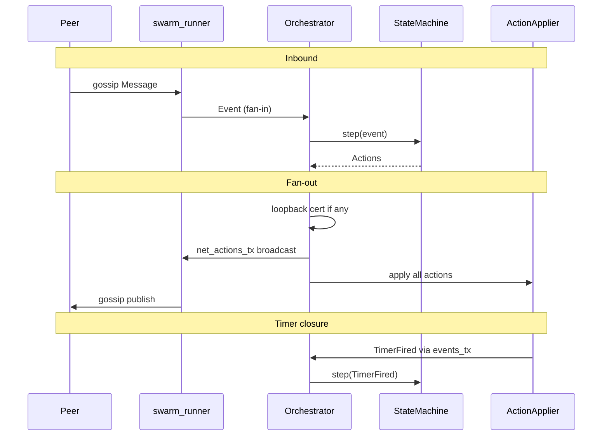


---


### 6.13 Summary


| Pipeline           | Entry                      | Exit                      | Bypass consensus? |
| ------------------ | -------------------------- | ------------------------- | ----------------- |
| Inbound gossip     | `Message`                  | `Event` → `step()`        | No                |
| Inbound blob       | `blob-chunk`               | `BlobCustody`             | Yes (no SM Event) |
| Outbound broadcast | `Action`                   | `gossipsub.publish`       | Inverse: from SM  |
| publish_tx         | `(Topic, bytes)`           | `gossipsub.publish`       | Yes               |
| Loopback cert      | `BroadcastCertifiedVertex` | `CertifiedVertexReceived` | No — same SM path |


Channel design + `try_send` keeps **pure consensus** separate from libp2p, while allowing the **DA path** and **pre-encoded publish** without clogging the state machine.

---


## 7. Wiring in `apps/node`

The `apps/node` binary almost **never** contains consensus algorithms — it is the **composition root**: the only place that initializes storage, network, channels, tasks, and assembles them into a runnable validator process. Central file: `apps/node/src/runtime.rs`.

```
crates/consensus, crates/net, crates/storage  →  libraries (Lego blocks)
apps/node/runtime.rs                          →  assembly + lifecycle
```

---


### 7.1 Composition root and dependency wiring


#### 7.1.1 What is a composition root?

A **composition root** is the single point in the process that builds the entire object graph and decides who connects to whom. Library crates do **not** open RocksDB themselves, do **not** spawn libp2p themselves — avoiding coupling and making it easy to swap parts in tests.


| Library module | Does not do itself      | Runtime provides                 |
| -------------- | ----------------------- | -------------------------------- |
| `consensus`    | Network, storage        | `HostContext` on each `step()`   |
| `net`          | State machine           | channels + keypair + `NetConfig` |
| `storage`      | Know validator identity | DB path from config              |


LUA-DAG uses **manual DI** (constructors + channels), not a DI framework.

#### 7.1.2 Dependency wiring

**Wiring** = connecting dependencies via:

- **Trait ports** (`HostContext`: DAG, clock, valset, beacon, persistence, signer, pending_blobs)
- **mpsc channels** (Event/Action between tasks)
- **Arc** sharing (`LiveDag`, `Metrics`, `ChainedBeacon`)

Runtime decides **spawn order** and **who holds which Sender/Receiver** — wrong wiring → deadlock or lost messages.

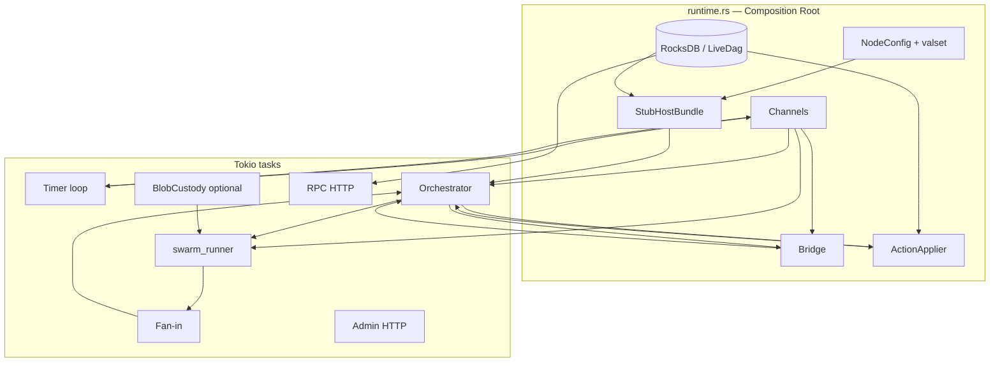


---


### 7.2 Task spawning — why many tasks?

A Tokio **task** is a lightweight concurrency unit (not 1:1 with OS threads). The node runs **many loops in parallel**:


| Task           | Loop                                 | May block?                    |
| -------------- | ------------------------------------ | ----------------------------- |
| `swarm_runner` | `select!` libp2p + actions + publish | No — uses `try_send` outbound |
| Orchestrator   | `events_rx.recv` → `step`            | Only blocks waiting for Event |
| Timer loop     | `timer_schedule_rx.recv`             | Block OK — dedicated task     |
| Fan-in         | merge swarm → main bus               | `try_send`                    |
| Admin / RPC    | HTTP accept                          | Dedicated task                |
| BlobCustody    | chunk ingest + publish               | Dedicated task                |


If everything were in **one** loop, a slow part (e.g. HTTP) would **stall** gossip and consensus.

```rust
// Spawn pattern in runtime.rs
tokio::spawn(async move { /* timer loop */ });
tokio::spawn(async move { /* fan-in */ });
tokio::spawn(orch.run());
// swarm_runner spawned inside spawn_gossip_tasks
```

---


### 7.3 Bridge pattern

`crates/net::Bridge` is a **channel bridge** between host and the consensus contract — it does **not** contain protocol logic.

```rust
Bridge::with_channels(events_tx.clone(), actions_capacity)
// → Bridge { events_tx, actions_rx }
// → BridgeHandle { actions_tx }  // dropped in runtime (_bridge_handle)
```


| Bridge component    | Actual role                                                                   |
| ------------------- | ----------------------------------------------------------------------------- |
| `bridge.events_tx`  | Clone of the main bus — orchestrator **loopbacks** local certs                |
| `bridge.actions_rx` | Orchestrator `select!` receives but **ignores** on the live path              |
| `BridgeHandle`      | `apply_action` API — runtime **does not use**; broadcast via `net_actions_tx` |


**Actual live path**:

```
Outbound broadcast: Orchestrator → net_actions_tx → swarm (NOT via bridge.actions_rx)
Loopback Event:     Orchestrator → bridge.events_tx → events_rx (same bus)
Inbound Event:      swarm → fan-in → events_rx
```

Bridge keeps the **contract** from the original spec (`Event` in / `Action` out); production added a parallel `net_actions_tx` — `translate_action` in the bridge remains a skeleton.

---


### 7.4 HostContext and `StubHostBundle`

Consensus `step(event, ctx)` needs **ports** — it does not import storage/network directly.

#### `HostContext` (borrowed, each step)

```rust
HostContext {
    dag, clock, valset, beacon, persistence, signer, pending_blobs
}
```

Assembled from `build_host_context(&bundle, &persistence)` — lifetime tied to the orchestrator step.

#### `StubHostBundle` (owned, lives for the process)

The name **Stub** is a legacy from plan 06b — this is the **production host bundle**, not a mock:


| Field                                | Port / role                                         |
| ------------------------------------ | --------------------------------------------------- |
| `dag: Arc<LiveDag>`                  | `DagView` — L1 vertex column + gossip ingress       |
| `clock: TokioClock`                  | `Clock` — process time                              |
| `valset: CachedValidatorSet`         | `ValidatorSetPort` — current epoch snapshot         |
| `beacon: Arc<ChainedBeacon>`         | `RandomnessBeacon` — `R_w = H(R_{w-1} ‖ MacroQC)`   |
| `signer: DevSigner`                  | Local BLS signing (matches valset entry)            |
| `pending_blobs: CustodyPendingBlobs` | `PendingBlobSource` — blob queue for vertex propose |


**ChainedBeacon** is shared with `ActionApplier`: when persisting MacroQc → `beacon.adopt_macro_qc`.

**CustodyPendingBlobs**: `None` if blob custody is off → vertex propose is empty but liveness continues.

---


### 7.5 Orchestrator lifecycle

`Orchestrator` = state-machine driver — **one task**, **one** `events_rx`.

```
Create (Orchestrator::new)
    ↓
[optional] genesis_propose if propose_enabled
    ↓
loop:
    events_rx.recv().await
    → (CertifiedVertex: verify + LiveDag.ingest)
    → sm.step(event, HostContext)
    → dispatch_actions(actions)
    ↓
events_rx closed → exit
```

`dispatch_actions` (fan-out each Action):

1. Loopback `BroadcastCertifiedVertex` → `bridge.events_tx`
2. `is_broadcast` → `net_actions_tx`
3. `action_applier.apply` — persist, timer, beacon, blob status (every Action)

The Orchestrator does **not** call libp2p; does **not** write Rocks directly (except cert ingest before step).

---


### 7.6 `runtime.rs` startup sequence

Spawn order **matters** — channels before tasks, swarm before orchestrator (so `net_actions_rx` has a consumer).

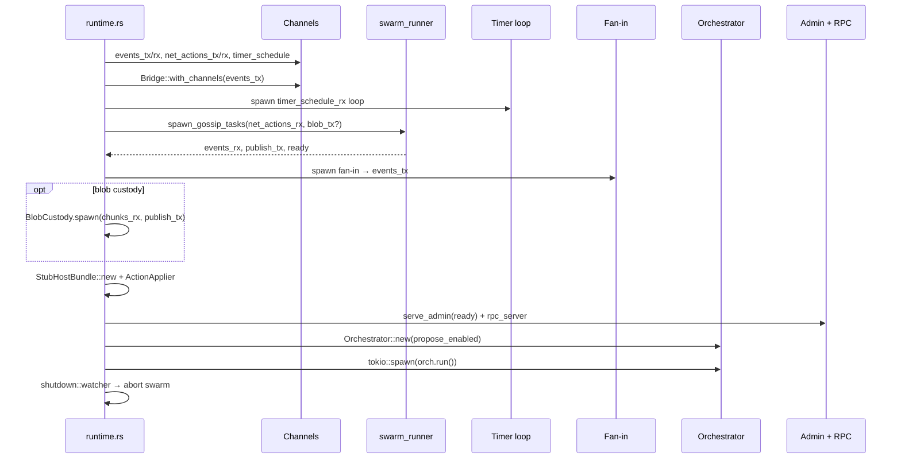


#### Step 1 — Config and storage

1. Load `NodeConfig`, validator set TOML.
2. Confirm `self_id` is in the valset.
3. `Database::open` → `RocksPersistence`, `LiveDag`.
4. `StateMachine::new(consensus_cfg, self_id)`, `Metrics`.


#### Step 2 — Event bus and Bridge

```rust
let (events_tx, events_rx) = mpsc::channel(1024);
let (bridge, _bridge_handle) = Bridge::with_channels(events_tx.clone(), 1024);
```

`events_tx` is cloned to: timer, fan-in, bridge loopback, swarm internal.

#### Step 3 — Timer pipeline

```rust
let (timer_schedule_tx, timer_schedule_rx) = mpsc::channel(256);
// ActionApplier receives timer_schedule_tx
// Spawn: schedule_rx → schedule_event → events_tx.send(TimerFired).await
```

Timer fire does **not** go through a separate fan-in — it sends straight to a clone of `events_tx`.

#### Step 4 — Swarm (if gossip is enabled)

Condition to spawn swarm: **not** (`allow_skeleton_network && network_mode != "live"`) → skeleton branch.

When spawning:

- Derive `macro_subnet_count` if config = 0.
- `devnet_keypair_from_label` → libp2p keypair.
- Optional `blob_chunks` channel if `l1_blob_custody_enabled`.
- `spawn_gossip_tasks` → `net_actions_rx`, `publish_tx`, `spawn.events_rx`, `ready`.

**Fan-in task**: `spawn.events_rx` → `try_send` → main `events_tx`.

**BlobCustody** (optional): `chunks_rx` + `publish_tx` clone.

#### Step 5 — Host bundle and ActionApplier

```rust
StubHostBundle::new(label, valset, live_dag, signer_path, blob_custody_handle)
ActionApplier::new(persistence, timer_schedule_tx, timer_registry, beacon, metrics)
```


#### Step 6 — HTTP surfaces

- **Admin** (`/readyz`, metrics): `net_ready_rx` from swarm — ready when listen bind completes.
- **RPC** (`RocksConsensusQuery`, optional blob submit): read-only + custody API.

Runs **before** the orchestrator so health probes work while the SM is processing.

#### Step 7 — Orchestrator

```rust
let propose_enabled = gossip_publish_tx.is_some();
Orchestrator::new(sm, bridge, events_rx, ..., net_actions_tx, host_bundle, action_applier, valset, propose_enabled)
tokio::spawn(orch.run())
```


#### Step 8 — Shutdown

```
shutdown::watcher() → shutdown_tx = true → admin/rpc drain
await orch_task
swarm_handle.abort()
```

---


### 7.7 Wiring map — who connects to whom


| From                   | Channel / handle    | To                 | Payload                   |
| ---------------------- | ------------------- | ------------------ | ------------------------- |
| swarm (internal)       | fan-in              | `events_tx`        | `Event`                   |
| Timer                  | `events_tx` clone   | orchestrator       | `TimerFired`              |
| Orchestrator loopback  | `bridge.events_tx`  | orchestrator       | `CertifiedVertexReceived` |
| Orchestrator broadcast | `net_actions_tx`    | swarm `actions_rx` | `Action`                  |
| ActionApplier          | `timer_schedule_tx` | timer loop         | `(TimerId, delay)`        |
| BlobCustody            | `publish_tx`        | swarm              | `(Topic, bytes)`          |
| Swarm inbound blob     | `blob_chunks_tx`    | BlobCustody        | `BlobChunk`               |


**Orchestrator owns**: `events_rx` (sole consumer of the main bus).

**Swarm owns**: `net_actions_rx`, `publish_rx`, internal gossip state.

---


### 7.8 `propose_enabled` and skeleton mode


#### `propose_enabled`

```rust
let propose_enabled = gossip_publish_tx.is_some();
```


|                              | `propose_enabled = true`                     | `propose_enabled = false`     |
| ---------------------------- | -------------------------------------------- | ----------------------------- |
| Swarm                        | Yes                                          | No                            |
| `genesis_propose()` at start | Yes                                          | No                            |
| L1 distributed vertex cert   | Active                                       | Ingress-only                  |
| Log                          | "L1 distributed vertex certification active" | "skeleton mode: ingress-only" |


Not a separate config flag — **derived** from whether the swarm was spawned.

#### Skeleton mode (no swarm)

Activated when: `allow_skeleton_network && network_mode != "live"`.


| Item                      | Skeleton                     | With swarm          |
| ------------------------- | ---------------------------- | ------------------- |
| `spawn_gossip_tasks`      | No                           | Yes                 |
| `net_actions_tx` consumer | No                           | swarm               |
| Fan-in / BlobCustody      | No                           | Yes                 |
| `propose_enabled`         | false                        | true (if swarm OK)  |
| `net_ready_rx`            | Always `true` (fake)         | Swarm `ready` watch |
| Consensus + Event ingress | Yes (if test injects Events) | Full                |


**Live mode gate** (fail early at startup):

```
network_mode == "live"
  && !allow_skeleton_network
  && !l3_wire_complete
→ bail (L3 production not wired yet)
```

Skeleton does **not** replace `StubHostBundle` with a mock — host ports are still real Rocks + LiveDag; only the gossip layer is **turned off**.

---


### 7.9 ActionApplier — wiring local side-effects

Separated from orchestrator network routing:


| Action                                      | Applier does                             |
| ------------------------------------------- | ---------------------------------------- |
| `PersistMacroQc` / `PersistMacroCheckpoint` | Rocks + beacon adopt                     |
| `EmitSlashEvidence`                         | Append evidence column                   |
| `ScheduleTimer` / `CancelTimer`             | Registry + schedule loop                 |
| `UpdateBlobStatus`                          | Persistence API tier                     |
| `NotifyInactivityLeak`                      | Metrics log                              |
| Broadcast variants                          | No-op in applier (separate network path) |


`ActionApplier` receives `timer_schedule_tx` **once** at build time — the orchestrator does not know the timer implementation.

---


### 7.10 Overall wiring diagram

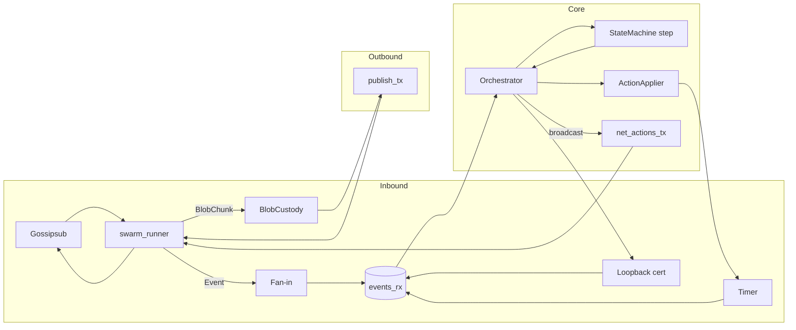


---


### 7.11 Summary


| Concept           | In LUA-DAG                                                  |
| ----------------- | ----------------------------------------------------------- |
| Composition root  | `apps/node/src/runtime.rs`                                  |
| Wiring            | Channels + `StubHostBundle` + `Bridge` + spawn order        |
| Bridge            | `events_tx` loopback; `actions_rx` legacy/unused live       |
| Host              | `build_host_context` per step; bundle owned by orchestrator |
| Concurrency       | swarm, fan-in, timer, orchestrator, HTTP, BlobCustody       |
| `propose_enabled` | Swarm spawned ⇒ genesis propose + L1 cert active            |
| Skeleton          | No swarm; same host ports; ingress-only consensus           |


Correct wiring ensures the **consensus crate does not know about libp2p**, while the node binary still runs a full validator with P2P + Rocks + HTTP.

---


## 8. Topic ↔ Payload ↔ Event/Action table


| Topic              | Payload (Borsh type) | Outbound `Action`                         | Inbound `Event`                   |
| ------------------ | -------------------- | ----------------------------------------- | --------------------------------- |
| `certified-vertex` | `CertifiedVertex`    | `BroadcastCertifiedVertex`                | `CertifiedVertexReceived`         |
| `vertex-proposal`  | `VertexProposal`     | `BroadcastVertexProposal`                 | `VertexProposalReceived`          |
| `vertex-partial`   | `VertexPartial`      | `BroadcastVertexPartial`                  | `VertexPartialReceived`           |
| `micro-qc`         | `MicroQc`            | `BroadcastMicroQc`                        | `MicroQcAssembled`                |
| `macro-proposal`   | `MacroProposal`      | `BroadcastMacroProposal`                  | `MacroProposalReceived`           |
| `bls-partial/{id}` | `BlsPartial`         | `BroadcastBlsPartial`                     | `BlsPartialReceived`              |
| `subnet-aggregate` | `SubnetAggregate`    | `BroadcastSubnetAggregate`                | `SubnetAggregateReceived`         |
| `macro-qc`         | `MacroQc`            | `BroadcastMacroQc`                        | `MacroQcReceived`                 |
| `slash-evidence`   | `SlashEvidence`      | `EmitSlashEvidence { evidence }`          | `SlashEvidenceFound`              |
| `blob-chunk`       | `BlobChunk`          | *(via* `publish_tx`*, not via SM Action)* | *(→ BlobCustody, not → SM Event)* |


Broadcast check function: `gossip_wire::is_broadcast(&Action)`.

---


## 9. Network configuration (`NetConfig`)

File: `crates/net/src/config.rs`, loaded from the TOML `[net]` section.

```toml
# Conceptual example
[net]
listen = ["/ip4/0.0.0.0/tcp/9000"]
bootstrap = ["/dns4/validator-0/tcp/9000/p2p/12D3Koo..."]
macro_subnet_count = 0   # 0 = derive from valset at startup

[net.gossip]
heartbeat_ms = 700
mesh_n = 8
mesh_n_low = 6
mesh_n_high = 12

[net.peers]
max_peers = 64
ban_duration_secs = 600
```

`macro_subnet_count`: runtime computes from `consensus::macro_fin::compute_ke` if = 0.

---


## 10. Production path vs Skeleton vs Simulator


|               | Production (`swarm_runner` + `gossip_wire`) | Skeleton (`bridge.rs`)  | Simulator (`apps/sim`)                  |
| ------------- | ------------------------------------------- | ----------------------- | --------------------------------------- |
| libp2p        | Yes                                         | No                      | No                                      |
| Encode/decode | `gossip_wire`                               | No (WARN drop)          | In-memory `virtual_net`                 |
| Event loop    | Tokio + Swarm                               | mpsc only               | Deterministic clock                     |
| Purpose       | Real node / Docker devnet                   | Interface test / legacy | Adversarial test (drop/delay/partition) |


**Note**: `Bridge::translate_action` is still a skeleton (WARN log). Production does **not call** this function — the orchestrator routes via `net_actions_tx`.

---


## 11. Current limitations & extension directions


| Item                                | Status                                                                 |
| ----------------------------------- | ---------------------------------------------------------------------- |
| `PeerManager` scoring/ban           | Implemented, **not yet wired** into swarm / gossipsub peer score       |
| `rpc/causal_set`, `checkpoint_sync` | Only request/response **types** — no protocol handler on the Swarm yet |
| `gossip/publisher` dedup            | Module exists, not attached to publish path                            |
| `IdentityMap`                       | API exists; host does not yet map PeerId↔ValidatorId on every path     |
| QUIC transport                      | Builder exists; swarm runner not using it yet                          |
| Kademlia discovery                  | `DiscoveryConfig` stub, `enable_kad = false` by default                |


Natural extension directions (spec §7.3): add req-resp behaviour to `LuaDagBehaviour`, wire `PeerManager` into gossipsub scoring, complete `Bridge` or deprecate it if `gossip_wire` is sufficient.

---


## 12. Reference diagrams


### 12.1 Layered architecture

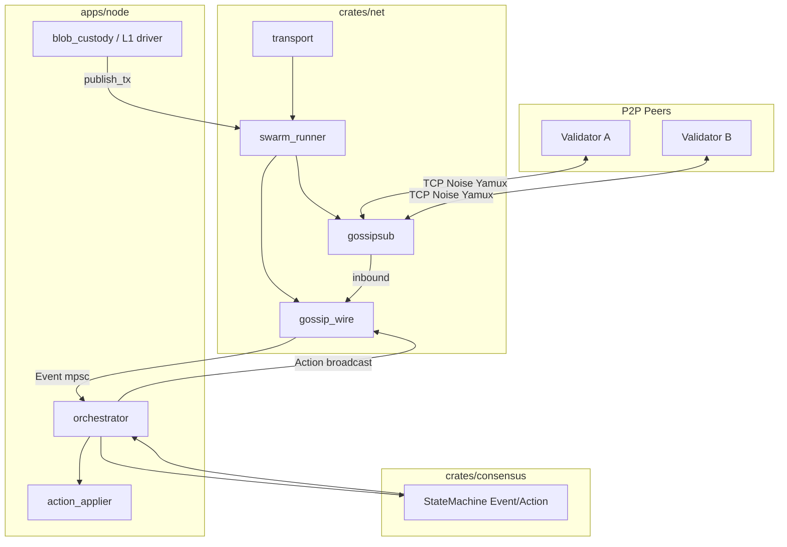


### 12.2 `spawn_gossip_tasks` event loop

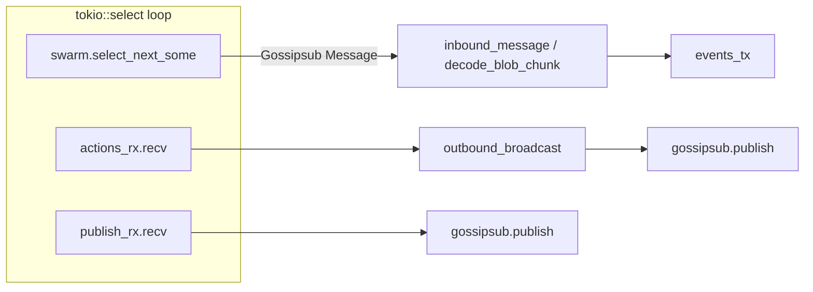


### 12.3 Comparing the three publish paths

```
Consensus Action (broadcast)
    orchestrator → net_actions_tx → actions_rx → outbound_broadcast → publish

Own CertifiedVertex loopback
    orchestrator → bridge.events_tx → CertifiedVertexReceived (local)

Blob / L1 direct
    BlobCustody → publish_tx → publish (skip Action queue)
```

---


## 13. Glossary


### 13.1 Networking & P2P


| Term                   | Explanation                                                                                                                                                                           |
| ---------------------- | ------------------------------------------------------------------------------------------------------------------------------------------------------------------------------------- |
| **P2P (Peer-to-Peer)** | A network model with no central server. Each **node** (validator) both sends and receives messages, and may relay for other peers.                                                    |
| **Node / Peer**        | A validator process on the network. In libp2p, a peer is identified by **PeerId** (hash of the public key).                                                                           |
| **Validator**          | An entity that participates in consensus, with a **ValidatorId** (32 bytes) and BLS keys. Distinct from PeerId at the wire layer — mapped via `IdentityMap`.                          |
| **Bootstrap peer**     | A known peer address (in config). A new node **dials** bootstrap to join the network; bootstrap is not a central server, only an entry point.                                         |
| **Multiaddr**          | A libp2p address as a protocol-stack string, e.g. `/ip4/0.0.0.0/tcp/9000` or `/dns4/validator-a/tcp/9000/p2p/12D3Koo...`. One string describes both transport and destination PeerId. |
| **Dial / Listen**      | **Listen**: open a port and await connections. **Dial**: actively connect to another peer (bootstrap or newly discovered).                                                            |


### 13.2 libp2p stack


| Term                      | Explanation                                                                                                                                                       |
| ------------------------- | ----------------------------------------------------------------------------------------------------------------------------------------------------------------- |
| **libp2p**                | Modular P2P framework (Protocol Labs). Provides transport, encryption, multiplexing, pub/sub (gossipsub), discovery. **Only** `crates/net` **may import libp2p.** |
| **Swarm**                 | libp2p's central event loop: manages connections, behaviours (gossipsub), publish/subscribe. In code: `Swarm<LuaDagBehaviour>`.                                   |
| **Behaviour**             | A protocol module attached to the Swarm. Currently: `LuaDagBehaviour { gossipsub }`. Later may add req-resp, kad-dht.                                             |
| **Transport**             | Lowest layer: establishes a byte-stream connection between two peers.                                                                                             |
| **TCP**                   | Reliable, ordered protocol. Usually upgraded with Noise + Yamux; nodelay may be enabled for small messages.                                                       |
| **QUIC**                  | Transport over UDP with built-in TLS 1.3 + multiplex. In libp2p it is an alternative to TCP and does not go through Noise/Yamux.                                  |
| **Noise**                 | Peer-to-peer encryption handshake (similar to TLS but lighter, suited to P2P). Authenticates PeerId during the handshake.                                         |
| **Yamux**                 | **Multiplexer**: many logical streams on one TCP connection. Gossipsub and future RPC can use separate streams without opening more sockets.                      |
| **DNS resolver (libp2p)** | Allows dialing multiaddrs like `/dns4/service-name/tcp/9000` — needed for Docker Compose / Kubernetes.                                                            |


### 13.3 Gossip & Gossipsub


| Term                            | Explanation                                                                                                                                              |
| ------------------------------- | -------------------------------------------------------------------------------------------------------------------------------------------------------- |
| **Gossip**                      | Word-of-mouth dissemination: not broadcast to every node; each node sends only to a small neighbor set; the message gradually reaches the whole network. |
| **Gossipsub**                   | libp2p pub/sub on gossip + mesh. Supports anti-spam, message-id dedup, peer scoring (libp2p built-in).                                                   |
| **Topic**                       | Logical pub/sub channel. A node **subscribes** to a topic to receive its messages. LUA-DAG uses the prefix `lua-dag/v1/...`.                             |
| **Publish / Subscribe**         | **Publish**: send a payload on a topic. **Subscribe**: register to receive topic messages. The Swarm subscribes to all consensus topics at startup.      |
| **Mesh**                        | For each topic, gossipsub maintains a set of directly connected peers (mesh). Parameters `mesh_n`, `mesh_n_low`, `mesh_n_high` in config.                |
| **Heartbeat**                   | Gossipsub period for maintaining mesh and fanout. Config: `heartbeat_ms` (default 700ms on devnet).                                                      |
| **ValidationMode::Strict**      | Gossipsub only forwards messages that passed local validation. The LUA-DAG Swarm enables strict mode.                                                    |
| **MessageAuthenticity::Signed** | Gossip messages are signed with the node keypair — prevents source spoofing at the libp2p layer (distinct from consensus BLS signatures).                |


### 13.4 Serialization & consensus contract


| Term             | Explanation                                                                                                                           |
| ---------------- | ------------------------------------------------------------------------------------------------------------------------------------- |
| **Event**        | Input to the consensus state machine (`consensus::event::Event`). Examples: `MacroProposalReceived`, `BlsPartialReceived`.            |
| **Action**       | Output from the state machine (`consensus::action::Action`). Examples: `BroadcastMacroProposal`, `ScheduleTimer`.                     |
| **Borsh**        | Deterministic binary serializer (NEAR). Gossip payload = Borsh struct → `Vec<u8>`. Important for stable hashes/signatures.            |
| **Bridge**       | Skeleton adapter: `events_tx` / `actions_rx` channel pair between host and consensus. Does **not** run libp2p directly in production. |
| **gossip_wire**  | Production adapter: maps `Action` ↔ `(Topic, bytes)` and `(topic, bytes)` ↔ `Event`.                                                  |
| **mpsc channel** | Tokio multi-producer single-consumer queue — connects swarm task, orchestrator, timers asynchronously.                                |
| **HostContext**  | Port bundle (DAG, clock, valset, beacon, persistence, signer) injected into `StateMachine::step`. **Not** directly related to libp2p. |


### 13.5 LUA-DAG protocol data (on the wire)


| Term                               | Explanation                                                                                    |
| ---------------------------------- | ---------------------------------------------------------------------------------------------- |
| **CertifiedVertex**                | An L1 vertex with a BLS aggregate certificate — enough stake to treat as certified on the DAG. |
| **VertexProposal / VertexPartial** | Distributed vertex cert stages: proposer sends a proposal; validators send partial votes.      |
| **MicroQc**                        | Micro-level quorum certificate (Bullshark L2).                                                 |
| **MacroProposal / MacroQc**        | Macro-level checkpoint & QC (L3 Casper-FFG).                                                   |
| **BlsPartial / SubnetAggregate**   | BLS signatures partitioned by subnet (Mode A aggregation).                                     |
| **SlashEvidence**                  | Evidence of misbehavior (equivocation, surround vote, ...).                                    |
| **BlobChunk**                      | Erasure-coded shard of a large blob (data availability path).                                  |


---


