# Kiến trúc tầng Network & Gossip — LUA-DAG

> Tài liệu giải thích từ nền tảng (P2P, libp2p, gossipsub) đến triển khai cụ thể trong repo `lua-dag-consensus`.
> Nguồn: `crates/net/`, `apps/node/src/runtime.rs`, `apps/node/src/orchestrator.rs`, spec `2026-05-11-folder-architecture-design.md`.

---

## Mục lục

1. [Tóm tắt nhanh](#1-tóm-tắt-nhanh)
2. [Vị trí trong kiến trúc tổng thể](#2-vị-trí-trong-kiến-trúc-tổng-thể)
3. [Nguyên tắc thiết kế](#3-nguyên-tắc-thiết-kế)
4. [Tầng Transport — kết nối vật lý](#4-tầng-transport--kết-nối-vật-ly)
5. [Tầng Gossip — lan truyền message](#5-tầng-gossip--lan-truyền-message)
6. [Luồng dữ liệu Inbound / Outbound](#6-luồng-dữ-liệu-inbound--outbound)
7. [Wiring trong `apps/node`](#7-wiring-trong-appsnode)
8. [Bảng Topic ↔ Payload ↔ Event/Action](#8-bảng-topic--payload--eventaction)
9. [Cấu hình mạng (`NetConfig`)](#9-cấu-hình-mạng-netconfig)
10. [Production path vs Skeleton vs Simulator](#10-production-path-vs-skeleton-vs-simulator)
11. [Hạn chế hiện tại & hướng mở rộng](#11-hạn-chế-hiện-tại--hướng-mở-rộng)
12. [Sơ đồ tham khảo](#12-sơ-đồ-tham-khảo)
13. [Từ điển thuật ngữ](#13-từ-điển-thuật-ngữ)

---

## 1. Tóm tắt nhanh

LUA-DAG tách **logic đồng thuận** (consensus state machine) khỏi **hạ tầng mạng** (libp2p):

| Tầng | Crate / module | Biết gì? | Không biết gì? |
|------|----------------|----------|----------------|
| Consensus | `crates/consensus` | `Event`, `Action`, thuật toán L2/L3/L1 | libp2p, socket, TCP |
| Network adapter | `crates/net` | libp2p, gossipsub, Borsh wire format | quyết định đồng thuận |
| Host / node | `apps/node` | ghép channels, RocksDB, timers, blob custody | (ủy thác net + consensus) |

**Production path thực tế** không đi qua `Bridge::translate_action` (skeleton), mà qua:

```
swarm_runner (event loop libp2p)
    ↔ gossip_wire (encode/decode + routing topic)
    ↔ mpsc channels ↔ Orchestrator ↔ StateMachine
```

---

## 2. Vị trí trong kiến trúc tổng thể

Theo spec folder architecture (§7.3), tầng network nằm **dưới** host node và **bên cạnh** consensus — không xuyên vào state machine:

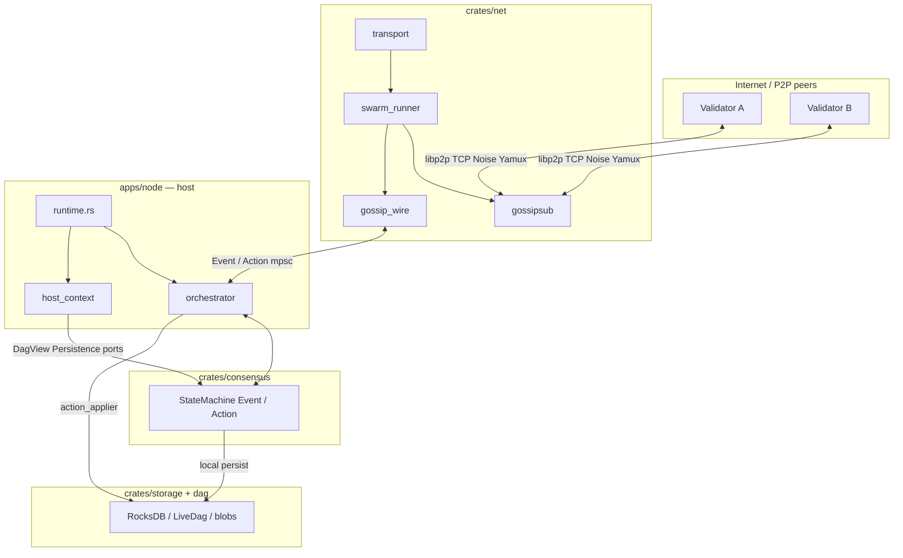

**Quy tắc vàng**: `consensus` **không bao giờ** `use libp2p::*`. Mọi byte trên dây đi qua `crates/net`.

---

## 3. Nguyên tắc thiết kế

1. **Pure consensus, impure adapters** — SM deterministic, test offline được; mạng thay bằng mock/sim không đụng thuật toán.

2. **Một cổng wire duy nhất** — `gossip_wire.rs` là nơi map topic + Borsh ↔ `Event`/`Action`. Tránh rải logic encode ở nhiều file.

3. **Topic versioning** — Prefix `lua-dag/v1/`; không sửa tên topic cũ, chỉ **thêm** variant mới (xem comment trong `topics.rs`).

4. **Hai đường publish**:
   - **Consensus-driven**: `Action` → orchestrator → `net_actions_tx` → swarm → gossip.
   - **Host-driven**: L1 driver / blob custody → `publish_tx` → swarm (bypass SM cho latency DA).

5. **Fail visible** — Buffer full → log WARN + metric drop; decode fail → log, không crash swarm.

6. **Identity tách lớp** — `PeerId` (libp2p Ed25519 keypair devnet) ≠ `ValidatorId` (consensus). `IdentityMap` map khi cần attribution.

---

## 4. Tầng Transport — kết nối vật lý

Tầng **Transport** là lớp thấp nhất trong ngăn xếp mạng libp2p: nó biến gói tin trên Internet thành **kết nối P2P đã xác thực, đã mã hóa, và hỗ trợ nhiều luồng logic** — nền tảng để gossipsub và các giao thức khác chạy phía trên. Trong LUA-DAG, transport được cấu hình trong `crates/net/src/transport.rs` và được Swarm sử dụng khi node validator **listen** (chờ kết nối) hoặc **dial** (chủ động kết nối peer).

### 4.1 Transport là gì trong libp2p?

Trong libp2p, **Transport** là một abstraction (trait) trả lời hai câu hỏi:

- **Dial**: làm sao mở kết nối *outbound* tới một địa chỉ?
- **Listen**: làm sao chấp nhận kết nối *inbound* từ peer khác?

Sau khi transport hoàn tất, Swarm nhận một **kết nối đã upgrade** — gắn với **PeerId** đã xác thực, có thể mở **substream** cho từng giao thức (gossipsub, identify, request-response, …). Gossipsub **không** gửi block/vote trực tiếp xuống socket; nó chỉ mượn substream trên kết nối mà transport đã dựng sẵn.

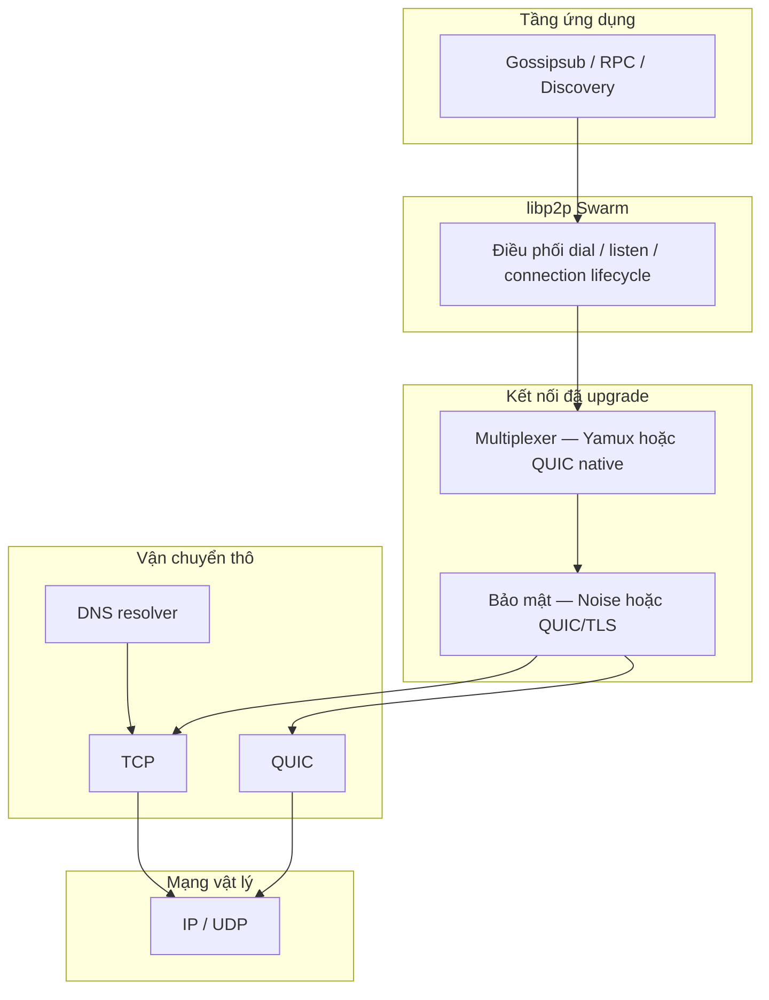

### 4.2 Multiaddr — địa chỉ tự mô tả

libp2p không dùng chuỗi `host:port` đơn thuần mà dùng **Multiaddr**: một chuỗi mô tả **toàn bộ stack giao thức** cần đi qua, từ ngoài vào trong.

| Multiaddr ví dụ | Ý nghĩa |
|-----------------|---------|
| `/ip4/203.0.113.5/tcp/9000` | IPv4 + cổng TCP |
| `/dns4/boot.lua-dag.io/tcp/9000` | Phân giải DNS trước, rồi TCP |
| `/ip4/203.0.113.5/udp/9000/quic-v1` | QUIC trên UDP |
| `/dns4/node-a/tcp/9000/p2p/12D3Koo...` | DNS + TCP + **PeerId đích** |

Swarm dùng Multiaddr khi:

- **`listen_on`**: node mở cổng lắng nghe và quảng bá địa chỉ của mình.
- **`dial`**: node kết nối bootstrap peer hoặc peer mới gặp.
- **Bootstrap config**: danh sách điểm vào mạng biết trước.

Transport đọc Multiaddr để **chọn nhánh vận chuyển** phù hợp (TCP hay QUIC) và biết có cần DNS hay không.

### 4.3 Vì sao cần stack nhiều lớp, không dùng raw socket?

Một **raw TCP socket** chỉ cung cấp luồng byte hai chiều — không danh tính, không mã hóa, một kênh duy nhất. Với mạng validator P2P, điều đó thiếu ba thứ căn bản:

| Thiếu sót của raw socket | Giải pháp trong stack libp2p |
|---------------------------|------------------------------|
| **Không xác thực peer** — không biết đối phương có đúng PeerId/validator không | **Noise** (nhánh TCP) hoặc **TLS 1.3 tích hợp** (nhánh QUIC) ràng buộc khóa với PeerId |
| **Không mã hóa** — vote, block header, blob chunk lộ trên đường truyền | Kênh mã hóa AEAD sau handshake |
| **Một socket = một luồng** — gossipsub, sync, ping mỗi thứ một TCP riêng → tốn socket, khó NAT | **Multiplexing** (Yamux trên TCP, stream native trên QUIC) |
| **Gắn cứng TCP** — khó thêm QUIC/WebSocket/memory transport cho test | Trait **Transport** + **or_transport** — tầng trên không đổi |

libp2p xây kết nối theo kiểu **lắp ghép + upgrade**: bắt đầu từ byte stream thô, rồi **nâng cấp dần** thành kết nối an toàn và đa luồng.

### 4.4 Hai nhánh vận chuyển và `or_transport`

LUA-DAG (qua `build_transport`) hỗ trợ **hai đường vận chuyển song song**, ghép bằng **`or_transport`**: khi dial, transport nào **nhận diện được** Multiaddr sẽ xử lý.

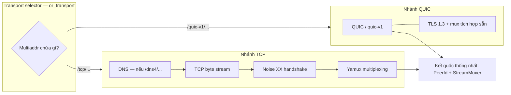

**Điểm quan trọng**: cả hai nhánh trả về **cùng một giao diện** cho Swarm — `(PeerId, StreamMuxer)`. Gossipsub và consensus **không cần biết** peer đang dùng TCP hay QUIC.

### 4.5 Chi tiết từng lớp

#### 4.5.1 DNS — phân giải tên miền

**DNS** (trong libp2p) bọc transport bên dưới: nếu Multiaddr chứa `/dns4`, `/dns6`, hoặc `/dnsaddr`, lớp này phân giải hostname → IP **trước** khi mở TCP.

- Cho phép bootstrap/listen dùng **tên miền ổn định** thay vì IP cứng.
- IP đổi phía sau DNS → cấu hình node không cần sửa.
- Hoàn toàn **minh bạch** với gossipsub: tầng trên chỉ thấy kết nối thành công hay thất bại.

#### 4.5.2 TCP — luồng byte tin cậy

**TCP** (Transmission Control Protocol) cung cấp kết nối **full-duplex**, **có thứ tự**, **tự retransmit** khi mất gói.

- Là nền tảng phổ biến, đi qua được hầu hết firewall.
- Bản thân TCP **không** mã hóa, **không** xác thực peer, **không** multiplex — nên bắt buộc **upgrade** thêm Noise và Yamux.
- Tùy chọn **`TCP_NODELAY`** (nodelay): giảm buffering, hạ latency cho message nhỏ (vote, heartbeat gossipsub).

#### 4.5.3 QUIC — vận chuyển hiện đại trên UDP

**QUIC** chạy trên UDP, tích hợp sẵn nhiều thứ mà nhánh TCP phải lắp riêng:

| Khả năng | TCP + Noise + Yamux | QUIC |
|----------|---------------------|------|
| Mã hóa + xác thực | Noise XX (3 message) | TLS 1.3 trong handshake QUIC |
| Multiplexing | Yamux trên một byte stream | Stream là khái niệm gốc của QUIC |
| Head-of-line blocking giữa stream | Có (TCP là một luồng) | Không ở tầng transport |
| Thiết lập kết nối | TCP 3-way + Noise 3 msg | ~1 RTT (0-RTT tùy cache) |

Trong libp2p, nhánh QUIC **không** đi qua Noise/Yamux — TLS và mux đã nằm trong QUIC. PeerId vẫn được xác minh qua chứng chỉ/khóa gắn với identity node.

#### 4.5.4 Noise — bảo mật và xác thực PeerId (nhánh TCP)

Sau khi TCP connected, libp2p chạy **Noise Protocol Framework**, pattern **XX** (libp2p 0.55):

```
Dialer                          Listener
  │ ── e (ephemeral key) ────────► │
  │ ◄── e, ee, s, es ──────────── │   (static key s được mã hóa)
  │ ── s, se ────────────────────► │
  │ ══ kênh AEAD hai chiều ═════ │
```

Ký hiệu: `e` = khóa tạm, `s` = khóa tĩnh (identity), `ee/es/se` = các bước Diffie-Hellman trộn vào khóa phiên.

Noise đảm nhiệm:

- **Mã hóa + toàn vẹn** (AEAD) cho mọi byte sau handshake.
- **Xác thực PeerId**: khóa tĩnh Noise gắn với keypair libp2p — peer giả mạo ID bị ngắt ngay.
- **Forward secrecy**: khóa ephemeral bảo vệ phiên cũ nếu khóa tĩnh lộ sau này.

Đây là tuyến phòng thủ đầu tiên trước khi bất kỳ message gossip nào được xử lý.

#### 4.5.5 Yamux — multiplexing (nhánh TCP)

**Yamux** (Yet Another Multiplexer) chia **một kết nối đã mã hóa** thành nhiều **substream** logic:

```
Một kết nối TCP + Noise
         │
    ┌────┴────┬────────┬─────────┐
    ▼         ▼        ▼         ▼
 Stream 1  Stream 2  Stream 3  Stream N
 Gossipsub  Identify   RPC     Ping
```

Mỗi substream:

- Có ID riêng, mở/đóng độc lập, full-duplex.
- Có **flow control** (cửa sổ) riêng — stream sync chậm không bóp nghẹt gossipsub vote.

Nhờ Yamux, mỗi cặp validator thường chỉ cần **một kết nối vật lý** cho mọi giao thức libp2p.

#### 4.5.6 Handshake — quá trình bắt tay

**Handshake** là trao đổi ban đầu trước khi truyền dữ liệu ứng dụng. Trong stack libp2p có **hai cấp**:

| Cấp | Nhánh TCP | Nhánh QUIC |
|-----|-----------|------------|
| Vật lý | TCP three-way handshake | QUIC initial handshake (UDP) |
| Bảo mật | Noise XX (3 message) | TLS 1.3 (tích hợp) |
| Multiplexing | Negotiate Yamux (multistream-select) | Stream sẵn có |

Chỉ sau khi handshake hoàn tất, Swarm coi kết nối **sẵn sàng** và behaviour (gossipsub) mới được mở substream.

#### 4.5.7 Upgrade — nâng cấp kết nối tuần tự (nhánh TCP)

Với TCP, libp2p không dùng socket thô trực tiếp mà **upgrade** qua **multistream-select**:

```
TCP connected
      │
      ▼  negotiate: "/noise"
   Noise XX  →  kênh mã hóa + PeerId xác thực
      │
      ▼  negotiate: "/yamux/1.0.0"
    Yamux    →  StreamMuxer
      │
      ▼
 Ready for protocols (gossipsub, …)
```

Mỗi bước bổ sung một khả năng; thiết kế này cho phép **thay/thêm** giao thức bảo mật hoặc muxer mới mà không phá tầng trên.

### 4.6 Vai trò Transport trong Swarm

Swarm ghép **Transport** (cách kết nối) với **NetworkBehaviour** (kết nối để làm gì — gossipsub trong LUA-DAG).

| Thao tác Swarm | Transport làm gì | Trong LUA-DAG |
|----------------|------------------|---------------|
| `listen_on(multiaddr)` | Mở điểm lắng nghe; emit `NewListenAddr` | Validator lắng nghe cổng P2P |
| `dial(multiaddr)` | Chọn nhánh TCP/QUIC, chạy upgrade, trả connection | Kết nối bootstrap / peer mới |
| Quản lý connection | Theo dõi establish/close; cấp substream cho behaviour | Gossipsub xin substream trên mesh |

Đến tay gossipsub, kết nối **luôn** ở trạng thái upgraded — gossipsub chỉ lo publish/subscribe/mesh, không đụng TCP/Noise/Yamux.

### 4.7 Quan hệ Transport ↔ Gossipsub

Phân tách trách nhiệm rõ ràng:

| Tầng | Câu hỏi trả lời |
|------|-----------------|
| **Transport** | *Làm sao hai validator kết nối an toàn và truyền byte?* |
| **Gossipsub** | *Message nào lan truyền, trên topic nào, theo mesh ra sao?* |

Luồng khi validator A gửi message tới B:

1. Swarm đã có (hoặc dial) kết nối upgraded tới B.
2. Gossipsub mở substream trên muxer.
3. Payload Borsh (MicroQc, MacroProposal, …) đi qua substream đã mã hóa.
4. Bên B: transport giải mã → Yamux/QUIC demux → gossipsub nhận → `gossip_wire` decode → `Event`.

Transport **không** hiểu nội dung consensus; gossipsub **không** hiểu chi tiết socket.

### 4.8 Tóm tắt trách nhiệm các lớp

| Lớp | Trách nhiệm | Ghi chú |
|-----|-------------|---------|
| **DNS** | Hostname → IP trong Multiaddr | Thường phía dial |
| **TCP** | Byte stream tin cậy trên IP | Cần upgrade Noise + Yamux |
| **Noise XX** | Mã hóa, toàn vẹn, xác thực PeerId, forward secrecy | Chỉ nhánh TCP |
| **Yamux** | Nhiều substream, flow control | Chỉ nhánh TCP |
| **QUIC** | Transport + TLS 1.3 + mux trên UDP | Không qua Noise/Yamux |
| **or_transport** | Chọn nhánh theo Multiaddr; giao diện thống nhất | Kết quả: `(PeerId, StreamMuxer)` |

Implementation tham chiếu: `crates/net/src/transport.rs` — `build_transport` (QUIC + TCP/Noise/Yamux), `build_transport_tcp_only` (DNS + TCP/Noise/Yamux).

---

## 5. Tầng Gossip — lan truyền message

Nếu tầng **Transport** trả lời *“làm sao hai validator kết nối an toàn?”*, tầng **Gossip** trả lời *“message đồng thuận lan tới toàn mạng thế nào, với chi phí băng thông hợp lý?”*. LUA-DAG dùng **libp2p Gossipsub** — pub/sub có mesh overlay — làm cơ chế phân phối chính cho MicroQc, MacroProposal, vertex cert, slash evidence, và blob shard.

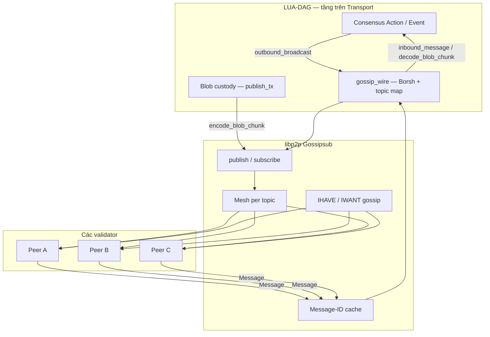

---

### 5.1 Gossip protocol — lan truyền kiểu “truyền miệng”

**Gossip protocol** mô phỏng cách tin đồn lan trong xã hội: node nhận message mới → chuyển tiếp cho **một tập hàng xóm nhỏ** → hàng xóm lại chuyển tiếp → message lan dần toàn mạng.

```
        Node A (nguồn)
       /    \
      B      C
     / \    / \
    D   E  F   G
```

**Ưu điểm** so với server trung tâm:

- Không single point of failure — mất một node không dừng mạng.
- Băng thông **phân tán** — không ai flood tới mọi peer mỗi lần publish.
- Tự mở rộng khi thêm validator.

**Nhược điểm thuần gossip**: cùng message có thể đến nhiều lần qua đường khác nhau → cần **dedup** và cơ chế mesh/IHAVE để kiểm soát băng thông. Gossipsub giải quyết điều này.

---

### 5.2 Publish / Subscribe (Pub/Sub)

**Pub/Sub** tách người gửi khỏi người nhận:

| Khái niệm | Ý nghĩa |
|-----------|---------|
| **Topic** | Kênh logic — “phòng chat” theo loại dữ liệu |
| **Subscribe** | Node đăng ký nhận mọi message trên topic |
| **Publish** | Node gửi payload lên topic; mạng định tuyến tới subscriber |

Publisher **không cần biết** danh sách peer — chỉ cần `publish(topic, bytes)`. Điều này phù hợp validator set thay đổi theo epoch.

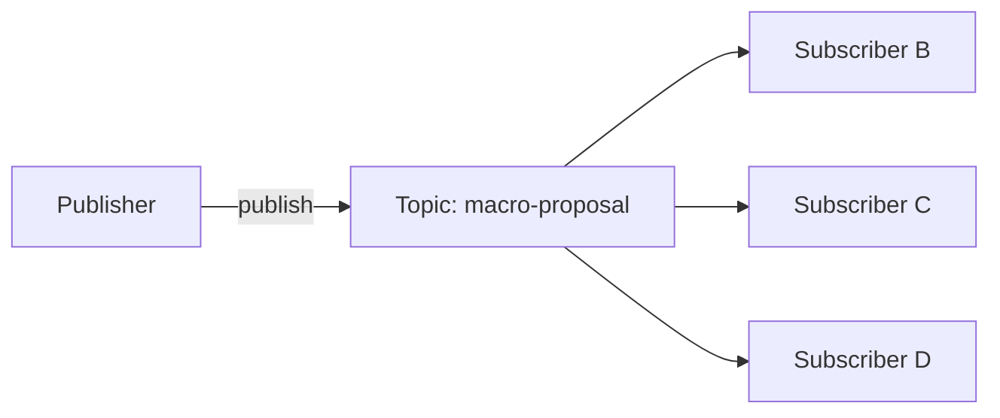

---

### 5.3 Gossipsub — Pub/Sub + mesh overlay

**Gossipsub** (libp2p) kết hợp pub/sub với **mesh overlay** cho từng topic: thay vì gửi full payload tới mọi subscriber, mỗi node duy trì tập **mesh peers** nhỏ và chỉ flood full message trong mesh.

#### 5.3.1 Mesh

Với mỗi topic đã subscribe, node giữ **mesh** — tập peer nhận **toàn bộ payload** trực tiếp:

```
Topic "macro-qc" — mesh của Node A (~8 peer)

        B
       / \
      A---C
       \ /
        D
```

Khi A publish, payload đi tới mesh peers; họ forward tiếp trong mesh của họ → message lan toàn mạng với chi phí ~O(mesh × hops), không O(N²).

#### 5.3.2 GRAFT / PRUNE — duy trì mesh

Mỗi **heartbeat**, gossipsub so sánh kích thước mesh với ngưỡng:

| Tham số | Vai trò |
|---------|---------|
| `mesh_n` | Số peer mục tiêu trong mesh |
| `mesh_n_low` | Dưới ngưỡng → **GRAFT** (thêm peer vào mesh) |
| `mesh_n_high` | Trên ngưỡng → **PRUNE** (bớt peer khỏi mesh) |
| `heartbeat_ms` | Chu kỳ bảo trì mesh + gossip metadata |

Trong LUA-DAG (`NetConfig.gossip`): `mesh_n = 8`, `mesh_n_low = 6`, `mesh_n_high = 12`, `heartbeat_ms = 700`.

Heartbeat cũng là lúc gossipsub gửi **IHAVE**, xử lý **IWANT**, và cập nhật **peer score**.

#### 5.3.3 Fanout

Node có thể **publish** lên topic mà **chưa subscribe** (ví dụ publish một lần rồi không nghe). Gossipsub tạo tập **fanout** tạm — vài peer đã subscribe topic đó — để message vẫn có điểm vào mạng. Fanout không thay mesh; khi node subscribe lâu dài, mesh thay fanout.

#### 5.3.4 IHAVE / IWANT — gossip metadata

Peer **ngoài mesh** cùng subscribe topic không nhận full payload mỗi lần. Thay vào đó:

```
1. Node A ── IHAVE [msg-id-1, msg-id-2] ──► Node D (ngoài mesh)
2. Node D thiếu msg-id-2 ── IWANT [msg-id-2] ──► Node A
3. Node A ── full payload msg-id-2 ──► Node D
```

| Bước | Gửi gì | Mục đích |
|------|--------|----------|
| **IHAVE** | Danh sách **Message-ID** đã có | Quảng bá “tôi có tin mới” — payload nhỏ |
| **IWANT** | ID cần lấy | Peer thiếu tin yêu cầu nội dung |
| **Response** | Full message | Chỉ gửi byte khi thực sự cần |

Cơ chế này giảm băng thông so với blind flood toàn mạng.

#### 5.3.5 Message-ID và deduplication

Message có thể tới cùng node qua nhiều đường:

```
A → B → D
A → C → D   (cùng message, hai path)
```

Gossipsub gán **Message-ID** duy nhất cho mỗi message. Node giữ **cache** ID đã thấy:

- ID **mới** → accept, forward (nếu hợp lệ), xử lý.
- ID **trùng** → drop — tránh vòng lặp vô hạn và xử lý trùng.

Đây là dedup **ở tầng gossipsub** (mạng P2P).

#### 5.3.6 Peer scoring

Gossipsub theo dõi **điểm uy tín** từng peer (P1–P7 trong spec gossipsub v1.1):

| Hành vi | Ảnh hưởng điểm |
|---------|----------------|
| Chuyển tiếp message hợp lệ, đúng hạn | Cộng điểm |
| Spam, message invalid, chậm IWANT | Trừ điểm |
| Điểm thấp | Ít được chọn mesh, có thể bị PRUNE |

LUA-DAG có `PeerManager` scoring riêng (`crates/net/src/peers/`) — hướng tích hợp với gossipsub peer score; logic nghiệp vụ (equivocation, slash) nằm ở consensus.

#### 5.3.7 ValidationMode và MessageAuthenticity

Hai knob bảo mật khi khởi tạo gossipsub behaviour:

| Cấu hình | Ý nghĩa trong LUA-DAG |
|----------|----------------------|
| **`ValidationMode::Strict`** | Message phải pass validation trước khi gossipsub forward cho peer khác. Chế độ nghiêm — chống lan truyền payload rác trên overlay. |
| **`MessageAuthenticity::Signed`** | Mỗi gossip message được **ký bằng keypair libp2p** của publisher. Peer nhận xác minh chữ ký trước khi xử lý — lớp xác thực **wire**, tách khỏi chữ ký BLS **trong payload** consensus. |

**Hai lớp xác thực** (không nhầm lẫn):

```
Lớp libp2p (Signed)     → ai publish lên gossipsub? PeerId có khớp chữ ký wire?
Lớp consensus (Borsh)   → MicroQc / MacroQc / vertex cert có hợp lệ protocol?
```

Sau khi gossipsub deliver message, LUA-DAG decode Borsh trong `gossip_wire`; lỗi codec → log WARN, không đưa vào state machine. Consensus `step()` mới verify chữ ký BLS và quy tắc protocol.

---

### 5.4 Vai trò Gossipsub trong Swarm LUA-DAG

`swarm_runner` gắn `gossipsub::Behaviour` vào `LuaDagBehaviour`. Event loop xử lý:

| Sự kiện gossipsub | Ý nghĩa |
|-------------------|---------|
| `Message { topic, data }` | Payload inbound → decode |
| `Subscribed` / `Unsubscribed` | Peer tham gia/rời overlay topic |
| `GossipsubNotSupported` | Peer kết nối nhưng không nói gossipsub |
| `SlowPeer` | Peer chậm forward — cảnh báo chất lượng mạng |

Outbound: `swarm.behaviour_mut().gossipsub.publish(topic, payload)` từ hai nguồn — `actions_rx` (consensus broadcast) và `publish_tx` (blob/L1 trực tiếp).

---

### 5.5 Hệ thống Topic LUA-DAG

Mọi topic dùng prefix **`lua-dag/v1/`** — version protocol trên wire. **Không sửa** tên topic cũ; thêm loại mới bằng variant mới (`gossip/topics.rs`).

| `Topic` | Wire name | Loại dữ liệu |
|---------|-----------|--------------|
| `CertifiedVertex` | `.../certified-vertex` | Vertex L1 đã certified |
| `VertexProposal` | `.../vertex-proposal` | Đề xuất vertex (distributed cert) |
| `VertexPartial` | `.../vertex-partial` | Partial vote cho vertex |
| `MicroQc` | `.../micro-qc` | Micro quorum certificate (L2) |
| `MacroProposal` | `.../macro-proposal` | Đề xuất macro checkpoint (L3) |
| `BlsPartial(s)` | `.../bls-partial/{subnet_id}` | Chữ ký BLS partial theo subnet |
| `SubnetAggregate` | `.../subnet-aggregate` | Aggregate chữ ký subnet |
| `MacroQc` | `.../macro-qc` | Macro QC |
| `SlashEvidence` | `.../slash-evidence` | Bằng chứng slash |
| `BlobChunk` | `.../blob-chunk` | Shard erasure blob (data availability) |

**Tại sao tách nhiều topic?**

- Validator chỉ subscribe luồng cần xử lý → giảm CPU/băng thông.
- Mesh **riêng per topic** — macro QC chậm không block vertex partial nhanh.
- `bls-partial/{subnet}` — Mode A aggregation: mỗi subnet một kênh, tránh một topic khổng lồ.

#### Subscribe set động

Khi swarm khởi động, `subscribe_set(macro_subnet_count)`:

- Subscribe tất cả topic cố định ở bảng trên.
- **`BlsPartial`**: subscribe `lua-dag/v1/bls-partial/0` … `/{N-1}` với `N = macro_subnet_count` (flat mode: count = 0 → subscribe subnet 0).

`macro_subnet_count` có thể derive từ kích thước validator set qua `compute_ke` khi config = 0.

---

### 5.6 Payload Borsh — wire format

Gossipsub chỉ truyền **`Vec<u8>`**. LUA-DAG serialize struct protocol bằng **Borsh** (deterministic, compact):

```
Rust struct (MicroQc, MacroProposal, …)
        │  borsh::to_vec
        ▼
    Vec<u8> payload
        │  gossipsub.publish(topic, payload)
        ▼
    Peer decode → struct
```

Helpers (`gossip/codec.rs`):

```rust
encode_action_payload<T: BorshSerialize>(value: &T) -> Vec<u8>
decode_event_payload<T: BorshDeserialize>(bytes: &[u8]) -> T
```

**BlobChunk** encode/decode trực tiếp qua `borsh` trong `gossip_wire` (type từ `dag` crate).

---

### 5.7 `gossip_wire` — cầu nối Action/Event ↔ topic

Module trung tâm map giữa consensus và gossip. Hai hàm tổng:

| Hàm | Chiều | Input → Output |
|-----|-------|----------------|
| `outbound_broadcast` | Outbound | `Action` → `Option<(Topic, Vec<u8>)>` |
| `inbound_message` | Inbound | `(topic_str, bytes)` → `Option<Event>` |
| `is_broadcast` | Routing | `Action` có lên gossip không? |

**Outbound** — consensus phát `Action`:

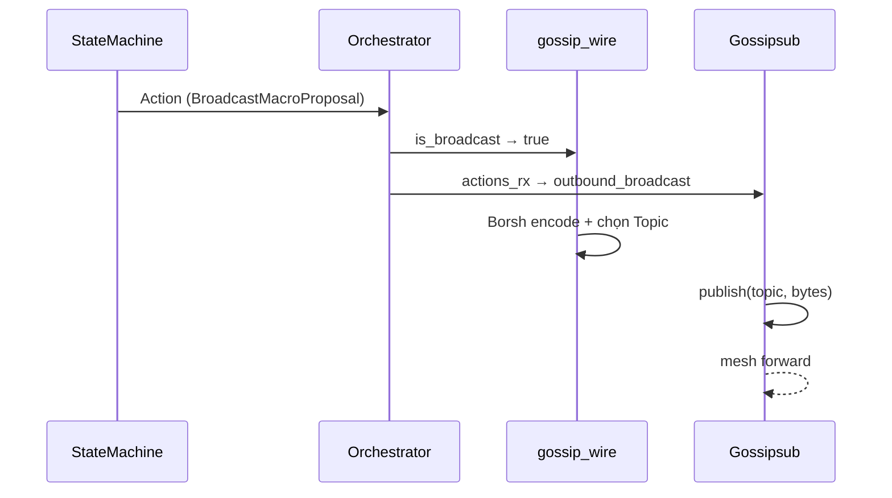

Action **không** lên gossip: `ScheduleTimer`, `PersistMacroQc`, `UpdateBlobStatus`, … → `outbound_broadcast` trả `Ok(None)`.

**Inbound** — peer gửi message:

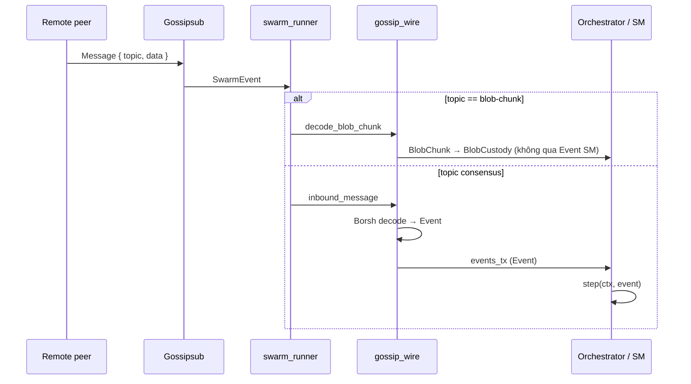

**Validation inbound đặc biệt**: topic `bls-partial/{n}` — payload phải có `p.subnet == n`, không thì lỗi codec (chống gửi nhầm subnet).

Bảng map đầy đủ: xem [mục 8](#8-bảng-topic--payload--eventaction).

#### Đường publish thứ ba — bypass consensus queue

L1 driver / blob custody gọi `encode_certified_vertex` / `encode_blob_chunk` → **`publish_tx`** → swarm publish trực tiếp. Không qua `Action` state machine — giảm latency cho data availability.

#### Loopback certified vertex

Gossipsub **không deliver** message do chính node publish. Orchestrator loopback `CertifiedVertexReceived` qua `events_tx` để LiveDag và Bullshark thấy cert local.

---

### 5.8 Tách riêng `blob-chunk`

Blob shard khác message consensus về **kích thước, tần suất, consumer**:

| | Message consensus | `blob-chunk` |
|--|-------------------|--------------|
| Kích thước | Nhỏ (QC, vote, proposal) | Lớn (erasure shard) |
| Consumer | State machine (`Event`) | `BlobCustody` task |
| Decode | `inbound_message` → `Event` | `decode_blob_chunk` → `BlobChunk` |
| Backpressure | `events_tx` full → drop + metric | `blob_chunks_tx` full → drop + WARN |

Tách luồng tránh nghẽn channel consensus khi flood shard DA.

---

### 5.9 Publisher dedup ring

Ngoài Message-ID dedup của gossipsub, `gossip/publisher.rs` có **Publisher** — ring buffer hash BLAKE3 payload:

```
payload bytes → BLAKE3 → đã thấy trong cửa sổ N? → drop : publish + ghi nhận
```

Ngăn publish trùng payload trong cửa sổ gần đây (cùng Action gọi hai lần, re-broadcast vô tình). Module sẵn sàng; có thể gắn vào publish path khi cần.

---

### 5.10 Tóm tắt — tầng Gossip trả lời câu gì?

| Câu hỏi | Trả lời |
|---------|---------|
| Message lan thế nào? | Gossipsub mesh + IHAVE/IWANT trên từng topic |
| Ai nhận gì? | Subscribe topic; mesh ~8 peer/topic; bls-partial theo subnet |
| Format trên wire? | Borsh bytes; topic `lua-dag/v1/...` |
| Consensus nói chuyện ra sao? | `Action` → `gossip_wire` → publish; inbound → `Event` |
| Blob DA? | Topic riêng + `decode_blob_chunk` + `publish_tx` |
| Chống spam/trùng? | Message-ID dedup, Signed, Strict, peer scoring, publisher dedup |

Implementation: `crates/net/src/gossip/`, `gossip_wire.rs`, `swarm_runner.rs` (gossipsub behaviour + event loop).

---

## 6. Luồng dữ liệu Inbound / Outbound

Toàn bộ giao tiếp giữa **libp2p**, **consensus state machine**, và **host** (persist, timer, blob) trong `apps/node` đi qua **kênh bất đồng bộ** — không gọi trực tiếp cross-task. Phần này mô tả từng pipeline: ai gửi gì, qua channel nào, và chính sách khi hàng đợi đầy.

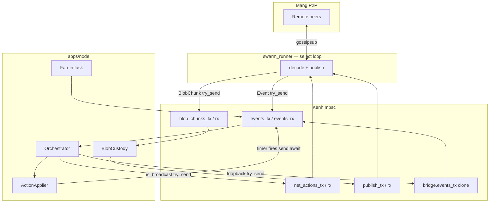

---

### 6.1 Nền tảng: channel, fan-in/out, backpressure

#### 6.1.1 `tokio::sync::mpsc` — Multi-Producer, Single-Consumer

Mỗi pipeline dùng **bounded channel**:

- Nhiều **`Sender`** (clone được) gửi vào một hàng đợi FIFO.
- Một **`Receiver`** duy nhất đọc tuần tự.
- Ranh giới giữa task — truyền quyền sở hữu dữ liệu **không cần mutex** trên Event/Action.

Ví dụ: `events_tx` có thể được clone bởi swarm fan-in, bridge loopback, và timer task — tất cả hội tụ về một `events_rx` mà orchestrator sở hữu.

#### 6.1.2 Fan-in và fan-out

| Khái niệm | Trong LUA-DAG |
|-----------|---------------|
| **Fan-in** | Nhiều nguồn → một `events_rx`: gossip inbound, fan-in từ swarm, loopback cert, `TimerFired` |
| **Fan-out** | Một `dispatch_actions` → nhiều đích: `net_actions_tx`, `action_applier`, `bridge.events_tx` (loopback) |

Orchestrator xử lý Event **tuần tự** trên một receiver — tránh race trên state machine. Fan-out sau `step()` **không** dùng broadcast channel; routing thủ công từng `Action`.

#### 6.1.3 Backpressure — hàng đợi có giới hạn

Channel capacity thường **1024** (`EVENT_BUFFER` trong swarm, runtime wiring). Khi consumer chậm hơn producer → queue đầy → **backpressure**.

Hai cách phản ứng:

| API | Hành vi khi đầy | Rủi ro |
|-----|-----------------|--------|
| **`send().await`** | Task producer **suspend** chờ chỗ trống | An toàn dữ liệu; có thể **block event loop** nếu gọi từ swarm `select!` |
| **`try_send()`** | Trả `TrySendError::Full` **ngay** — không chờ | Producer tự drop / log / metric — **không block** loop |

**Nguyên tắc LUA-DAG**: trên **swarm `select!` loop** và **orchestrator hot path** ưu tiên `try_send` — mất message cục bộ chấp nhận được (gossip redundant, sync/timeout bù) hơn là treo toàn bộ I/O mạng.

Ngoại lệ: timer khi fire dùng `events_tx.send(...).await` — chấp nhận block task timer ngắn hạn thay vì mất `TimerFired`.

#### 6.1.4 Bản đồ channel chính

| Channel | Payload | Producer(s) | Consumer | Capacity (typical) |
|---------|---------|-------------|----------|-------------------|
| `events_tx` → `events_rx` | `Event` | Fan-in, bridge loopback, timers | Orchestrator | 1024 |
| `spawn.events_rx` → fan-in | `Event` | swarm_runner (internal) | Fan-in task → `events_tx` | 1024 |
| `net_actions_tx` → `net_actions_rx` | `Action` | Orchestrator | swarm_runner | 1024 |
| `publish_tx` → `publish_rx` | `(Topic, Vec<u8>)` | BlobCustody, L1 encode | swarm_runner | 1024 |
| `blob_chunks_tx` | `BlobChunk` | swarm_runner | BlobCustody | 1024 |
| `bridge.events_tx` | `Event` | Orchestrator (loopback) | Cùng bus → `events_rx` | clone của `events_tx` |
| `timer_schedule_tx` | `(TimerId, delay)` | ActionApplier | Timer loop | 256 |

---

### 6.2 Mô hình event-driven

Consensus **không** gọi libp2p. libp2p **không** gọi `StateMachine::step`. Runtime đứng giữa:

```
Peer → Swarm → decode → Event → Orchestrator → step() → Vec<Action>
                                                              ↓
                                    ┌─────────────────────────┼─────────────────────────┐
                                    ▼                         ▼                         ▼
                              net_actions              action_applier            bridge loopback
                                    ↓                         ↓                         ↓
                              gossip publish            persist / timer              Event lại
```

Vòng khép kín: Event vào → Action ra → một phần Action thành gossip outbound → peer khác → Event inbound.

---

### 6.3 Bốn đường dữ liệu cốt lõi

| # | Tên | Hướng | Mô tả ngắn |
|---|-----|-------|------------|
| **1** | **Inbound gossip → Event** | Mạng → SM | Decode wire → `Event` → orchestrator |
| **2** | **Outbound Action → gossip** | SM → Mạng | `Action` broadcast → encode → publish |
| **3** | **publish_tx** | Host → Mạng | Bytes + topic đã encode; bypass Action queue |
| **4** | **Loopback CertifiedVertex** | SM → SM | Own cert không được gossipsub echo → inject Event local |

Thêm nhánh phụ: **blob-chunk inbound → BlobCustody** (không qua Event SM).

---

### 6.4 Đường 1 — Inbound: gossip → Event

#### 6.4.1 Trong `swarm_runner` (`select!`)

Khi gossipsub deliver `Message { topic, data }`:

```
1. decode_blob_chunk(topic, data)?
      Some(chunk) → blob_chunks_tx.try_send(chunk)   [kênh DA]
      None        → tiếp bước 2
2. inbound_message(topic, data)? → Option<Event>
3. events_tx.try_send(event)   [kênh consensus — internal to swarm task]
```

- Decode fail → `WARN`, swarm **tiếp tục** (không panic).
- `events_tx` full → drop + `WARN` (trong swarm task).
- `blob_chunks_tx` full → drop + `WARN`.

#### 6.4.2 Fan-in task (`runtime.rs`)

Swarm trả `spawn.events_rx` (receiver nội bộ). Runtime spawn task:

```
while ev = spawn.events_rx.recv().await {
    events_tx_for_swarm.try_send(ev)  // merge vào bus chính
}
```

Nếu bus chính đầy → `metrics.events_dropped` + WARN. Đây là **fan-in** từ swarm vào orchestrator.

#### 6.4.3 Orchestrator nhận Event

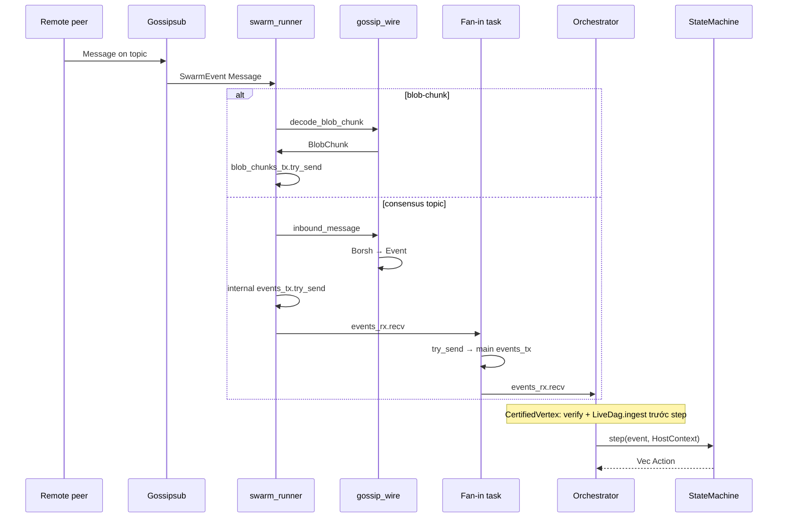

**Xử lý đặc biệt `CertifiedVertexReceived`** (trước `step()`):

1. `dag::cert::verify_certified_vertex` — reject nếu cert invalid.
2. `LiveDag.ingest` — ghi vertex column RocksDB.
3. Rồi mới `sm.step(event, ctx)`.

Các Event khác đi thẳng vào `step()`.

**Validation topic**: `bls-partial/{n}` — payload.subnet phải khớp `n`.

---

### 6.5 Đường 2 — Outbound: Action → gossip

Sau `step()`, orchestrator gọi `dispatch_actions` cho **từng** `Action` trong `Vec`:

```rust
// Thứ tự thực tế trong orchestrator.rs — cùng một vòng for
1. metrics.actions_dispatched++
2. if BroadcastCertifiedVertex → bridge.events_tx.try_send(CertifiedVertexReceived)  // đường 4
3. if gossip_wire::is_broadcast(action) → net_actions_tx.try_send(action.clone())     // đường 2
4. action_applier.apply(action)  // local — luôn gọi, kể cả broadcast                // persist/timer/...
```

**Quan trọng**: broadcast Action vẫn đi qua `action_applier` — ví dụ `EmitSlashEvidence` vừa persist evidence vừa `is_broadcast`; `BroadcastMacroQc` không persist ở applier nhưng timer actions kèm theo vẫn được apply.

#### 6.5.1 `is_broadcast` vs Action local

| `gossip_wire::is_broadcast` | Ví dụ Action | `net_actions_tx` | `action_applier` |
|-------------------------------|--------------|------------------|------------------|
| `true` | `BroadcastMicroQc`, `BroadcastMacroProposal`, `EmitSlashEvidence { .. }`, … | `try_send` | apply (persist slash nếu có) |
| `false` | `ScheduleTimer`, `PersistMacroQc`, `UpdateBlobStatus`, … | bỏ qua | apply only |

`outbound_broadcast` trong swarm map Action → `(Topic, bytes)`; Action không có wire counterpart trả `Ok(None)`.

#### 6.5.2 Trong swarm — nhánh `actions_rx`

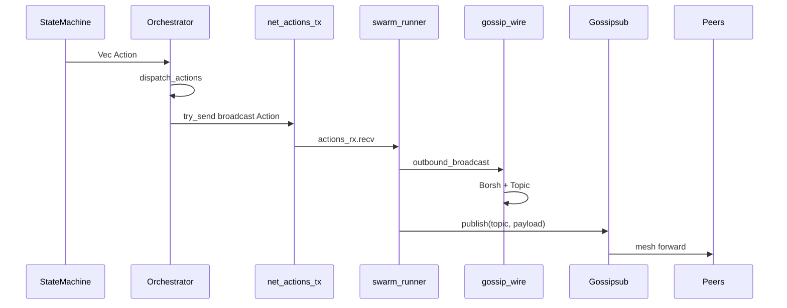

Publish fail (InsufficientPeers, duplicate, …) → `WARN`, không retry trong swarm — consensus timeout/sync xử lý retry logic.

`net_actions_tx` full → `metrics.actions_dropped` + WARN.

---

### 6.6 Đường 3 — `publish_tx`: blob / L1 trực tiếp

Một số dữ liệu **đã encode sẵn** `(Topic, Vec<u8>)` — không cần qua `Action` hay `outbound_broadcast` lần nữa:

| Nguồn | Hàm encode | Topic |
|-------|------------|-------|
| BlobCustody | `encode_blob_chunk` | `blob-chunk` |
| L1 driver | `encode_certified_vertex` | `certified-vertex` |

```
BlobCustody / L1
    → publish_tx.send / try_send (Topic, bytes)
    → swarm publish_rx.recv()
    → gossipsub.publish(topic, payload)
```

**Tại sao tách kênh?**

- Blob shard **bursty**, lớn — không nghẽn `net_actions_tx` typed Action.
- Tiết kiệm bước: không serialize lại struct đã có bytes.
- BlobCustody vừa **nhận** chunk inbound (`blob_chunks_rx`) vừa **publish** shard (`publish_tx` clone).

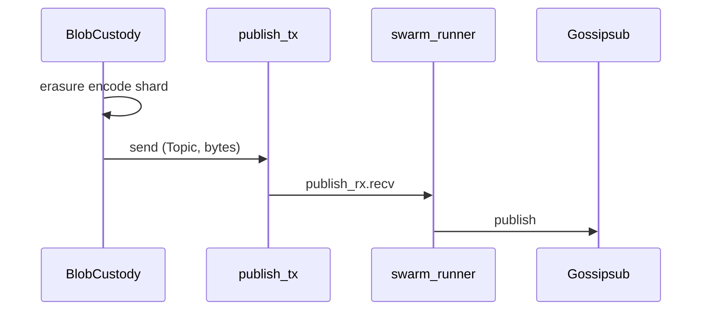

---

### 6.7 Đường 4 — Loopback `CertifiedVertex`

**Vấn đề**: Gossipsub **không deliver** message do **chính node** publish. Nếu node vừa `BroadcastCertifiedVertex` lên mạng, LiveDag và Bullshark **không** thấy cert local qua inbound gossip.

**Giải pháp**: ngay trong `dispatch_actions`, khi gặp `Action::BroadcastCertifiedVertex(cv)`:

```
bridge.events_tx.try_send(Event::CertifiedVertexReceived(cv.clone()))
```

`bridge.events_tx` là clone của `events_tx` — event vào **cùng bus** với inbound gossip. Iteration orchestrator tiếp theo xử lý như cert từ peer (verify + ingest + step).

```
BroadcastCertifiedVertex
    ├─ try_send → net_actions_tx        (peers nhận qua gossip)
    └─ try_send → bridge.events_tx      (self nhận qua Event bus)
            └─ events_rx → verify → ingest → step
```

Cũng dùng **`try_send`** — full thì drop + WARN (không block orchestrator).

---

### 6.8 `swarm_runner` — vòng `select!` trung tâm

Một task, ba nhánh **công bằng** (không nhánh nào block vô hạn nhánh khác):

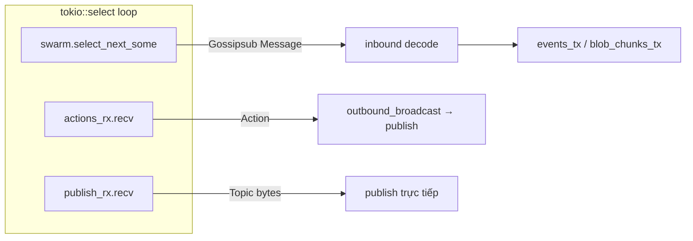

| Nhánh | Input | Output |
|-------|-------|--------|
| Swarm events | libp2p (connect, message, …) | Inbound decode hoặc log lifecycle |
| `actions_rx` | `Action` từ orchestrator | `gossipsub.publish` |
| `publish_rx` | `(Topic, Vec<u8>)` pre-encoded | `gossipsub.publish` |

Nếu `actions_rx` hoặc `publish_rx` closed → swarm task **thoát** loop.

**Không có swarm** (skeleton / test không gossip): `net_actions_tx` và `publish_tx` không có consumer — orchestrator vẫn chạy; broadcast Action `try_send` fail hoặc không wired tùy mode.

---

### 6.9 Action không lên mạng

`gossip_wire::outbound_broadcast` → `Ok(None)`; `is_broadcast` → `false`:

| Action | Xử lý bởi |
|--------|-----------|
| `ScheduleTimer` / `CancelTimer` | ActionApplier → timer registry; fire → `Event::TimerFired` |
| `PersistMacroQc` / `PersistMacroCheckpoint` | ActionApplier → RocksDB + beacon chain |
| `UpdateBlobStatus` | ActionApplier → persistence / API tier |
| `NotifyInactivityLeak` | ActionApplier → metrics / ops log |

Timer path:

```
ScheduleTimer → action_applier → timer_schedule_tx
    → schedule_event → tokio sleep
    → events_tx.send(TimerFired).await   // dùng send, không try_send
    → orchestrator events_rx → step()
```

---

### 6.10 Chính sách backpressure — tóm tắt

| Điểm gửi | Cơ chế | Khi đầy |
|----------|--------|---------|
| Swarm → internal Event | `try_send` | Drop + WARN |
| Fan-in → main `events_tx` | `try_send` | `events_dropped` metric |
| Orchestrator → `net_actions_tx` | `try_send` | `actions_dropped` metric |
| Loopback → `bridge.events_tx` | `try_send` | WARN |
| Swarm → `blob_chunks_tx` | `try_send` | WARN |
| Timer → `events_tx` | **`send().await`** | Block timer task (hiếm khi đầy lâu) |
| BlobCustody → `publish_tx` | thường `send().await` trong custody loop | Block custody task |

**Bất biến thiết kế**: **swarm `select!` không bao giờ `.await` trên send vào channel đầy** — ưu tiên liveness mạng.

---

### 6.11 Vai trò ba module điều phối

| Module | Trách nhiệm luồng dữ liệu |
|--------|---------------------------|
| **`runtime.rs`** | Tạo channel; spawn swarm, fan-in, orchestrator, timers, BlobCustody; wire `Bridge::with_channels(events_tx, …)` |
| **`orchestrator.rs`** | `events_rx.recv` → verify/ingest cert → `step()` → `dispatch_actions` fan-out |
| **`swarm_runner.rs`** | `select!`: inbound decode, `actions_rx` publish, `publish_rx` publish |

`action_applier` xử lý **side-effect local** song song với routing (cùng vòng `for action`), không thay orchestrator làm router mạng.

---

### 6.12 End-to-end — một vòng đầy đủ

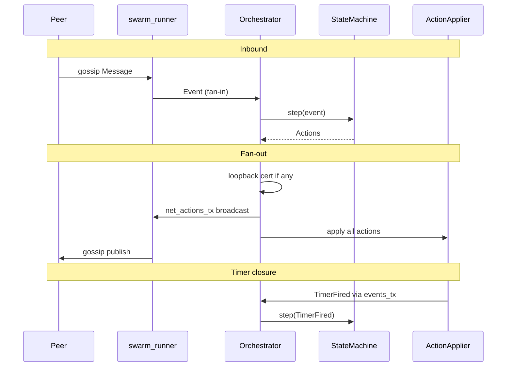

---

### 6.13 Tóm tắt

| Pipeline | Entry | Exit | Bypass consensus? |
|----------|-------|------|-------------------|
| Inbound gossip | `Message` | `Event` → `step()` | Không |
| Inbound blob | `blob-chunk` | `BlobCustody` | Có (không Event SM) |
| Outbound broadcast | `Action` | `gossipsub.publish` | Ngược: từ SM |
| publish_tx | `(Topic, bytes)` | `gossipsub.publish` | Có |
| Loopback cert | `BroadcastCertifiedVertex` | `CertifiedVertexReceived` | Không — cùng SM path |

Thiết kế channel + `try_send` giữ **consensus thuần** tách khỏi libp2p, đồng thời cho phép **DA path** và **pre-encoded publish** không làm nghẽn state machine.

---

## 7. Wiring trong `apps/node`

Binary `apps/node` gần như **không** chứa thuật toán đồng thuận — nó là **composition root**: nơi duy nhất khởi tạo storage, network, channels, tasks, và ghép chúng thành một validator process chạy được. File trung tâm: `apps/node/src/runtime.rs`.

```
crates/consensus, crates/net, crates/storage  →  thư viện (Lego blocks)
apps/node/runtime.rs                          →  lắp ráp + vòng đời
```

---

### 7.1 Composition root và dependency wiring

#### 7.1.1 Composition root là gì?

**Composition root** là điểm duy nhất trong process tạo toàn bộ object graph và quyết định ai nối với ai. Các crate library **không** tự mở RocksDB, **không** tự spawn libp2p — tránh coupling và giúp test thay từng phần.

| Module library | Không tự làm | Runtime cung cấp |
|----------------|--------------|------------------|
| `consensus` | Network, storage | `HostContext` mỗi lần `step()` |
| `net` | State machine | channels + keypair + `NetConfig` |
| `storage` | Biết validator identity | path DB từ config |

LUA-DAG dùng **manual DI** (constructor + channel), không dùng DI framework.

#### 7.1.2 Dependency wiring

**Wiring** = nối dependency bằng:

- **Trait ports** (`HostContext`: DAG, clock, valset, beacon, persistence, signer, pending_blobs)
- **mpsc channels** (Event/Action giữa task)
- **Arc** chia sẻ (`LiveDag`, `Metrics`, `ChainedBeacon`)

Runtime quyết định **thứ tự spawn** và **ai giữ Sender/Receiver nào** — sai wiring → deadlock hoặc message mất.

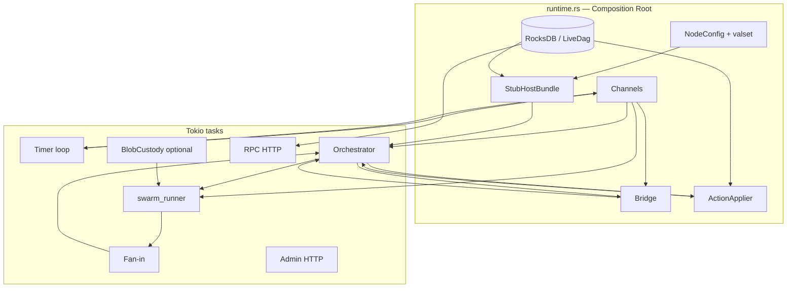

---

### 7.2 Task spawning — tại sao nhiều task?

Tokio **task** là đơn vị concurrency nhẹ (không phải OS thread 1:1). Node chạy **song song** nhiều vòng lặp:

| Task | Vòng lặp | Block được? |
|------|----------|-------------|
| `swarm_runner` | `select!` libp2p + actions + publish | Không — dùng `try_send` outbound |
| Orchestrator | `events_rx.recv` → `step` | Chỉ block chờ Event |
| Timer loop | `timer_schedule_rx.recv` | Block OK — task riêng |
| Fan-in | merge swarm → main bus | `try_send` |
| Admin / RPC | HTTP accept | Task riêng |
| BlobCustody | chunk ingest + publish | Task riêng |

Nếu gom tất cả vào **một** loop, một phần chậm (ví dụ HTTP) sẽ **đứng** gossip và consensus.

```rust
// Mẫu spawn trong runtime.rs
tokio::spawn(async move { /* timer loop */ });
tokio::spawn(async move { /* fan-in */ });
tokio::spawn(orch.run());
// swarm_runner spawn bên trong spawn_gossip_tasks
```

---

### 7.3 Bridge pattern

`crates/net::Bridge` là **cầu nối channel** giữa host và contract consensus — **không** chứa logic protocol.

```rust
Bridge::with_channels(events_tx.clone(), actions_capacity)
// → Bridge { events_tx, actions_rx }
// → BridgeHandle { actions_tx }  // dropped in runtime (_bridge_handle)
```

| Thành phần Bridge | Vai trò thực tế |
|-------------------|-----------------|
| `bridge.events_tx` | Clone của bus chính — orchestrator **loopback** cert local |
| `bridge.actions_rx` | Orchestrator `select!` nhận nhưng **bỏ qua** trong live path |
| `BridgeHandle` | API `apply_action` — runtime **không dùng**; broadcast qua `net_actions_tx` |

**Live path thực tế**:

```
Outbound broadcast: Orchestrator → net_actions_tx → swarm (KHÔNG qua bridge.actions_rx)
Loopback Event:     Orchestrator → bridge.events_tx → events_rx (cùng bus)
Inbound Event:      swarm → fan-in → events_rx
```

Bridge giữ **contract** từ spec ban đầu (`Event` in / `Action` out); production đã thêm `net_actions_tx` song song — `translate_action` trong bridge vẫn skeleton.

---

### 7.4 HostContext và `StubHostBundle`

Consensus `step(event, ctx)` cần **ports** — không import storage/network trực tiếp.

#### `HostContext` (borrowed, mỗi lần step)

```rust
HostContext {
    dag, clock, valset, beacon, persistence, signer, pending_blobs
}
```

Được lắp từ `build_host_context(&bundle, &persistence)` — lifetime gắn với orchestrator step.

#### `StubHostBundle` (owned, sống cả process)

Tên **Stub** là di sản plan 06b — đây là **host bundle production**, không phải mock:

| Field | Port / vai trò |
|-------|----------------|
| `dag: Arc<LiveDag>` | `DagView` — L1 vertex column + gossip ingress |
| `clock: TokioClock` | `Clock` — thời gian process |
| `valset: CachedValidatorSet` | `ValidatorSetPort` — snapshot epoch hiện tại |
| `beacon: Arc<ChainedBeacon>` | `RandomnessBeacon` — `R_w = H(R_{w-1} ‖ MacroQC)` |
| `signer: DevSigner` | Ký BLS local (khớp valset entry) |
| `pending_blobs: CustodyPendingBlobs` | `PendingBlobSource` — blob queue cho vertex propose |

**ChainedBeacon** chia sẻ với `ActionApplier`: khi persist MacroQc → `beacon.adopt_macro_qc`.

**CustodyPendingBlobs**: `None` nếu blob custody tắt → vertex propose rỗng nhưng vẫn liveness.

---

### 7.5 Orchestrator lifecycle

`Orchestrator` = driver state machine — **một task**, **một** `events_rx`.

```
Create (Orchestrator::new)
    ↓
[optional] genesis_propose if propose_enabled
    ↓
loop:
    events_rx.recv().await
    → (CertifiedVertex: verify + LiveDag.ingest)
    → sm.step(event, HostContext)
    → dispatch_actions(actions)
    ↓
events_rx closed → exit
```

`dispatch_actions` (fan-out mỗi Action):

1. Loopback `BroadcastCertifiedVertex` → `bridge.events_tx`
2. `is_broadcast` → `net_actions_tx`
3. `action_applier.apply` — persist, timer, beacon, blob status (mọi Action)

Orchestrator **không** gọi libp2p; **không** ghi Rocks trực tiếp (trừ ingest cert trước step).

---

### 7.6 Trình tự khởi động `runtime.rs`

Thứ tự spawn **có ý nghĩa** — channel trước task, swarm trước orchestrator (để `net_actions_rx` có consumer).

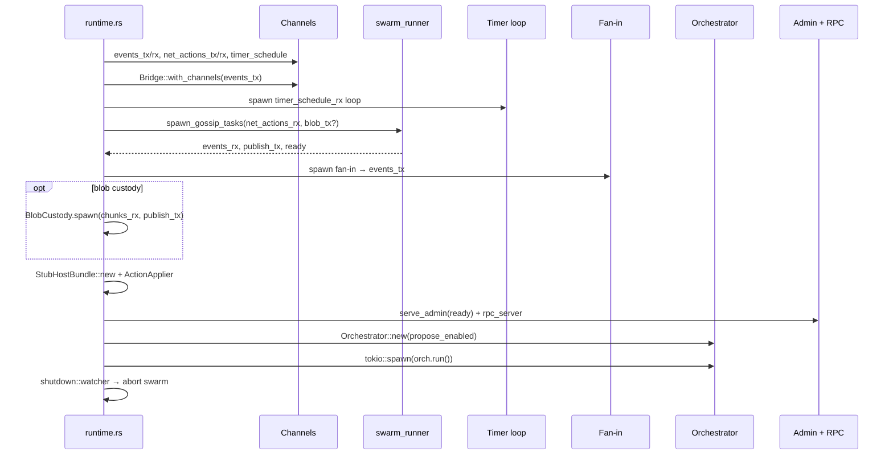

#### Bước 1 — Config và storage

1. Load `NodeConfig`, validator set TOML.
2. Xác nhận `self_id` có trong valset.
3. `Database::open` → `RocksPersistence`, `LiveDag`.
4. `StateMachine::new(consensus_cfg, self_id)`, `Metrics`.

#### Bước 2 — Event bus và Bridge

```rust
let (events_tx, events_rx) = mpsc::channel(1024);
let (bridge, _bridge_handle) = Bridge::with_channels(events_tx.clone(), 1024);
```

`events_tx` clone tới: timer, fan-in, bridge loopback, swarm internal.

#### Bước 3 — Timer pipeline

```rust
let (timer_schedule_tx, timer_schedule_rx) = mpsc::channel(256);
// ActionApplier nhận timer_schedule_tx
// Spawn: schedule_rx → schedule_event → events_tx.send(TimerFired).await
```

Timer fire **không** qua fan-in riêng — gửi thẳng clone `events_tx`.

#### Bước 4 — Swarm (nếu có gossip)

Điều kiện spawn swarm: **không** (`allow_skeleton_network && network_mode != "live"`) → skeleton branch.

Khi spawn:

- Derive `macro_subnet_count` nếu config = 0.
- `devnet_keypair_from_label` → libp2p keypair.
- Optional `blob_chunks` channel nếu `l1_blob_custody_enabled`.
- `spawn_gossip_tasks` → `net_actions_rx`, `publish_tx`, `spawn.events_rx`, `ready`.

**Fan-in task**: `spawn.events_rx` → `try_send` → main `events_tx`.

**BlobCustody** (optional): `chunks_rx` + `publish_tx` clone.

#### Bước 5 — Host bundle và ActionApplier

```rust
StubHostBundle::new(label, valset, live_dag, signer_path, blob_custody_handle)
ActionApplier::new(persistence, timer_schedule_tx, timer_registry, beacon, metrics)
```

#### Bước 6 — HTTP surfaces

- **Admin** (`/readyz`, metrics): `net_ready_rx` từ swarm — ready khi listen bind xong.
- **RPC** (`RocksConsensusQuery`, optional blob submit): read-only + custody API.

Chạy **trước** orchestrator để health probe hoạt động khi SM đang xử lý.

#### Bước 7 — Orchestrator

```rust
let propose_enabled = gossip_publish_tx.is_some();
Orchestrator::new(sm, bridge, events_rx, ..., net_actions_tx, host_bundle, action_applier, valset, propose_enabled)
tokio::spawn(orch.run())
```

#### Bước 8 — Shutdown

```
shutdown::watcher() → shutdown_tx = true → admin/rpc drain
await orch_task
swarm_handle.abort()
```

---

### 7.7 Bản đồ wiring — ai nối ai

| Từ | Channel / handle | Tới | Payload |
|----|------------------|-----|---------|
| swarm (internal) | fan-in | `events_tx` | `Event` |
| Timer | `events_tx` clone | orchestrator | `TimerFired` |
| Orchestrator loopback | `bridge.events_tx` | orchestrator | `CertifiedVertexReceived` |
| Orchestrator broadcast | `net_actions_tx` | swarm `actions_rx` | `Action` |
| ActionApplier | `timer_schedule_tx` | timer loop | `(TimerId, delay)` |
| BlobCustody | `publish_tx` | swarm | `(Topic, bytes)` |
| Swarm inbound blob | `blob_chunks_tx` | BlobCustody | `BlobChunk` |

**Orchestrator sở hữu**: `events_rx` (duy nhất consumer bus chính).

**Swarm sở hữu**: `net_actions_rx`, `publish_rx`, internal gossip state.

---

### 7.8 `propose_enabled` và skeleton mode

#### `propose_enabled`

```rust
let propose_enabled = gossip_publish_tx.is_some();
```

| | `propose_enabled = true` | `propose_enabled = false` |
|--|--------------------------|---------------------------|
| Swarm | Có | Không |
| `genesis_propose()` lúc start | Có | Không |
| L1 distributed vertex cert | Active | Ingress-only |
| Log | "L1 distributed vertex certification active" | "skeleton mode: ingress-only" |

Không phải cờ config riêng — **derive** từ việc swarm có spawn hay không.

#### Skeleton mode (không swarm)

Kích hoạt khi: `allow_skeleton_network && network_mode != "live"`.

| Hạng mục | Skeleton | Có swarm |
|----------|----------|----------|
| `spawn_gossip_tasks` | Không | Có |
| `net_actions_tx` consumer | Không | swarm |
| Fan-in / BlobCustody | Không | Có |
| `propose_enabled` | false | true (nếu swarm OK) |
| `net_ready_rx` | Luôn `true` (fake) | Swarm `ready` watch |
| Consensus + ingress Event | Có (nếu inject Event test) | Đầy đủ |

**Live mode gate** (startup fail sớm):

```
network_mode == "live"
  && !allow_skeleton_network
  && !l3_wire_complete
→ bail (chưa wire L3 production)
```

Skeleton **không** thay `StubHostBundle` bằng mock — host ports vẫn Rocks + LiveDag thật; chỉ **tắt** lớp gossip.

---

### 7.9 ActionApplier — wiring local side-effects

Tách khỏi orchestrator routing mạng:

| Action | Applier làm |
|--------|-------------|
| `PersistMacroQc` / `PersistMacroCheckpoint` | Rocks + beacon adopt |
| `EmitSlashEvidence` | Append evidence column |
| `ScheduleTimer` / `CancelTimer` | Registry + schedule loop |
| `UpdateBlobStatus` | Persistence API tier |
| `NotifyInactivityLeak` | Metrics log |
| Broadcast variants | No-op trong applier (network path riêng) |

`ActionApplier` nhận `timer_schedule_tx` **một lần** lúc build — orchestrator không biết timer implementation.

---

### 7.10 Sơ đồ wiring tổng thể

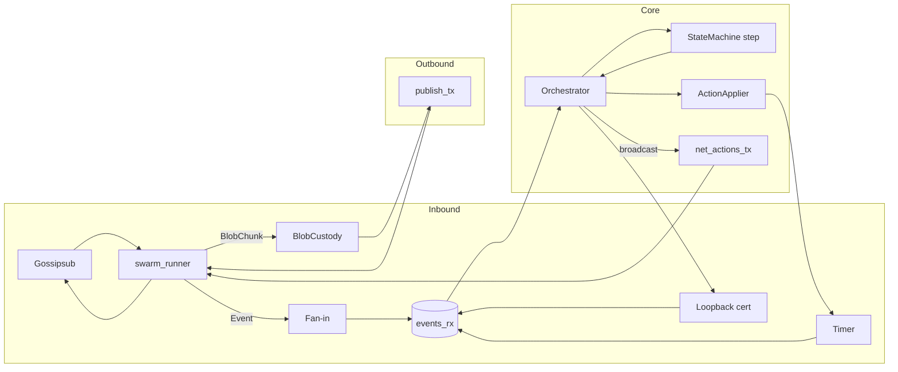

---

### 7.11 Tóm tắt

| Khái niệm | Trong LUA-DAG |
|-----------|---------------|
| Composition root | `apps/node/src/runtime.rs` |
| Wiring | Channels + `StubHostBundle` + `Bridge` + spawn order |
| Bridge | `events_tx` loopback; `actions_rx` legacy/unused live |
| Host | `build_host_context` per step; bundle owned by orchestrator |
| Concurrency | swarm, fan-in, timer, orchestrator, HTTP, BlobCustody |
| `propose_enabled` | Swarm spawned ⇒ genesis propose + L1 cert active |
| Skeleton | No swarm; same host ports; ingress-only consensus |

Wiring đúng đảm bảo **consensus crate không biết libp2p**, trong khi node binary vẫn chạy validator đầy đủ P2P + Rocks + HTTP.

---

## 8. Bảng Topic ↔ Payload ↔ Event/Action

| Topic | Payload (Borsh type) | Outbound `Action` | Inbound `Event` |
|-------|---------------------|-------------------|-----------------|
| `certified-vertex` | `CertifiedVertex` | `BroadcastCertifiedVertex` | `CertifiedVertexReceived` |
| `vertex-proposal` | `VertexProposal` | `BroadcastVertexProposal` | `VertexProposalReceived` |
| `vertex-partial` | `VertexPartial` | `BroadcastVertexPartial` | `VertexPartialReceived` |
| `micro-qc` | `MicroQc` | `BroadcastMicroQc` | `MicroQcAssembled` |
| `macro-proposal` | `MacroProposal` | `BroadcastMacroProposal` | `MacroProposalReceived` |
| `bls-partial/{id}` | `BlsPartial` | `BroadcastBlsPartial` | `BlsPartialReceived` |
| `subnet-aggregate` | `SubnetAggregate` | `BroadcastSubnetAggregate` | `SubnetAggregateReceived` |
| `macro-qc` | `MacroQc` | `BroadcastMacroQc` | `MacroQcReceived` |
| `slash-evidence` | `SlashEvidence` | `EmitSlashEvidence { evidence }` | `SlashEvidenceFound` |
| `blob-chunk` | `BlobChunk` | *(via `publish_tx`, không qua Action SM)* | *(→ BlobCustody, không → SM Event)* |

Hàm kiểm tra broadcast: `gossip_wire::is_broadcast(&Action)`.

---

## 9. Cấu hình mạng (`NetConfig`)

File: `crates/net/src/config.rs`, load từ TOML section `[net]`.

```toml
# Ví dụ conceptual
[net]
listen = ["/ip4/0.0.0.0/tcp/9000"]
bootstrap = ["/dns4/validator-0/tcp/9000/p2p/12D3Koo..."]
macro_subnet_count = 0   # 0 = derive từ valset tại startup

[net.gossip]
heartbeat_ms = 700
mesh_n = 8
mesh_n_low = 6
mesh_n_high = 12

[net.peers]
max_peers = 64
ban_duration_secs = 600
```

`macro_subnet_count`: runtime tính từ `consensus::macro_fin::compute_ke` nếu = 0.

---

## 10. Production path vs Skeleton vs Simulator

| | Production (`swarm_runner` + `gossip_wire`) | Skeleton (`bridge.rs`) | Simulator (`apps/sim`) |
|--|---------------------------------------------|----------------------|------------------------|
| libp2p | Có | Không | Không |
| Encode/decode | `gossip_wire` | Không (WARN drop) | In-memory `virtual_net` |
| Event loop | Tokio + Swarm | Chỉ mpsc | Deterministic clock |
| Mục đích | Node thật / devnet Docker | Interface test / legacy | Adversarial test (drop/delay/partition) |

**Lưu ý**: `Bridge::translate_action` vẫn là skeleton (log WARN). Production **không gọi** hàm này — orchestrator route qua `net_actions_tx`.

---

## 11. Hạn chế hiện tại & hướng mở rộng

| Hạng mục | Trạng thái |
|----------|------------|
| `PeerManager` scoring/ban | Implemented, **chưa wired** vào swarm / gossipsub peer score |
| `rpc/causal_set`, `checkpoint_sync` | Chỉ có request/response **types** — chưa có protocol handler trên Swarm |
| `gossip/publisher` dedup | Module có, chưa gắn publish path |
| `IdentityMap` | Có API, host chưa map hàng loạt PeerId↔ValidatorId trong mọi path |
| QUIC transport | Có builder, swarm runner chưa dùng |
| Kademlia discovery | `DiscoveryConfig` stub, `enable_kad = false` default |

Hướng mở rộng tự nhiên (spec §7.3): thêm req-resp behaviour vào `LuaDagBehaviour`, wire `PeerManager` vào gossipsub scoring, hoàn thiện `Bridge` hoặc deprecate nếu `gossip_wire` đủ.

---

## 12. Sơ đồ tham khảo

### 12.1 Kiến trúc phân tầng

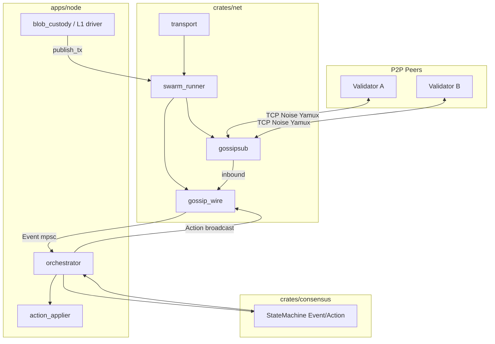

### 12.2 Event loop `spawn_gossip_tasks`

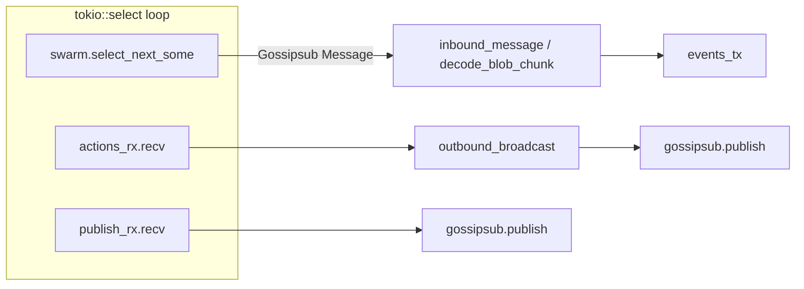

### 12.3 So sánh ba đường publish

```
Consensus Action (broadcast)
    orchestrator → net_actions_tx → actions_rx → outbound_broadcast → publish

Own CertifiedVertex loopback
    orchestrator → bridge.events_tx → CertifiedVertexReceived (local)

Blob / L1 direct
    BlobCustody → publish_tx → publish (skip Action queue)
```

---

## 13. Từ điển thuật ngữ

### 13.1 Mạng & P2P

| Thuật ngữ | Giải thích |
|-----------|------------|
| **P2P (Peer-to-Peer)** | Mô hình mạng không có server trung tâm. Mỗi **node** (validator) vừa gửi vừa nhận message, có thể relay cho peer khác. |
| **Node / Peer** | Một tiến trình validator trong mạng. Trong libp2p, peer được định danh bằng **PeerId** (hash của public key). |
| **Validator** | Thực thể tham gia đồng thuận, có **ValidatorId** (32 byte) và khóa BLS. Khác PeerId ở tầng wire — cần map qua `IdentityMap`. |
| **Bootstrap peer** | Địa chỉ peer biết trước (trong config). Node mới **dial** bootstrap để vào mạng; bootstrap không phải server trung tâm, chỉ là điểm vào. |
| **Multiaddr** | Địa chỉ libp2p dạng chuỗi protocol stack, ví dụ `/ip4/0.0.0.0/tcp/9000` hoặc `/dns4/validator-a/tcp/9000/p2p/12D3Koo...`. Một chuỗi mô tả cả transport lẫn PeerId đích. |
| **Dial / Listen** | **Listen**: mở cổng chờ kết nối. **Dial**: chủ động kết nối tới peer khác (bootstrap hoặc peer mới gặp). |

### 13.2 libp2p stack

| Thuật ngữ | Giải thích |
|-----------|------------|
| **libp2p** | Framework P2P modular (Protocol Labs). Cung cấp transport, mã hóa, multiplexing, pub/sub (gossipsub), discovery. **Chỉ `crates/net` được import libp2p.** |
| **Swarm** | Vòng lặp sự kiện trung tâm của libp2p: quản lý kết nối, behaviour (gossipsub), publish/subscribe. Trong code: `Swarm<LuaDagBehaviour>`. |
| **Behaviour** | Module protocol gắn vào Swarm. Hiện tại: `LuaDagBehaviour { gossipsub }`. Sau này có thể thêm req-resp, kad-dht. |
| **Transport** | Lớp thấp nhất: thiết lập kết nối byte stream giữa hai peer. |
| **TCP** | Giao thức tin cậy, có thứ tự. Thường được upgrade thêm Noise + Yamux; có thể bật nodelay cho message nhỏ. |
| **QUIC** | Transport trên UDP, tích hợp TLS 1.3 + multiplex. Trong libp2p là nhánh thay thế TCP, không đi qua Noise/Yamux. |
| **Noise** | Handshake mã hóa peer-to-peer (tương tự TLS nhưng nhẹ, phù hợp P2P). Xác thực PeerId trong quá trình bắt tay. |
| **Yamux** | **Multiplexer**: nhiều logical stream trên một kết nối TCP. Gossipsub và RPC sau này có thể dùng stream riêng mà không mở thêm socket. |
| **DNS resolver (libp2p)** | Cho phép dial multiaddr dạng `/dns4/service-name/tcp/9000` — cần cho Docker Compose / Kubernetes. |

### 13.3 Gossip & Gossipsub

| Thuật ngữ | Giải thích |
|-----------|------------|
| **Gossip** | Lan truyền kiểu "truyền miệng": không broadcast tới mọi node, mỗi node chỉ gửi cho tập hàng xóm nhỏ; message lan dần toàn mạng. |
| **Gossipsub** | Pub/sub của libp2p trên nền gossip + mesh. Hỗ trợ chống spam, message-id dedup, peer scoring (libp2p built-in). |
| **Topic** | Kênh logic pub/sub. Node **subscribe** topic nào thì nhận message topic đó. LUA-DAG dùng prefix `lua-dag/v1/...`. |
| **Publish / Subscribe** | **Publish**: gửi payload lên topic. **Subscribe**: đăng ký nhận message topic. Swarm subscribe toàn bộ topic consensus khi khởi động. |
| **Mesh** | Với mỗi topic, gossipsub duy trì tập peer kết nối trực tiếp (mesh). Tham số `mesh_n`, `mesh_n_low`, `mesh_n_high` trong config. |
| **Heartbeat** | Chu kỳ gossipsub duy trì mesh và fanout. Config: `heartbeat_ms` (mặc định 700ms devnet). |
| **ValidationMode::Strict** | Gossipsub chỉ forward message đã pass validation local. Swarm LUA-DAG bật strict mode. |
| **MessageAuthenticity::Signed** | Message gossip được ký bằng keypair node — chống giả mạo nguồn ở tầng libp2p (khác với chữ ký BLS consensus). |

### 13.4 Serialization & contract consensus

| Thuật ngữ | Giải thích |
|-----------|------------|
| **Event** | Input vào state machine consensus (`consensus::event::Event`). Ví dụ: `MacroProposalReceived`, `BlsPartialReceived`. |
| **Action** | Output từ state machine (`consensus::action::Action`). Ví dụ: `BroadcastMacroProposal`, `ScheduleTimer`. |
| **Borsh** | Binary serializer deterministic (NEAR). Payload gossip = struct Borsh → `Vec<u8>`. Quan trọng cho hash/chữ ký ổn định. |
| **Bridge** | Adapter skeleton: cặp channel `events_tx` / `actions_rx` giữa host và consensus. **Không** chạy libp2p trực tiếp trong production. |
| **gossip_wire** | Adapter production: map `Action` ↔ `(Topic, bytes)` và `(topic, bytes)` ↔ `Event`. |
| **mpsc channel** | Tokio multi-producer single-consumer queue — nối swarm task, orchestrator, timers bất đồng bộ. |
| **HostContext** | Bundle port (DAG, clock, valset, beacon, persistence, signer) inject vào `StateMachine::step`. **Không** liên quan trực tiếp libp2p. |

### 13.5 Dữ liệu protocol LUA-DAG (trên wire)

| Thuật ngữ | Giải thích |
|-----------|------------|
| **CertifiedVertex** | Vertex L1 đã có certificate BLS aggregate — đủ stake để coi là certified trên DAG. |
| **VertexProposal / VertexPartial** | Giai đoạn distributed vertex cert: proposer gửi proposal, validator gửi partial vote. |
| **MicroQc** | Quorum certificate cấp micro (Bullshark L2). |
| **MacroProposal / MacroQc** | Checkpoint & QC cấp macro (L3 Casper-FFG). |
| **BlsPartial / SubnetAggregate** | Chữ ký BLS phân mảnh theo subnet (Mode A aggregation). |
| **SlashEvidence** | Bằng chứng vi phạm (equivocation, surround vote, ...). |
| **BlobChunk** | Shard erasure-coded của blob lớn (data availability path). |

---

## Tài liệu liên quan

- [Folder architecture spec](../superpowers/specs/2026-05-11-folder-architecture-design.md) — §7.3 `crates/net`
- [Net crate implementation plan](../superpowers/plans/2026-05-12-04-net-crate.md)
- [Layer 1 architecture](./layer-1.md)
- Tests tham khảo: `crates/net/tests/gossip_roundtrip.rs`, `apps/node/tests/l1_gossip_roundtrip.rs`, `apps/node/tests/blob_gossip_roundtrip.rs`

---

*Document synthesized from codebase review and multi-provider architecture analysis (ChatGPT, Claude, DeepSeek). Last updated: 2026-07-22.*
