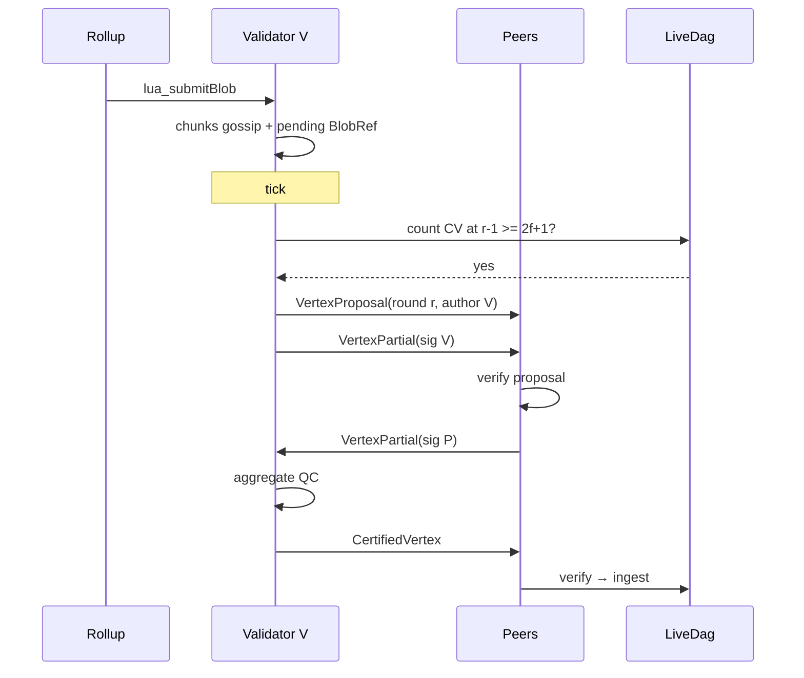

# Design: L1 distributed vertex certification (production-only path)

**Date:** 2026-05-29  
**Status:** **Approved (locked)** — plan: [`2026-05-29-l1-distributed-vertex-cert.md`](../plans/2026-05-29-l1-distributed-vertex-cert.md)  
**Audience:** Contributors replacing centralized `L1Driver` with per-validator L1 produce  
**Relations:**
- [`2026-05-23-l1-availability-dag-design.md`](2026-05-23-l1-availability-dag-design.md) — phases 07a–07c (verify, blob, erasure)
- [`2026-05-26-l1-driver-real-blob-attach-design.md`](2026-05-26-l1-driver-real-blob-attach-design.md) — pending blob queue (keep data plane; change control plane consumer)
- Supersedes centralized produce described in 07a §4.3 (“sign all quorum members centrally on every node”)

### Locked decisions (2026-05-29)

| Decision | Choice |
|----------|--------|
| L1 produce path | **Production-only** on `apps/node` — no centralized `L1Driver` |
| Who publishes `CertifiedVertex` | **Any node** with ≥ `2f+1` partials (approach B) |
| Author on QC | Certificate bitmap **must** include author's valset index |
| Genesis round `0` | `may_propose` without prior CV; `parents = []`; each validator may propose `author = self` |
| Blob attach | Ingress validator only — no round-robin across authors |

---

## 1. Problem

L1 today mixes **production ingress crypto** with a **non-production produce path**:

| Area | Today | Gap |
|------|-------|-----|
| Ingress | `verify_certified_vertex` on orchestrator | OK |
| Blob DA | `publish_payload` → chunks + `pending` `BlobRef` | OK |
| Produce | Single `L1Driver` builds `2f+1` vertices/tick, `build_quorum_cert` with `devnet_bls_ikm` for multiple valset indices | Not Narwhal-class |
| Parents | `parent_hash_for_round` → 0–1 parent, no `2f+1` gate on round `r-1` | Not spec-aligned |
| Wire | `certified-vertex` only | No `vertex-proposal` / `vertex-partial` |
| Blob attach | Central driver round-robin pending across quorum authors | Only ingress validator should attach its pending blobs |

Contributors and operators should see **one** L1 story: each validator proposes, peers sign, quorum promotes `CertifiedVertex`, every node verifies before `LiveDag`.

---

## 2. Goals

1. **Remove** centralized L1 produce (`L1Driver`, `build_quorum_vertices_with_blobs`, multi-signer `build_quorum_cert` on the hot path).
2. **Per-validator `AuthorLoop`:** on tick, at most one `Vertex` with `author = self`.
3. **Distributed QC:** gossip `vertex-proposal` + `vertex-partial`; any node may aggregate ≥ `2f+1` partials into `CertifiedVertex` and gossip `certified-vertex` (**approach B**).
4. **Propose gate:** propose round `r` only when local `LiveDag` has ≥ `2f+1` certified vertices at round `r - 1`.
5. **Parents:** `vertex.parents` = content hashes of **all** certified vertices at round `r - 1` known locally (minimum `2f+1`; include more when available).
6. **Blob:** `BlobCustodyHandle::drain_pending()` only on **author loop of the node that received `lua_submitBlob`**; no round-robin to other authors.
7. **Keep:** `verify_certified_vertex`, blob chunk gossip, `LiveDag::ingest` only for verified CV, Bullshark unchanged.

---

## 3. Non-goals

- Bullshark / SM `Action` / `Event` changes for L1.
- `Action::BroadcastCertifiedVertex` (host `publish_tx` only — locked in 06b-L1).
- Persistent vertex mempool across restart (in-memory partial collector OK for v1).
- Cross-validator blob re-anchor or shared pending queue.
- Replacing `DevSigner` with HSM (may still use file/env keys; must sign **only** local valset entry).
- L4 Bitcoin anchor, full DAS slashing pipeline.

---

## 4. Concepts (locked vocabulary)

| Term | Meaning |
|------|---------|
| **Tick** | Timer interval; triggers `AuthorLoop` attempt, not a DAG round id. |
| **Round** | `Vertex.round` — logical DAG layer `r`. |
| **Vertex / header** | Uncertified `Vertex` body. |
| **QC** | ≥ `2f+1` BLS signatures on one signing root → `BlsAggSig`. |
| **CV** | `CertifiedVertex { vertex, certificate }`. |
| **LiveDag** | Per-node `DagView`; only verified CVs ingested. |

**Tick ≠ round.** Multiple ticks may add CVs to the same round; one tick may carry proposals for round `r` while round `r-1` is still filling.

---

## 5. Production data flow

### 5.1 Data plane (unchanged)

```
Rollup → lua_submitBlob → BlobCustodyHandle::publish_payload
  → split/erasure chunks → RocksDB + gossip blob-chunk
  → enqueue_pending(BlobRef) on ingress validator only
```

`CustodyLedger` remains per-node; chunk gossip async (no tick).

### 5.2 Control plane (new)

```
Each tick (per validator V):
  if certified_count(LiveDag, r-1) >= 2f+1:
      parents ← hashes of all CV at round r-1 (local view)
      blobs ← drain_pending()   // may be empty → empty vertex OK
      vertex ← Vertex { round: r, author: V, parents, blobs, hash: seal }
      sign(sk_V) → gossip VertexProposal + VertexPartial(V)
  else:
      skip propose (keep pending blobs queued)

On any node, CertCollector:
  on VertexPartial / Proposal for hash h:
      if distinct partials >= 2f+1:
          aggregate → CertifiedVertex
          verify locally → gossip certified-vertex

On any node, orchestrator:
  on CertifiedVertexReceived:
      verify_certified_vertex + author ∈ valset → LiveDag.ingest
```

### 5.3 Mermaid (single canonical flow)



---

## 6. Wire format

New gossip topics (host path, parallel to `blob-chunk`):

| Topic | Payload | Maps to |
|-------|---------|---------|
| `lua-dag/v1/vertex-proposal` | Borsh `Vertex` (sealed `hash`) | Collector + peers verify body |
| `lua-dag/v1/vertex-partial` | `VertexPartial { vertex_hash, validator, sig }` | Collector |
| `lua-dag/v1/certified-vertex` | existing `CertifiedVertex` | `Event::CertifiedVertexReceived` |

**Rules:**

- `vertex_hash` MUST equal `vertex.hash` for proposals.
- Partial `sig` domain: `lua-dag/v1/vertex-cert` over `signing_bytes(vertex)` (existing `dag::signing`).
- Duplicate partials same `(vertex_hash, validator)` → idempotent drop.
- `certified-vertex` MUST pass `verify_certified_vertex` before ingest (no change).

**Rejected:** SM `Action` for L1 publish (stay host `publish_tx` in `swarm_runner`).

---

## 7. Propose gate and parents

### 7.1 Gate

```rust
fn may_propose_round(dag: &LiveDag, r: u64, valset: &ValidatorSet) -> bool {
    if r == 0 {
        return true; // genesis: no parents; parallel author=self proposals allowed
    }
    let need = quorum_threshold(n);
    dag.certified_count_at_round(Round(r - 1)) >= need
}
```

Each node uses **local** `LiveDag` (may lag peers).

### 7.2 Parents

For round `r > 0`:

```rust
parents = dag.vertices_at_round(Round(r - 1))
    .iter()
    .map(|cv| cv.vertex.hash)
    .collect();
```

Require `parents.len() >= 2f+1` at propose time (gate ensures this). Sort order for determinism: lexicographic by hash bytes (locked in plan).

**Replaces:** `parent_hash_for_round` single-parent shortcut for produce path.

### 7.3 Author in valset

Ingress verify (add to `dag::cert` or orchestrator):

- `vertex.author` MUST match a `ValidatorSet` entry.
- Certificate bitmap MUST include author's valset index (author self-attests) — **required v1**.

---

## 8. Blob attachment (prod)

| Rule | Detail |
|------|--------|
| Who enqueues | Node that ran `publish_payload` after RPC |
| Who drains | Same node's `AuthorLoop` only |
| When | On tick when `may_propose_round` true |
| Empty pending | Still propose (`blobs: []`) to keep liveness |
| Peers | Verify `BlobRef` in header; custody for blob bytes separate (07b/07c) |

**Remove:** `build_quorum_vertices_with_blobs` round-robin partition.

---

## 9. Components (apps/node)

| Module | Responsibility |
|--------|----------------|
| `l1/author_loop.rs` | Tick, gate, build vertex, sign, publish proposal+partial |
| `l1/cert_collector.rs` | Partial map per `vertex_hash`, aggregate, publish CV |
| `l1/propose.rs` | `may_propose_round`, `parents_for_round` |
| `blob/mod.rs` | Unchanged data plane; `drain_pending` called from author loop |
| `orchestrator.rs` | Unchanged CV verify + ingest |
| **Delete** | `l1/driver.rs`, `build_quorum_vertices_*` produce usage |

`runtime.rs`: spawn `AuthorLoop` + `CertCollector` per node when `l1_enabled`; **remove** `L1Driver` spawn.

---

## 10. Config migration

| Remove / deprecate | Add |
|--------------------|-----|
| `l1_driver_enabled` | `l1_author_loop_enabled` (default true for live) |
| Central driver flags | `l1_tick_ms` (reuse `round_duration_ms`) |

`l1_real_vertex_certs` becomes **mandatory true** when L1 enabled (no `[0xAB]` fixture on live nodes).

`devnet.toml` remains for **keys/topology** but uses the **same produce path** as production (no special central signer).

---

## 11. Sim vs node

| Binary | L1 produce |
|--------|------------|
| `apps/node` | **Only** distributed path (this spec) |
| `apps/sim` | May keep `vertex_factory` batch helpers behind `sim` feature for Bullshark tests — **must not** be used by `apps/node` runtime |

---

## 12. Acceptance criteria

1. **4-node live:** each node runs `AuthorLoop`; round `r` accumulates up to 4 CVs (distinct authors); round `r+1` proposals include multi-parent links to round `r`.
2. **No central sign:** node process never calls `build_quorum_cert` with another validator's `devnet_bls_ikm` on produce path.
3. **QC gate:** vertex with only 1 partial never appears in `LiveDag`.
4. **Blob:** rollup submit to node A → `BlobRef` only in A's vertex; chunks on all nodes after gossip.
5. **Negative:** tampered partial / wrong author rejected; propose with `r-1` under quorum blocked.
6. **Tests:** unit `parents_for_round`, `may_propose_round`; integration 4-node partial → CV; existing `verify_certified_vertex` tests stay green.

---

## 13. Risks

| Risk | Mitigation |
|------|------------|
| Local LiveDag lag → fork proposals | Re-org policy v1: highest round wins; document weak sync |
| Duplicate CV gossip | Idempotent ingest by `vertex.hash` |
| Partial storm | Per-hash cap + bitmap dedup |
| Scope creep | No SM changes; delete driver in same PR series |

---

## 14. Self-review

- [x] Single canonical flow (no parallel devnet produce path on node)
- [x] Tick vs round distinguished
- [x] `2f+1` for round gate vs QC explicit
- [x] Approach B (any node publishes CV) documented
- [x] Blob path per-ingress validator only
- [x] Non-goals bound scope
- [x] Genesis round `0` locked (`parents = []`, no gate)

---

## 15. Next step

Execute plan: [`2026-05-29-l1-distributed-vertex-cert.md`](../plans/2026-05-29-l1-distributed-vertex-cert.md) (Tasks 1–11; optional 3-PR split).
